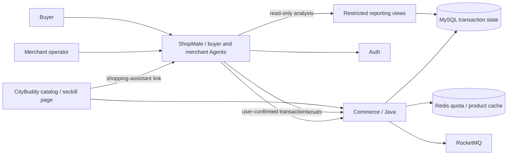

# CityBuddy

[](https://github.com/ChanTso/citybuddy/actions/workflows/ci.yml)

A Java commerce backend for catalog, standard orders, seckill, simulated payments and refunds.
Commerce owns transaction state; Auth issues user identities and scoped service delegations.
The implementation focuses on contention, idempotency, asynchronous recovery and authorized writes.

The retail entry is [ShopMate](https://github.com/ChanTso/shopmate): one buyer shopping assistant
and merchant workbench, both using CityBuddy identities and transaction APIs. This repository
retains a small catalog/seckill engineering page; its shopping-assistant link opens ShopMate.
The former buyer support model loop and chat endpoints are retired.

## Results

| Path or change | Observed result | Workload and source |
|---|---|---|
| Redis-first sold-out rejection | 6,000 requests/s; 180,002 correct rejections; p99 4.92 ms; zero dropped iterations | 32 activities, 30 seconds. A measured work point, not the maximum or a long-run capacity claim. [Report](bench/results/soldout_fixed_series_20260907.md). |
| Order-consumer combination | SQL order-wait p99 9.26 s → 1.70 s; 60,001 orders completed on both sides with no dropped iterations | Same single-activity/SKU 200 requests/s × 300 seconds, including startup, MySQL buffer pool 1 GiB. [Final eight-point comparison](bench/results/seckill_order_final_comparison_20260908.md). |
| Ordinary order to simulated payment | 4,801 completed flows across two runs, with SQL amount/inventory checks | 20 flows/s × 120 seconds per run; a baseline, not maximum throughput. [Report](bench/results/order_payment_baseline_20260907.md). |
| Activity lock: `FOR UPDATE` → `FOR SHARE` | p50 1,535.1 → 6.1 ms; dropped iterations 949 → 0 | Historical one-activity comparison at 800 requests/s. [Paired results](bench/README.md#shared-activity-lock-result). |
| Generated machine credential: BCrypt → digest | Refund-preparation p50 4,139.8 → 13.4 ms; Auth median CPU 694.42% → 4.30% | Historical 30 requests/s step, one Agent worker and deterministic model. [Paired results](bench/agent/README.md#repeated-obo-service-credential-verification). |

Performance measurements ran on a MacBook Pro M4, Docker 8 CPUs / 14 GB, with Commerce limited to
4 CPUs. The final order comparison measured baseline `fe60d7c3c95eb09399a95562745e96ff5cc386c7`
and final code `9bb08c6087d9a73befb909b021debb30a9fb9aa1`. Linked reports retain exact revisions,
workloads, persistence settings and raw output; historical comparisons are not combined into one result.

The final 200/s repeat completed all 59,963 admitted orders but had 37 unissued startup iterations;
it is not a second zero-drop pass. At 400/s orders still accumulated, then cleared after input stopped.
One negative HTTP receiving-time sample also prevents certifying that point as clean HTTP capacity.
The final report keeps both limits, SQL correctness and recovery observations. The maximum sustained
order rate and the limiting side of the higher sold-out loads remain undetermined.

[StateEval](https://github.com/ChanTso/state-eval) checks the Agent call chain against SQL business state.
In the final ShopMate ownership ablation, both foreign-order arms stopped before refund preparation;
there was no observed incremental ownership-guard benefit. The former support caller's 55/300 → 0/300
campaign remains historical and is not reused as the new chain's result. ShopMate's separate retail
acceptance retains 24 passes, 3 business failures and 3 provider failures across 30 real-model attempts;
it does not claim that every task passed. See [ShopMate](https://github.com/ChanTso/shopmate) for its scope.

## Transaction and identity design



- **Seckill admission and resolution.** Redis Lua atomically checks quota and the activity-user
  admission key. MySQL owns reservations, orders, inventory and the ledger; RocketMQ transaction
  messages carry admitted work to durable resolution; a worker recovers pending Redis handoffs.
  The transaction checker reads reservation state from MySQL. Stock or activity-user conflicts
  resolve an admitted reservation as `UNFULFILLED`, without creating an order or reusing its quota.
- **Concurrency and replay.** Shared activity reads allow concurrent admission while rebuilds
  remain exclusive. Insert-first uniqueness, ordered locks, status/version CAS and ledgers make
  duplicate requests, message redelivery and unpaid-timeout cancellation converge to one result.
- **Payments and refunds.** Payment attempts and callbacks are bound to the order owner, amount
  and currency. A prepared sensitive action changes no refund state. Confirmation commits the
  refund request and durable receipt; retries recover that result. Providers are simulated:
  `REQUESTED` means the refund request was recorded, not that money was settled.
- **Identity and delegation.** Auth provides RS256 login, JWKS and key rotation. A service exchanges
  a direct user token for a short-lived exact-scope OBO token. Commerce checks subject, actor,
  scope, session binding and resource ownership. OBO tokens are not server-enforced one-use tokens.
  Generated high-entropy machine credentials use a client-bound digest; human passwords retain
  BCrypt. Existing BCrypt service rows require explicit rotation to use the new verifier.
- **Merchant approval.** Listing, inventory, price, promotion and campaign writes use persisted
  proposals and direct operator approval. For price changes, Commerce snapshots one to 25
  same-currency products into an immutable
  operator/session/request-key draft. Approval requires the owning operator's direct identity.
  One transaction locks products in sorted order, verifies all versions and eligibility, then
  commits prices, the receipt, catalog generation and publication events. Business conflicts
  produce `REJECTED` without partial product writes; replay returns the stored terminal result.

The full [contracts](docs/CONTRACTS.md) define exact scopes, APIs, state transitions and invariants.
The [engineering notes](docs/LESSONS.md) explain the deadlocks, snapshot and recovery failures
that shaped these choices.

## Services and data ownership

| Component | Responsibility |
|---|---|
| `commerce-service` / Java 21, Spring Boot | Catalog, orders, seckill, payments, refunds, reconciliation and merchant drafts |
| `auth-service` / Java 21, Spring Boot | User login, signing keys, JWKS and authenticated exact-scope token exchange |
| `agent-service` / Python, FastAPI | Retained support identity, historical feedback/evidence and storage readers; no model loop or chat API |
| `knowledge-indexer` / Python | Buyer knowledge indexing, version ordering, rebuild and alias switching |
| `web` / React, TypeScript | Catalog/seckill engineering page and link to ShopMate buyer |

MySQL is authoritative for business and identity state. Commerce Redis and support Redis serve
separate projection/cache workloads; Elasticsearch is a derived knowledge index. Product and FAQ
Outbox records have configured publishers. Other retained transaction records must not be counted
as an undelivered queue merely because their state is `PENDING`.

Merchant analysis reads restricted `merchant_*` views without user identities. Payment amounts are
historical successful-payment gross **before refunds**, grouped by currency and payment-success
time in UTC half-open intervals. Changing a product price does not rewrite historical paid amounts.
See the [merchant contract](docs/CONTRACTS.md#merchant-analysis-and-approved-price-changes).

## Local retail entry

ShopMate runs the buyer and merchant pages on `http://127.0.0.1:3100/buyer` and
`http://127.0.0.1:3100`, backed by its API on 8101 and one CityBuddy Auth/Commerce pair on
9081/9082. The optional CityBuddy Vite page on 5173 proxies that same pair. It does not copy a
browser token into the ShopMate link: log in there with the same buyer account.

Requires Java 21, Python 3.11, uv 0.11.24, Node.js 24, GNU Make, Docker Compose v2,
OpenSSL, `sha256sum`, `curl` and `tar`. Start with:

```bash
make demo
```

This prints preparation and startup instructions. It does **not** launch services, reset data or
change credentials. `make demo-story` prints the buyer walkthrough; `make demo-stop` prints the
actual stop commands. Follow [docs/DEMO.md](docs/DEMO.md) for the sibling ShopMate startup,
private local login files, CityBuddy page and fixture boundaries. The default retail deployment
has no active seckill fixture; dedicated seckill workloads remain in `bench/`.

The old standalone support demo is no longer a second buyer entry. Its historical database
volumes, support evidence, PendingAction and receipts are preserved without automatic migration
or confirmation. Historical Agent benchmarks require their recorded source revisions, not the
current retired chat endpoint. ShopMate's [README](https://github.com/ChanTso/shopmate/blob/main/README.md)
documents model configuration and controlled fixture reset.

## Verification

```bash
make java-ci python-ci web-ci repo-ci
```

Run the affected integration suites from the [Makefile](Makefile), such as
`make test-mysql-integration`, `make test-identity-integration`, `make test-catalog-integration`
and `make test-rocketmq-integration`. They exercise the actual local data and messaging services.
GitHub Actions runs the full parallel matrix as the merge gate; changes to CI or shared topology
also run local `make ci`. Development and review requirements are in [AGENTS.md](AGENTS.md).

## Further reading and retained measurements

- [Business, identity and interface contracts](docs/CONTRACTS.md).
- [Concurrency, recovery and debugging notes](docs/LESSONS.md).
- [Seckill/Redis workloads, comparisons and reproduction](bench/README.md).
- [Local diagnosis and retained raw archives](bench/results/archives_20260906.md).
- [Buyer Agent workload history, TLS investigation and raw-result links](bench/agent/README.md).
- [Buyer walkthrough and fixture boundaries](docs/DEMO.md).
- [StateEval campaign](https://github.com/ChanTso/state-eval/tree/main/results/ownership-campaign-v1/formal)
  and [prior art](https://github.com/ChanTso/state-eval/blob/main/docs/PRIOR_ART.md).
- [ShopMate tasks and evaluation boundaries](https://github.com/ChanTso/shopmate/blob/b327368d557150e5459cd6814d60721e6fa5c489/evals/README.md).

Older measurements retain their original versions and workload descriptions in `bench/results/`.
Historical design notes are indexed under [docs/archive](docs/archive/README.md).
