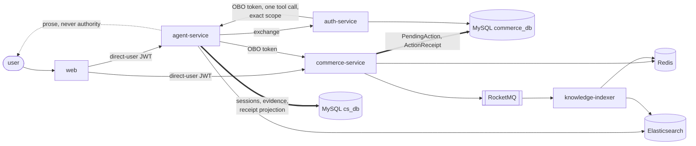

# CityBuddy

[](https://github.com/ChanTso/citybuddy/actions/workflows/ci.yml)

CityBuddy is a local-commerce transaction backend with a text-only AI customer-support agent
built on top of it. The point of the project is the boundary between the two: an LLM agent can
read business data and *prepare* sensitive actions such as refunds, but it cannot become the
authority on whether a transaction happened.

Everything below runs locally against real MySQL, Redis, Elasticsearch, and RocketMQ instances —
no in-memory substitutes and no mocked infrastructure in the integration suite.



The dashed edge is the whole point. Everything the model says reaches the user as explanation; the
solid path through commerce into MySQL is the only thing that decides whether a refund happened.

## What is worth reading here

- **Delegated identity.** RS256 login and JWKS publication, plus just-in-time token exchange
  that mints an exact-scope on-behalf-of token per tool call. The OBO token binds `act.azp`,
  the user subject, the server-owned support session, and resource ownership; commerce rejects
  body-level identity substitution. See the
  [identity and authorization contracts](docs/CONTRACTS.md#contract-identity-authorization).
- **Seckill admission under contention.** Redis Lua performs atomic quota and one-order-per-user
  admission; MySQL holds authoritative reservation, order, inventory, and ledger truth. A
  RocketMQ transaction message binds the admission decision to durable order creation, and the
  transaction checker resolves from a persisted decision marker only.
- **Sensitive action truth.** Commerce owns `PendingAction` and an immutable `ActionReceipt`. The
  agent prepares an action and claims it before commerce commits, so a lost response can never
  leave a refund executed remotely and recorded locally as never executed. Model prose is
  explicitly non-authoritative: only a projected receipt lets a client render success, SSE tokens
  cannot produce a success state, and a deterministic action-claim lexicon exists as defense in
  depth.
- **Failure convergence.** Idempotency keys, unique constraints, an inventory ledger, and
  status/version CAS make duplicate delivery, unpaid-timeout cancellation, and partial refunds
  converge to one result. The deadlocks, stale snapshots, and precision losses found while proving
  that — including a gap-lock deadlock that a throughput bottleneck had been hiding — are written
  up in [docs/LESSONS.md](docs/LESSONS.md).

## Services

| Service | Runtime | Responsibility |
|---|---|---|
| `auth-service` | Java 21 / Spring Boot | Login, RS256 tokens, JWKS and key rotation, service-authenticated exact-scope OBO exchange |
| `commerce-service` | Java 21 / Spring Boot | Products, inventory, orders, seckill, payment, refund, reconciliation, internal tool APIs |
| `agent-service` | Python 3.11 / FastAPI | Support sessions, bounded ReAct agent, tool mediation, retrieval, SSE egress, durable evidence |
| `knowledge-indexer` | Python 3.11 | FAQ/product indexing, source-version ordering, tombstones, rebuild and alias switching |
| `web` | React / TypeScript | Small demonstration surface for the verified direct-user paths |

Data topology: MySQL (`commerce_db`, `cs_db`, auth), two Redis instances with different eviction
policies, Elasticsearch 8 with the IK analyzer, and RocketMQ 5 Broker/Proxy.

## Truth ownership

- MySQL `commerce_db` is authoritative for products, inventory, orders, reservations, payments,
  refunds, `PendingAction`, and `ActionReceipt`. MySQL `cs_db` is authoritative for support
  sessions, conversations, evidence, and feedback.
- Elasticsearch is a derived index. Both Redis instances are non-authoritative projections or
  caches. The browser never supplies user or owner truth.
- Evaluation-only identity, sandbox, state, and audit routes exist solely under the `evaluation`
  profile and are never called by the web surface.

Full ownership, invariant, and interface tables are in [docs/CONTRACTS.md](docs/CONTRACTS.md).

## Seeing it run

The flagship flow — an answer with citations, a model claiming a refund that never happened, and a
real refund that completes only because a human confirmed it and commerce committed it — runs in
about ninety seconds once the local topology below is up:

```bash
make demo
```

```bash
make demo-story
```

Six beats, each read back out of the authoritative database rather than believed from the response
that produced it. The middle three, verbatim from a run:

```
──────────────────────────────────────────────────────────────────────────────
  3. The model claims the refund already happened
     Prose is not a state. Saying it happened does not make it true anywhere that counts.
──────────────────────────────────────────────────────────────────────────────
  the model answers  "Your refund has been issued."
  JSON path  outcome=completed receiptId=None
             the sentence is passed through: 'Your refund has been issued.'
             it carries no action state and no receipt, so no client can render one
  SSE  path  event: error data: {"sequence":1,"code":"unsafe_output"}
             the egress filter refuses the claim outright rather than tokenising it
  MySQL      0 refunds exist for this order

──────────────────────────────────────────────────────────────────────────────
  4. The agent prepares the refund. It cannot execute it.
     Preparation writes a PendingAction in commerce and stops there.
──────────────────────────────────────────────────────────────────────────────
  outcome    action_pending
  reply      Please confirm or decline the prepared refund request.
  receiptId  None
  MySQL      pending action fcce7b0e-8192-479d-993c-c3753f2e0029 is PREPARED

──────────────────────────────────────────────────────────────────────────────
  5. The user confirms. Commerce executes, and the agent projects the receipt.
     The receipt is the only thing that lets a client render a success state.
──────────────────────────────────────────────────────────────────────────────
  outcome    action_completed
  reply      The refund request was submitted and recorded.
  receiptId  d90ffff6-ca46-4238-aaad-de47ae3f0e34
  MySQL      receipt REQUESTED, refund f1474937-c01a-4485-9147-72ce800c121e
  MySQL      pending action is now CONSUMED
```

The walkthrough, including the browser version and an account of which parts are fixtures, is in
[docs/DEMO.md](docs/DEMO.md).

## Running it locally

Requires Java 21, Python 3.11, `uv` 0.11.24, Node.js 24, GNU Make, Docker with Compose v2,
OpenSSL, `sha256sum`, `curl`, and `tar`.

```bash
make setup
```

Generate synthetic local credentials, start the data topology, and apply all three migration
streams with their exact grants:

```bash
make init-local && make up
```

`make down` preserves named volumes. The destructive reset is deliberately explicit:
`make reset-local CONFIRM_RESET_LOCAL=1`.

Each service takes its whole configuration from flags and environment, and there is no default
profile that turns identity, orders, refunds and actions on together. The one combination that
runs all four services against each other is `scripts/demo.sh`, described under
[seeing it run](#seeing-it-run); the entry points themselves are `./mvnw -pl auth-service
spring-boot:run`, `./mvnw -pl commerce-service spring-boot:run`, `uv run citybuddy-agent` and
`uv run citybuddy-indexer`.

The web surface proxies the three APIs in development, at the ports `scripts/demo.sh` publishes:

```bash
npm --prefix web ci && cp web/.env.example web/.env.local && npm --prefix web run dev
```

## Measured performance

Local three-path latency for the support agent, with inference held at zero so what remains is the
platform's own orchestration cost. The highest step where nothing was shed, one process on one
machine:

| Path | Rate | p99 |
|---|---|---|
| Plain chat | 75 req/s | 31 ms |
| Knowledge retrieval | 60 req/s | 689 ms |
| Refund preparation | 15 req/s | 424 ms |

The first measurement found most of the agent's CPU going on work it threw away — a fresh TLS
context per outbound request. Method, raw output, the profile before and after, and what is still
unexplained are in [bench/agent/README.md](bench/agent/README.md). The seckill admission
measurement is in [bench/README.md](bench/README.md).

## Verification

These targets run against the real local topology with isolated temporary fixtures and clean up
after themselves. They are the reproducible evidence for the capabilities listed above:

```bash
make test-identity-integration
```

```bash
make test-catalog-integration
```

```bash
make test-retrieval-evidence-integration
```

```bash
make test-knowledge-sync-integration
```

```bash
make test-knowledge-rebuild-integration
```

```bash
make test-evaluation-sandbox-integration
```

The full gate — Java, Python, web, repository hygiene, secret scanning, and the ordered
integration suite — is:

```bash
make ci
```

## Current scope

CityBuddy has no cloud deployment and no real model-provider access; the model is a deterministic
fixture, so every latency figure here excludes inference by construction.

Cart, checkout, a full storefront, agent workstation, multimodal intake, PII/output-safety
handling, and human handoff are out of scope. The payment and refund providers are mocked: a
committed receipt means the refund request is durably recorded and owned by commerce, not that
money moved.

The sporadic preparation HTTP 502 measured by the benchmark was a variable-width timestamp
mismatch: commerce sometimes rendered millisecond-aligned instants with three fractional digits,
while the agent requires canonical six-digit UTC microseconds. Commerce now pins both preparation
expiry and receipt commit time to that wire format; the historical counts and mechanism remain in
[bench/agent/README.md](bench/agent/README.md).

Parallel mock-payment settlement exposed two lock cycles. Callback closure reads and another
order's payment start could scan the same attempt rows, while two new starts could both lock an
empty request/order index gap before trying to insert into it. The attempt-order unique index is
now order-first, closure reads use bounded explicit indexes, and start discovery locks an existing
attempt but not an absent key; uniqueness arbitrates a competing insert. An isolated 6,000-payment
run added zero MySQL deadlocks or lock timeouts, returned no typed payment 503s, and left all six
authoritative order/attempt/callback/ledger counts at 6,000. The fixture therefore settles payments
in a bounded parallel pool again. The historical deadlocks and exact payment result are in
[bench/agent/README.md](bench/agent/README.md).

That isolation also found the same locking-miss-then-insert shape in order idempotency: unrelated
new orders could hold compatible gaps in the composite primary key and deadlock when both inserted.
Order creation now leaves an absent key unlocked, lets the primary key adjudicate a competing
insert, and locks only a positive reread or a recovery observation. The deterministic real-MySQL
race commits both orders without 1213, and a four-worker 6,000-order acceptance run moved neither
the 1205 nor 1213 counter while leaving 6,000 matched orders, idempotency rows and outbox events.
The exact boundary and raw SQL are recorded in
[bench/results/order_idempotency_parallel_creation_fix.txt](bench/results/order_idempotency_parallel_creation_fix.txt).

Development rules are in [AGENTS.md](AGENTS.md). Retired process records are in
[docs/archive/](docs/archive/README.md).
