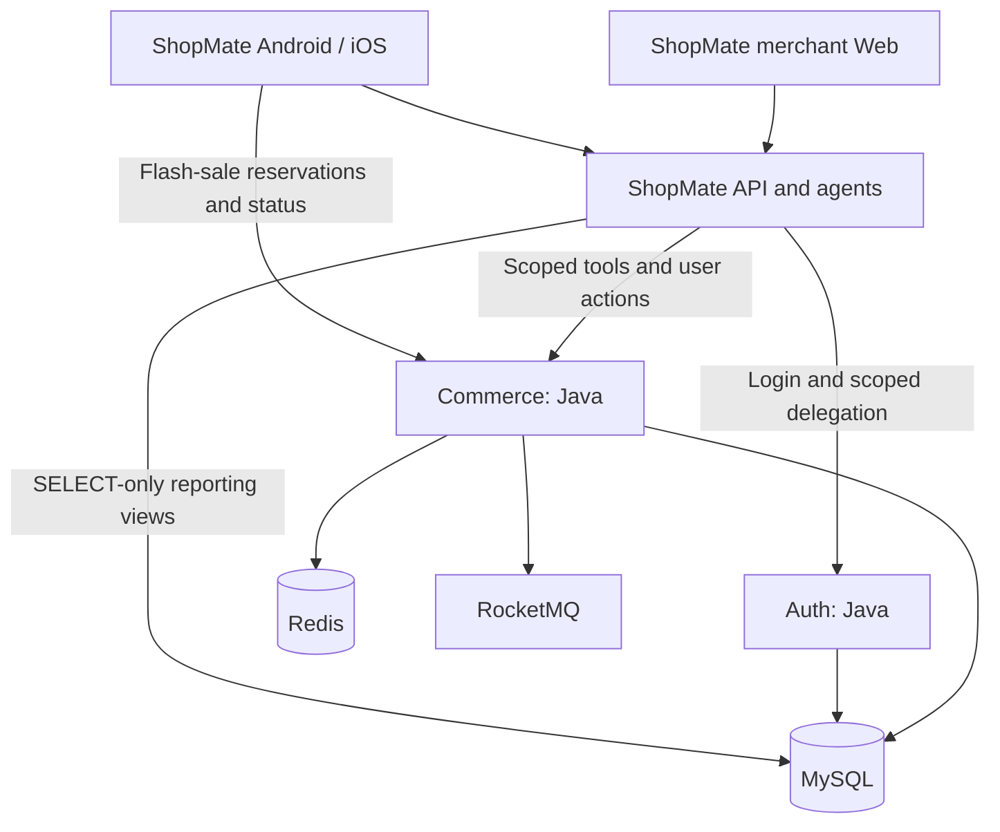

# CityBuddy

**English** · [简体中文](README.zh-CN.md) · [Contributing](CONTRIBUTING.md)

[](https://github.com/ChanTso/citybuddy/actions/workflows/ci.yml)

**A retail commerce and identity backend: from concurrent admission to durable orders, from scoped delegation to confirmed execution.**

[ShopMate showcase](https://chantso.github.io/shopmate/) · [Project guide](docs/PROJECT_GUIDE.md) · [API and state contracts](docs/CONTRACTS.md) · [Performance experiments](bench/README.md)

CityBuddy uses Java 21 / Spring Boot for catalog, carts, multi-SKU checkout, flash sales (seckill), simulated payments and refunds, and merchant approvals.
MySQL owns transaction and identity state; Redis handles quota admission and product caching; RocketMQ drives asynchronous order creation and timeout handling.

[ShopMate](https://github.com/ChanTso/shopmate) is the application and Agent layer for the same retail brand: Android/iOS buyer apps, a React merchant workspace, and server-side assistants.
CityBuddy owns business rules, authorization and transactions; ShopMate owns interaction, conversations and tool orchestration. The product serves a single brand's own store.

## Representative results

| Observed result | Workload and record |
|---|---|
| **6,000 requests/s · p99 4.92 ms**<br>Sold-out rejection, zero dropped iterations | 32 activities × 30 seconds, 180,002 correct rejections. [Report](bench/results/soldout_fixed_series_20260907.md) |
| **Order-wait p99: 9.26 → 1.70 seconds** | One hot SKU, 200 requests/s × 300 seconds; both versions completed 60,001 orders, with a 1 GiB MySQL buffer pool. [Comparison](bench/results/seckill_order_final_comparison_20260908.md) |
| **4,801 ordinary order-to-simulated-payment flows**<br>Orders, amounts and inventory reconciled | Two runs at 20 flows/s × 120 seconds each, covering order creation, payment attempts and successful callbacks. [Baseline](bench/results/order_payment_baseline_20260907.md) |

Environment: MacBook Pro M4, Docker 8 CPUs / 14 GB, Commerce limited to 4 CPUs, load generator and services on the same machine.
Order wait is the SQL timestamp difference from reservation creation to order creation. Each path is measured separately; sold-out request throughput is not successful order throughput.
Reports retain complete SHAs, raw k6 output, resource samples, SQL checks, repeat runs and overload recovery observations.

## Core design

- **Flash-sale admission and asynchronous orders.** Redis Lua atomically checks activity quota and the per-buyer admission key, rejecting sold-out requests before MySQL/MQ.
  Pending handoffs can recover, and transaction messages resolve from reservation state. Each order, inventory change and ledger entry commits in one transaction before ACK.
- **Concurrency and recovery.** Shared activity reads, insert-first uniqueness and current reads handle hot-row contention and duplicate requests.
  Shorter inventory lock sections and four bounded consumer loops process orders; indexed timeout dispatch and batched dispatch receipts work with idempotent cancellation on redelivery.
- **Whole-cart checkout and payment consistency.** Quotes bind to cart versions; ordered product locks protect checks of stock, price and publication versions.
  Checkout commits atomically or rolls back as a whole. Payment callbacks and refunds use a consistent lock order, with current reads accounting for reserved refund amounts.
- **Identity and scoped delegation.** Auth provides RS256 login, JWKS, key rotation and exact-scope OBO exchange.
  Commerce checks the subject, service, authorization binding and resource ownership. High-entropy machine credentials use client-bound digests; human passwords retain BCrypt.
- **Sensitive actions and merchant approval.** Refund preparation and merchant proposals are separate from execution; Java rechecks business conditions after user confirmation or operator approval.
  PendingAction consumption, refund request and receipt commit atomically. Product approvals update applicable versions, catalog generation and Outbox records in the same transaction; repeated requests replay the stored result.

Payment providers are simulated; refund `REQUESTED` means the request was recorded. Exact states and permissions are defined in the [business contracts](docs/CONTRACTS.md).

## Services and data boundaries



`commerce-service` owns business transactions, while `auth-service` owns identities and credentials. ShopMate manages its own conversations and memory.
This repository also retains a catalog/flash-sale engineering page, knowledge indexing and historical support-evidence readers; see the [project guide](docs/PROJECT_GUIDE.md) for the full service list.
[StateEval](https://github.com/ChanTso/state-eval) combines real-model calls with independent read-only SQL to check business outcomes, recording each call-chain version separately.

## Run locally

Requires Java 21, Python 3.11+, uv, Node.js 24, Docker Compose and a sibling ShopMate checkout. Start in the CityBuddy directory:

```sh
make init-local setup-java setup-python
./mvnw --batch-mode --no-transfer-progress -pl auth-service,commerce-service -am package

cd ../shopmate
uv sync --frozen
python3 scripts/local_runtime.py up
npm --prefix web ci
npm --prefix web run build
uv run uvicorn shopmate.app:create_app --factory --host 127.0.0.1 --port 8101
```

Open the merchant workspace at **http://127.0.0.1:8101/**. Buyers use the [Android](https://github.com/ChanTso/shopmate/blob/main/android/README.md)
or [iOS](https://github.com/ChanTso/shopmate/blob/main/ios/README.md) app. Auth/Commerce use ports 9081/9082; the ShopMate API serves the Web client from the same origin.
See the [ShopMate runtime guide](https://github.com/ChanTso/shopmate/blob/main/docs/RUNTIME.md#run-locally) for initial setup, model configuration, demo accounts and shutdown. When retail data already exists, `up` preserves business changes.

## Verification and further reading

```sh
make java-ci python-ci web-ci repo-ci
```

Run the relevant real MySQL, Redis and RocketMQ integration suites from the [Makefile](Makefile) for the change. GitHub Actions runs the full parallel matrix.

- [Project guide](docs/PROJECT_GUIDE.md): service inventory, runtime, data ownership and historical results.
- [API and state contracts](docs/CONTRACTS.md): permissions, transactions, invariants and error semantics.
- [Engineering notes](docs/LESSONS.md): concrete tradeoffs in lock contention, isolation, idempotency and asynchronous recovery.
- [Benchmarks and raw results](bench/README.md): workloads, comparisons, environments and reproduction commands.
- [Development agreement](AGENTS.md): branch, check, review and measurement requirements.
