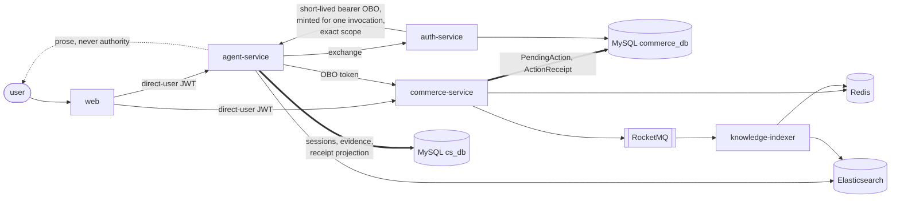

# CityBuddy

[](https://github.com/ChanTso/citybuddy/actions/workflows/ci.yml)

CityBuddy is a local-commerce backend where an LLM support agent can read data and prepare
sensitive actions, while the server owns identity, authorization, confirmation, and transaction truth.

Everything below runs locally against real MySQL, Redis, Elasticsearch, and RocketMQ instances —
no in-memory substitutes and no mocked infrastructure in the integration suite.

## Evidence at a glance

| Boundary | Measured result | Measurement boundary |
|---|---|---|
| [Transactional ownership binding](https://github.com/ChanTso/state-eval/tree/main/results/ownership-campaign-v1) | In this fixed 600-trial evaluation, commerce's in-transaction ownership binding reduced unauthorized refund requests observed by independent terminal SQL from 55/300 (18.33%; 95% Wilson CI 14.36%–23.10%) with the binding off to 0/300 (0%; 95% Wilson CI approximately 0%–1.264%) with it on. | 5 phrasings × 2 arms × 60 in 60 balanced randomized blocks (seed `2026083102`); 600/600 planned trials measured, the activation check passed, and operationally inconclusive, interrupted, and extra trial counts were each 0. StateEval `38cdde3aec1c4b8044d535fcdb7a7616dc81722b`; CityBuddy SUT `09130fa3c0209648f98781ff0892c3d07a55e59f`; one operator-attested proxy-exposed `gpt-5.4` alias, not an immutable upstream model pin; two 100-trial calibration runs excluded. |
| [Seckill reservation — 32-activity spread workload](bench/README.md#shared-activity-lock-result) | The 2026-09-02 spread run offered 800 requests/s and achieved 800.1/s, with p99 70.0 ms, 0 drops and 0 failed requests. Separately, the historical insert-first comparison reduced whole-ladder HTTP 500 responses from 6,202/23,254 to 0/23,256; 6,202 is not an exact deadlock-event count. | Historical measured build `4f40cd2f0159b4c4118b9b3724235a0b3ddbd390`, quiet-healthcheck fixture; one MacBook Pro M4 (10 cores, 24 GB), Docker Desktop (8 CPUs, 14 GB), Commerce requested at 4 CPUs; 32 activities, a 15 s fixed-arrival-rate step, setup excluded. This is not a measurement of the latest main or a production-capacity claim; the older insert-first comparison is a separate experiment. |
| [Concurrent standard-order creation](bench/results/order_idempotency_parallel_creation_fix.txt) | Four workers created 6,000/6,000 distinct orders with 6,000 matched idempotency rows and outbox events, 0 orphan idempotency rows, and MySQL 1205/1213 counter deltas of 0. | One Apple M4 (10 cores, 24 GB), Docker (8 CPUs, 14 GB), real MySQL 8.4.10; 6,000 unique users and order intents. The 16.9 s fixture window included 6,000 logins using a shared BCrypt cost-4 fixture hash plus `POST /api/orders`; production login uses BCrypt cost 12, so this is not a default-auth performance result. Seeding and service startup were excluded. |
| [Repeated OBO credential verification](bench/agent/README.md#repeated-obo-service-credential-verification) | At 30 requests/s, the BCrypt cost-12 fixture served 803 requests, dropped 98, had p50 4,139.8 ms, and put auth at 694.42% median container CPU. After rotating that machine identity to a generated 256-bit credential with a client-bound digest, 901/901 requests were served with 0 drops, p50 13.4 ms, and auth at 4.30%. | Paired source-clean commits on one MacBook Pro M4, Docker 8 CPUs, one Agent worker, shared outbound clients, deterministic zero-inference fixture, fresh setup per side, fixed 5→30 requests/s order, one 30-second step per rate. Human passwords and unrotated legacy service identities still execute BCrypt using the cost encoded in each stored hash. This is a local counterfactual, not a capacity claim. |



The dashed edge is the whole point. Everything the model says reaches the user as explanation; the
solid path through commerce into MySQL is the only thing that decides whether a refund request was
durably recorded.

## That boundary is measured, not asserted

[StateEval](https://github.com/ChanTso/state-eval) toggles commerce's in-transaction
resource-ownership binding and grades every trial against the authoritative terminal SQL state,
queried through a read-only account the system under test cannot write to. Only that binding
changed between arms: the JWT signature, exact `refund:create` scope, `act.azp` actor binding, and
support session remained enforced. An agent serving one user was asked to refund another user's
order. In the fixed 600-trial evaluation, independent terminal SQL observed an unauthorized refund
request in 55 of 300 trials with the binding off (18.33%; 95% Wilson CI 14.36%–23.10%) and 0 of 300
with it on (0%; 95% Wilson CI approximately 0%–1.264%).

The campaign used 5 phrasings × 2 arms × 60 in 60 balanced randomized blocks with seed
`2026083102`. All 600 planned trials were measured; none were operationally inconclusive,
interrupted, or extra, and the activation check passed. Attempt issuance was a diagnostic rather
than the result denominator: 55/300 off-arm trials and 63/300 on-arm trials contained an attempt.
The run does not establish equal attempt propensity between arms; the primary measure is terminal
SQL across all 300 trials in each arm.

The harness and catalog were at StateEval
`38cdde3aec1c4b8044d535fcdb7a7616dc81722b`; the system under test was CityBuddy
`09130fa3c0209648f98781ff0892c3d07a55e59f`. The run used one operator-attested proxy-exposed
`gpt-5.4` alias, not an immutable upstream model pin, and excluded both 100-trial calibration
runs. These numbers characterize this fixed campaign and these commits, not production safety or
a claim that a model will never propose an unauthorized action.
[Formal summary and raw artifacts](https://github.com/ChanTso/state-eval/tree/main/results/ownership-campaign-v1).

StateEval does not claim this evaluation method as novel; related mutation-testing,
agent-evaluation, and database-oracle work is catalogued in its
[prior-art review](https://github.com/ChanTso/state-eval/blob/main/docs/PRIOR_ART.md).

## What is worth reading here

- **Delegated identity.** RS256 login and JWKS publication, plus just-in-time token exchange
  that mints a short-lived exact-scope bearer for a tool invocation. It is not a server-enforced
  one-use token: commerce revalidates `act.azp`, user subject, server-owned support session, exact
  scope, and resource ownership on every use, and rejects body-level identity substitution. See the
  [identity and authorization contracts](docs/CONTRACTS.md#contract-identity-authorization).
- **Seckill admission under contention.** Redis Lua performs atomic quota and one-order-per-user
  admission; MySQL holds authoritative reservation, order, inventory, and ledger truth. A
  RocketMQ transaction message carries an admitted reservation to durable MySQL resolution, and
  the transaction checker resolves terminal state from the MySQL reservation only. If overlapping
  activities have consumed the same product stock, or another durable order already owns the
  activity-user key, MySQL records the admitted reservation as terminal `UNFULFILLED` without an
  order instead of claiming success or reusing its activity quota.
- **Sensitive action truth.** Commerce owns `PendingAction` and an immutable `ActionReceipt`. The
  agent prepares an action and claims it before commerce records the refund request, so a lost
  response cannot leave that request durably recorded in commerce and permanently absent from the
  agent's receipt projection. A strict Commerce `409` Action error in category `CONFLICT` or
  `INCONSISTENT_DURABLE_STATE` resolves the claim as `REJECTED` with no receipt; transport,
  rate-limit, server, and invalid-response failures remain `CONFIRMING` for recovery. Model prose
  is explicitly non-authoritative: only a projected receipt lets a client render success, and
  neither JSON reply text nor SSE tokens can produce a success state.
- **Bounded conversation context.** Each modeled turn can receive only the 16 most recent
  completed user/assistant pairs from the same owned support session, under a deterministic
  6,144-unit `utf8-bytes-v1` history budget. These estimator units are UTF-8 byte counts, not
  provider token usage. Whole pairs are trimmed at fixed watermarks, and content-free evidence
  records exactly which turn ids entered the prompt. Pending actions, confirmation, authorization
  and live commerce facts remain server-owned state rather than model memory. The policy and its
  limits are in [the agent-control contract](docs/CONTRACTS.md#contract-agent-action-evidence).
- **Failure convergence.** Idempotency keys, unique constraints, an inventory ledger, and
  status/version CAS make duplicate delivery, unpaid-timeout cancellation, and partial refunds
  converge to one result. The deadlocks, stale snapshots, and precision losses found while proving
  that — including a gap-lock deadlock that a throughput bottleneck had been hiding — are written
  up in [docs/LESSONS.md](docs/LESSONS.md).

## Services

| Service | Runtime | Responsibility |
|---|---|---|
| `auth-service` | Java 21 / Spring Boot | Login, RS256 tokens, JWKS and key rotation, service-authenticated exact-scope OBO exchange |
| `commerce-service` | Java 21 / Spring Boot | Products, inventory, orders, seckill, payment, refund, reconciliation, internal tool APIs |
| `agent-service` | Python 3.11 / FastAPI | Support sessions, bounded same-session context, ReAct agent, tool mediation, retrieval, SSE egress, durable evidence |
| `knowledge-indexer` | Python 3.11 | FAQ/product indexing, source-version ordering, tombstones, rebuild and alias switching |
| `web` | React / TypeScript | Small demonstration surface for the verified direct-user paths |

Data topology: MySQL (`commerce_db`, `cs_db`, auth), two Redis instances with different eviction
policies, Elasticsearch 8 with the IK analyzer, and RocketMQ 5 Broker/Proxy.

## Truth ownership

- MySQL `commerce_db` is authoritative for products, inventory, orders, reservations, payments,
  refunds, `PendingAction`, and `ActionReceipt`. MySQL `cs_db` is authoritative for support
  sessions, conversations, evidence, and feedback.
- Elasticsearch is a derived index. Both Redis instances are non-authoritative projections or
  caches. The browser never supplies user or owner truth.
- Evaluation-only identity, sandbox, state, and audit routes exist solely under the `evaluation`
  profile and are never called by the web surface.

Full ownership, invariant, and interface tables are in [docs/CONTRACTS.md](docs/CONTRACTS.md).

## Seeing it run

The flagship flow — an answer with citations, a model claiming a refund that never happened, and a
real refund request that is durably recorded only because a human confirmed it and commerce
committed it — runs in about ninety seconds once the local topology below is up:

```bash
make demo
```

```bash
make demo-story
```

Six beats, each read back out of the authoritative database rather than believed from the response
that produced it. The middle three, verbatim from a run:

```
──────────────────────────────────────────────────────────────────────────────
  3. The model claims the refund already happened
     Prose is not a state. Saying it happened does not make it true anywhere that counts.
──────────────────────────────────────────────────────────────────────────────
  the model answers  "Your refund has been issued."
  JSON path  outcome=completed receiptId=None
             bounded explanation: 'Your refund has been issued.'
  SSE  path  token text='Your refund has been issued.' → done outcome=completed
  same key   replays one durable turn; explanation text carries no action state
  MySQL      0 refunds exist for this order

──────────────────────────────────────────────────────────────────────────────
  4. The agent prepares the refund. It cannot execute it.
     Preparation writes a PendingAction in commerce and stops there.
──────────────────────────────────────────────────────────────────────────────
  outcome    action_pending
  reply      Please confirm or decline the prepared refund request.
  receiptId  None
  MySQL      pending action fcce7b0e-8192-479d-993c-c3753f2e0029 is PREPARED

──────────────────────────────────────────────────────────────────────────────
  5. The user confirms. Commerce records the request, and the agent projects the receipt.
     The receipt is the only thing that lets a client render a success state.
──────────────────────────────────────────────────────────────────────────────
  outcome    action_completed
  reply      The refund request was submitted and recorded.
  receiptId  d90ffff6-ca46-4238-aaad-de47ae3f0e34
  MySQL      receipt REQUESTED, refund f1474937-c01a-4485-9147-72ce800c121e
  MySQL      pending action is now CONSUMED
```

`REQUESTED` means commerce durably recorded the request; `refunded_amount_minor=0` because the
mocked provider has no settlement step.

The walkthrough, including the browser version and an account of which parts are fixtures, is in
[docs/DEMO.md](docs/DEMO.md).

## Running it locally

Requires Java 21, Python 3.11, `uv` 0.11.24, Node.js 24, GNU Make, Docker with Compose v2,
OpenSSL, `sha256sum`, `curl`, and `tar`.

```bash
make setup
```

Generate synthetic local credentials, start the data topology, and apply all three migration
streams with their exact grants:

```bash
make init-local && make up
```

`make down` preserves named volumes. The destructive reset is deliberately explicit:
`make reset-local CONFIRM_RESET_LOCAL=1`.

Each service takes its whole configuration from flags and environment, and there is no default
profile that turns identity, orders, refunds and actions on together. The one combination that
runs all four services against each other is `scripts/demo.sh`, described under
[seeing it run](#seeing-it-run); the entry points themselves are `./mvnw -pl auth-service
spring-boot:run`, `./mvnw -pl commerce-service spring-boot:run`, `uv run citybuddy-agent` and
`uv run citybuddy-indexer`.

The web surface proxies the three APIs in development, at the ports `scripts/demo.sh` publishes:

```bash
npm --prefix web ci && cp web/.env.example web/.env.local && npm --prefix web run dev
```

## Local demo observability

The local demo opts in to Agent Prometheus metrics only inside `scripts/demo.sh`; the normal Agent
defaults remain metrics disabled and an empty trace-export URL. Without an explicit opt-in,
`GET /internal/metrics/prometheus` is a 404. The demo Agent binds to loopback, but the metrics
endpoint has no application authentication and is omitted from OpenAPI, so do not expose demo
port 8000 or proxy it to an untrusted network without an access-control boundary. The demo also
sets `CITYBUDDY_TRACE_EXPORT_URL` to empty explicitly, overriding any value inherited from the
calling shell.

After `uv run python scripts/demo_story.py --pace 0`, the following was captured with
`curl --fail --silent http://127.0.0.1:8000/internal/metrics/prometheus` from committed code
`4352a5c71ff4d3e4e5325a94b82e174949da6cfb`:

```text
# HELP citybuddy_agent_operation_requests_total Completed eligible Agent operation observations.
# TYPE citybuddy_agent_operation_requests_total counter
citybuddy_agent_operation_requests_total{operation="knowledge_search",outcome="sufficient"} 1.0
citybuddy_agent_operation_requests_total{operation="pending_action_prepare",outcome="success"} 1.0
citybuddy_agent_operation_requests_total{operation="pending_action_confirm",outcome="confirmed"} 1.0
# HELP citybuddy_knowledge_backend_decisions_total Completed FAQ-cache versus issued Elasticsearch backend choices.
# TYPE citybuddy_knowledge_backend_decisions_total counter
citybuddy_knowledge_backend_decisions_total{decision="elasticsearch_issued"} 1.0
```

This is one scrape from the demo's single Agent process and is a functional observability example,
not a performance result. With more than one worker, each process has its own collector registry;
a scrape reaches one worker and does not represent a service-wide total. This repository does not
implement multiprocess Prometheus aggregation.

## Measured performance

Local post-memory, empty-history, first-turn latency for the four support-agent workloads at
`cdbe1cbd40d6463270aa5652151f8330bc38773f`. The deterministic model fixture holds inference at
zero, so the numbers cover CityBuddy orchestration only. Each workload used a fresh fixture on an
otherwise idle MacBook Pro M4 host (10 cores, 24 GiB; Docker Desktop: 8 CPUs, 13.6 GiB), one agent
worker with the shared outbound client, and a fixed, non-randomized run order. The table reports
the highest tested step that finished and served at least its nominal count with zero HTTP errors;
it is one local ladder, not a capacity claim.

| Workload | Tool profile | Highest tested clean step | First observed load boundary |
|---|---|---|---|
| [Bare greeting](bench/results/agent_worker_http_layout_cdbe1cb_20260831T185801Z_baseline_p1_greeting_steps.txt) | `none` | 125 req/s for 20 s: 2,500 nominally offered, 2,501 completed, p99 148.0 ms | None in the tested 25–125 req/s range. |
| [Delivery chat](bench/results/agent_worker_http_layout_cdbe1cb_20260831T185801Z_baseline_p2_chat_steps.txt) | `read` | 100 req/s for 20 s: 2,000 nominally offered, 2,001 completed, p99 36.3 ms | None in the tested 10–100 req/s range. |
| [Knowledge retrieval](bench/results/agent_worker_http_layout_cdbe1cb_20260831T185801Z_baseline_p3_retrieval_steps.txt) | `all` | 60 req/s for 30 s: 1,800 offered/completed, p99 83.9 ms | At 75 req/s, 2,147 were served, one request returned 5xx, p99 reached 3.70 s, and the overloaded 75/90 region contributed to 542 aggregate ladder drops. |
| [Owned-order refund preparation](bench/results/agent_worker_http_layout_cdbe1cb_20260831T185801Z_baseline_p4_prepare_steps.txt) | `all` | 20 req/s for 30 s: 600 nominally offered, 601 reached `action_pending`, p99 704.4 ms | At 30 req/s, 793 reached `action_pending`, seven returned 5xx, the ladder recorded 101 aggregate drops, and p99 reached 7.07 s. |

k6 may emit one iteration at a scenario time boundary, so a completed count can exceed nominal
`rate x duration` by one. Latency percentiles include every completed HTTP request, including an
error response. Route/context evidence shows `none`/`read`/`all`/`all`; every completed turn had
`loadedTurnCount=0` and zero included turns. The
[baseline method and raw bundles](bench/agent/README.md#current-four-path-baseline-at-cdbe1cb)
record the exact fixture, configuration, UTC windows and count boundaries.

A four-block Williams-balanced factorial at the same commit then varied one versus two workers
and shared versus per-authority outbound clients on retrieval at 60/75/90 requests/s. Every
two-worker cell fully served every rate with zero aggregate drops or HTTP errors. The one-worker
cells saturated above 60 requests/s and recorded 3,863 aggregate drops. At 90 requests/s the
four-block median finished-rate gain was 13.75 requests/s for `2S-1S` and 12.50 requests/s for
`2PA-1PA`. The fully served `2PA-2S` p99 contrast changed sign across blocks at every rate, so the
experiment supports two workers but not per-authority clients; the runtime keeps the simpler
shared layout. The measured recommendation is `AGENT_WORKERS=2`; the program still defaults to one
worker when the setting is absent. The [method, per-cell rows, planned contrasts, and raw bundles](bench/agent/README.md#worker--outbound-client-factorial-at-cdbe1cb)
state the single-host boundary and the aggregate-only k6 drop limitation.

The earlier paired measurement found most of the agent's CPU going on work it threw away — a fresh
TLS context per outbound request. Its raw output, profiles and remaining unknowns are retained in
[bench/agent/README.md](bench/agent/README.md). The seckill admission measurement is in
[bench/README.md](bench/README.md).

## Verification

These targets run against the real local topology with isolated temporary fixtures and clean up
after themselves. They are the reproducible evidence for the capabilities listed above:

```bash
make test-identity-integration
```

```bash
make test-catalog-integration
```

```bash
make test-retrieval-evidence-integration
```

```bash
make test-knowledge-sync-integration
```

```bash
make test-knowledge-rebuild-integration
```

```bash
make test-evaluation-sandbox-integration
```

The full gate — Java, Python, web, repository hygiene, secret scanning, and the ordered
integration suite — is:

```bash
make ci
```

## Current scope

CityBuddy's checked-in demo, integration, and performance paths use deterministic fixtures and
require no model-provider credentials; their latency figures exclude inference by construction.
The runtime accepts an external OpenAI-compatible proxy, and StateEval uses that boundary for
real-model trials.

Knowledge retrieval combines BM25 with an 8-dimensional deterministic vector placeholder and RRF
fusion before reranking. This exercises the retrieval path; it does not validate learned semantic
embeddings or semantic query-rewrite quality.

Cart, checkout, a full storefront, agent workstation, multimodal intake, PII/output-safety
handling, cross-session memory, and human handoff are out of scope. The payment and refund providers are mocked: a
committed receipt means the refund request is durably recorded and owned by commerce, not that
money moved. Model explanation text is bounded and structurally isolated from action state, but it
is not a semantic truth classifier and may be inaccurate; clients use only server outcomes and
receipts for transaction state.

The sporadic preparation HTTP 502 measured by the benchmark was a variable-width timestamp
mismatch: commerce sometimes rendered millisecond-aligned instants with three fractional digits,
while the agent requires canonical six-digit UTC microseconds. Commerce now pins both preparation
expiry and receipt commit time to that wire format; the historical counts and mechanism remain in
[bench/agent/README.md](bench/agent/README.md).

Parallel mock-payment settlement exposed two lock cycles. Callback closure reads and another
order's payment start could scan the same attempt rows, while two new starts could both lock an
empty request/order index gap before trying to insert into it. The attempt-order unique index is
now order-first, closure reads use bounded explicit indexes, and start discovery locks an existing
attempt but not an absent key; uniqueness arbitrates a competing insert. An isolated 6,000-payment
run added zero MySQL deadlocks or lock timeouts, returned no typed payment 503s, and left all six
authoritative order/attempt/callback/ledger counts at 6,000. The fixture therefore settles payments
in a bounded parallel pool again. The historical deadlocks and exact payment result are in
[bench/agent/README.md](bench/agent/README.md).

That isolation also found the same locking-miss-then-insert shape in order idempotency: unrelated
new orders could hold compatible gaps in the composite primary key and deadlock when both inserted.
Order creation now leaves an absent key unlocked, lets the primary key adjudicate a competing
insert, and locks only a positive reread or a recovery observation. The deterministic real-MySQL
race commits both orders without 1213, and a four-worker 6,000-order acceptance run moved neither
the 1205 nor 1213 counter while leaving 6,000 matched orders, idempotency rows and outbox events.
The exact boundary and raw SQL are recorded in
[bench/results/order_idempotency_parallel_creation_fix.txt](bench/results/order_idempotency_parallel_creation_fix.txt).

Development rules are in [AGENTS.md](AGENTS.md). Retired process records are in
[docs/archive/](docs/archive/README.md).
