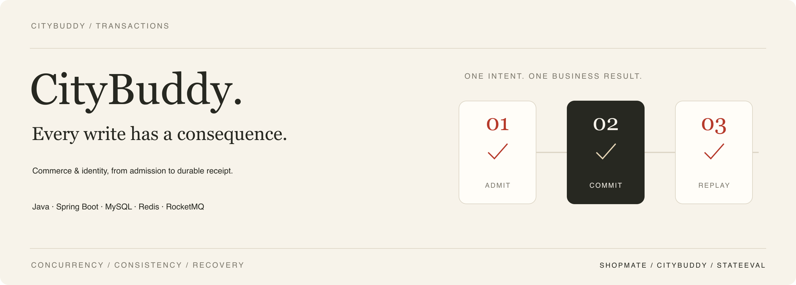
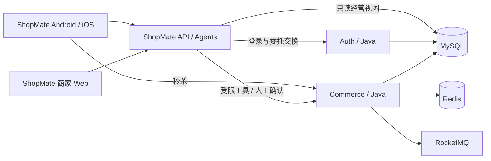

# CityBuddy

[English](README.md) · **简体中文** · [参与贡献](CONTRIBUTING.md)

[](https://github.com/ChanTso/citybuddy/actions/workflows/ci.yml)

**零售交易与身份后端：从并发准入到订单落库，从受限委托到确认执行。**

[ShopMate 产品展示](https://chantso.github.io/shopmate/) · [项目指南](docs/PROJECT_GUIDE.md) · [接口与状态契约](docs/CONTRACTS.md) · [性能实验](bench/README.md)

CityBuddy 使用 Java 21 / Spring Boot，提供商品、购物车、多 SKU 结账、秒杀、模拟支付退款与商家审批。
MySQL 保存交易和身份状态，Redis 承担配额准入与商品缓存，RocketMQ 推进异步成单和超时处理。

[ShopMate](https://github.com/ChanTso/shopmate) 是同一零售品牌的应用与 Agent 层：Android/iOS 买家 App、React 商家工作台和服务端助手。
CityBuddy 负责业务规则、授权和事务；ShopMate 负责交互、对话与工具编排。本站为单品牌自营商店。

## 代表性结果

| 实测结果 | 工作负载与记录 |
|---|---|
| **6,000 请求/秒 · p99 4.92 ms**<br>售罄拒绝，零丢弃 | 32 活动 × 30 秒，180,002 次正确拒绝。[报告](bench/results/soldout_fixed_series_20260907.md) |
| **成单等待 p99：9.26 → 1.70 秒** | 同一热点 SKU，200 请求/秒 × 300 秒；两版各完成 60,001 单，MySQL buffer pool 1 GiB。[对照](bench/results/seckill_order_final_comparison_20260908.md) |
| **4,801 次普通下单到模拟支付**<br>订单、金额与库存核对一致 | 两轮各 20 流程/秒 × 120 秒；覆盖下单、支付尝试和成功回调。[基线](bench/results/order_payment_baseline_20260907.md) |

环境：MacBook Pro M4，Docker 8 CPU / 14 GB，Commerce 限 4 CPU，发生器与服务同机。
成单等待为预约创建至订单创建的 SQL 时间差；各路径分别测量，售罄请求吞吐不等于成功成单能力。
报告保留完整 SHA、原始 k6 输出、资源采样、SQL 核对，以及重复测点和过载恢复结果。

## 核心设计

- **秒杀准入与异步成单。** Redis Lua 原子校验活动配额与一人一单，售罄在进入 MySQL/MQ 前拒绝。
  待交接任务可恢复，事务消息按预约状态决议；每单独立事务保存订单、库存与流水，提交后 ACK。
- **并发控制与恢复。** 活动共享读、insert-first 唯一约束和当前读处理热点竞争与重复请求。
  缩短库存锁持有区间，四路有界消费；超时派发使用队列索引与批量回执，重投由幂等取消收敛。
- **整车结账与账务一致性。** 报价绑定购物车版本，按固定顺序锁定商品并核对库存、价格与版本。
  结账原子提交或整批回滚；支付回调与退款统一取锁顺序，通过当前读核算已预留退款额度。
- **身份与受限委托。** Auth 提供 RS256 登录、JWKS、密钥轮换及精确 scope 的 OBO 交换。
  Commerce 校验主体、服务、授权绑定与资源归属；高熵机器凭证使用绑定客户端的摘要，人类密码保留 BCrypt。
- **敏感动作与操作员审批。** 退款准备、经营提案与实际执行分开；用户确认或操作员批准后，Java 复核业务条件。
  PendingAction、退款申请与回执原子提交；商品审批同事务更新适用的版本、catalog generation 与 Outbox，重复请求回放结果。

支付通道为模拟实现；退款 `REQUESTED` 表示申请已记录。准确的状态和权限定义见[业务契约](docs/CONTRACTS.md)。

## 服务与数据边界



`commerce-service` 管理业务事务，`auth-service` 管理身份与凭证；ShopMate 的对话与记忆由其自身管理。
本仓库另保留商品/秒杀工程页面、知识索引和历史支持证据读接口；完整服务清单见[项目指南](docs/PROJECT_GUIDE.md)。
[StateEval](https://github.com/ChanTso/state-eval) 使用真实模型调用与只读 SQL 检查业务终态，实验结果按调用链版本独立记录。

## 本地运行

需要 Java 21、Python 3.11+、uv、Node.js 24、Docker Compose 与同级 ShopMate 仓库。从 CityBuddy 目录开始：

```sh
make init-local setup-java setup-python
./mvnw --batch-mode --no-transfer-progress -pl auth-service,commerce-service -am package

cd ../shopmate
uv sync --frozen
python3 scripts/local_runtime.py up
npm --prefix web ci
npm --prefix web run build
uv run uvicorn shopmate.app:create_app --factory --host 127.0.0.1 --port 8101
```

打开商家工作台 **http://127.0.0.1:8101/**；买家使用 [Android](https://github.com/ChanTso/shopmate/blob/main/android/README.md)
或 [iOS](https://github.com/ChanTso/shopmate/blob/main/ios/README.md) 客户端。Auth/Commerce 使用 9081/9082，Web 由 ShopMate API 同源提供。
首次启动、模型配置、演示账号及停止步骤见 [ShopMate 运行说明](https://github.com/ChanTso/shopmate/blob/main/docs/RUNTIME.md#本地运行)；已有零售数据时 `up` 保留业务变更。

## 验证与进一步阅读

```sh
make java-ci python-ci web-ci repo-ci
```

按改动运行 [Makefile](Makefile) 中对应的真实 MySQL、Redis、RocketMQ 集成套件；GitHub Actions 执行完整并行矩阵。

- [项目指南](docs/PROJECT_GUIDE.md)：完整服务清单、运行方式、数据归属与历史结果。
- [接口与状态契约](docs/CONTRACTS.md)：权限、事务、不变量和错误语义。
- [工程复盘](docs/LESSONS.md)：锁竞争、隔离级别、幂等与异步恢复中的具体取舍。
- [压测与原始结果](bench/README.md)：工作负载、前后对照、测量环境与复现入口。
- [开发约定](AGENTS.md)：分支、检查、评审及测量记录要求。
