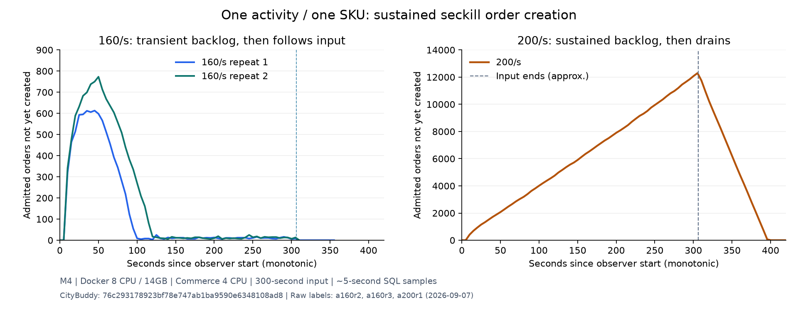

# Single-hotspot 200/s: full admission with sustained order backlog

CityBuddy commit: `76c293178923bf78e747ab1ba9590e6348108ad8`. M4, Docker configured for 8 CPUs / 14 GB (actual visible 14,638,391,296 bytes), Commerce 4 CPUs; k6 and services share the Docker network. One activity/SKU, 60050 distinct buyers and matching stock/quota, 200/s for 300 seconds, without positive business warm-up. Source, JAR, business configuration and segmented observation match the two 160 points. Dependencies remained running and historical data accumulated; identical initial cache state is not claimed.

- All 60001 requests were fresh ADMITTED; HTTP failures, drops, interruptions and negative durations were zero. HTTP p50 was about 2.47 ms, p99 about 37.92 ms.
- SQL confirmed all 60001 orders correctly created, with the observer reporting UNPAID/SENT. Missing orders, duplicate users/reservations, binding and creation-ledger errors, unexpected ledgers, and orders created after the payment deadline were all zero. Inventory 49 + 60001 = initial 60050; stock and quota deductions each totaled 60001.
- SQL wait from persisted reservation to order creation: p50 **36989.468 ms**, p95 **87338.829 ms**, p99 **91124.602 ms**, maximum 95255.726 ms, with no negative values.
- Order output across the five complete input minutes was 152.70, 161.40, 160.6167, 159.8833 and 157.55 orders/s, persistently below the approximately 200/s admitted input in later windows. Reservation-minute p99 values were 24272.219, 37086.750, 53186.645, 73565.021 and 93995.008 ms, showing growing wait. Five-second sampling found a maximum of 12294 admitted-but-unordered reservations and 16 pending dispatches.
- The last HTTP completed at 15:06:28.706890 UTC; the last order was created at 15:07:58.323691. From the last nonempty sample to the first all-ORDERED/SENT sample, recovery after input stopped falls approximately in **(89.16,95.04] seconds**. It is not exactly 95.04 seconds; original sample times and query durations remain recorded.
- One complete 60-second window after input stopped produced 139.4667 orders/s. The final 4104 orders belong to an incomplete-minute tail; 4104/60 is not the last minute's capacity.
- Transaction-message Diff/Inflight and global Redis handoff were zero; original: `mq_a200r1_76c2931_20260907T145922Z_ordered_1788793767858377000.txt`. Future unpaid cancellations are separate lifecycle cleanup, not part of this order-creation conclusion.

Conclusion for this version: 200/s is a sustained order-overload observation even though all admission requests succeeded and final SQL was correct. Combined with the two 160/s repeat points, the supported statement is that a single hotspot repeatedly completes 160/s for 5 minutes, while 200/s accumulates backlog and recovers after input stops. No integer binary search was performed. The batch average of 154.09 orders/s is not an exact capacity, and results from old revisions or different observers are not spliced into an optimization gain.

Original resource samples show peak Commerce CPU 261.08% and a cgroup throttling increment of 4 events / 66713 microseconds, without sustained saturation of its 4 CPUs. The source consumer processes messages serially, with an individual transaction and ACK per order. This point establishes insufficient output on the actual order path, but CPU headroom alone cannot identify one SQL statement or MQ as the unique limit. At that stage, the existing scheduling improvement was considered sufficient to explain the behavior, and no batch-transaction or concurrent-consumer refactor was added to that round's completion scope.

## Observation queries and original records

The first full after-SQL attempt hit the observer's original 15-second client timeout. `orders_a200r1_76c2931_20260907T145922Z_after.txt` retains the SQL and failure; it is not a successful verification. After measured input and sampling had ended, the same committed `bench/sql/seckill_orders.sql` was run successfully to a separate result file with a 60-second read-only client limit. The authoritative result is `orders_a200r1_76c2931_20260907T145922Z_after_retry60.txt`. Only the post-input observation timeout changed; the workload, business behavior and original failure record did not.

Original k6 records are in same-label console, summary, points and ladder steps. Progress/resources are in orders progress/resources; native before/during120/during240/input_end/drained snapshots are separate. Every measured artifact retains the full SHA. Natural cancellation and final inventory restoration were to be completed in separate subsequent records.

## Backlog curves

The left panel shows the two 160/s repeats and the right panel the 200/s point, with different vertical scales. Each series uses its own observer start as monotonic time zero and connects original SQL samples taken approximately every 5 seconds. Dashed lines map original HTTP times to approximate input-end positions; millisecond alignment between runs is not claimed. The curves distinguish temporary backlog recovery from sustained imbalance, without replacing complete SQL checks or latency percentiles.

## Natural cancellation cleanup, separate from order measurement

Progress first confirmed all 60001 orders cancelled at 15:59:22 UTC; the latest payment deadline was 15:22:58.323578. Full SQL at 16:00:08 confirmed inventory restored to 60050, 60001 creation and 60001 cancellation ledger entries, and zero unsettled reservations, bad bindings, incomplete admissions or pending timeout dispatches. Both message groups showed Diff/Inflight zero and Redis handoff was zero. Originals: `recovery_a200r1_76c2931_20260907T145922Z_final_1788796808588647000.txt` and `recovery_mq_a200r1_76c2931_20260907T145922Z_1788796833782680000.txt`. Cancellation of the large unpaid population lagged substantially; this 5-minute order-creation point is not steady-state capacity for the entire order lifecycle.

[Lossless raw-output archive](seckill-orders-a200-20260907.tar.gz). It contains the original k6, SQL and resource records, without replacing them with recalculated results.
