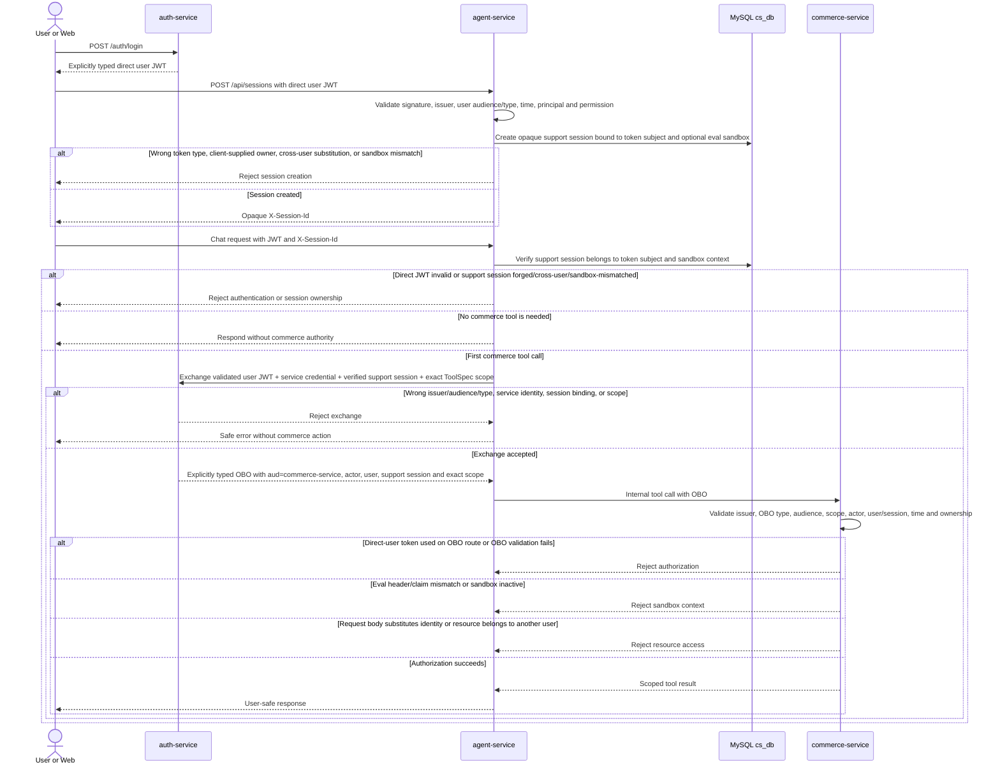
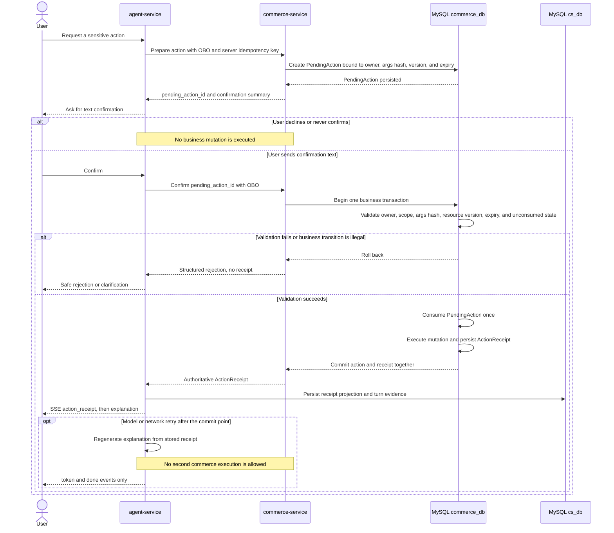

# CityBuddy background and frozen contracts

This document contains cross-slice context, frozen contracts, route outcomes, risks, and change control. It is not a slice-status source.

After locating the single active slice in [IMPLEMENTATION.md](../IMPLEMENTATION.md), begin with the sections listed under that slice's **Referenced contracts**. Read additional contract sections when an explicit dependency, shared contract, sequencing question, or frozen-contract conflict makes that useful.

<a id="contracts-project-context"></a>

## 2. Project context and current truth

CityBuddy is intended to combine local-commerce transactions with a text-only AI customer-support path. Its defining boundary is not the number of services; it is that identity, transactional side effects, retrieval evidence, and evaluation-only access remain independently enforceable.

The target service set is:

| Service | Language/runtime boundary | Target responsibility |
|---|---|---|
| `auth-service` | Java 21 / Spring Boot 3.5 | Login, RS256 user tokens, service-authenticated token exchange, OBO tokens, JWKS publication and key rotation, and evaluation-only test identities. |
| `commerce-service` | Java 21 / Spring Boot 3.5 | Products, inventory, orders, seckill admission and ordering, mock payment, refund, support tickets, CRM and FAQ truth, internal tool APIs, and evaluation-only state APIs. |
| `agent-service` | Python 3.11 / FastAPI / Pydantic | Customer-support APIs, a single ReAct agent, deterministic control signals, model policy, tool mediation, action confirmation, retrieval, safety, SSE egress, and authoritative support evidence. |
| `knowledge-indexer` | Python 3.11 | Asynchronous FAQ and product indexing, source-version ordering, tombstones, rebuilds, and versioned Elasticsearch alias changes. RocketMQ consumption remains gated by the Python client spike. |
| `web` | React / TypeScript / Vite | A later minimal demonstration surface for login, products, seckill status, support chat, and action receipts. |
| `litellm-proxy` | LiteLLM Proxy | OpenAI-compatible provider access, key isolation, rate limiting, same-tier provider failover, one bounded network retry, and usage/cost records. It never makes business-tier routing decisions. |

The repository contains executable CB-000 skeletons for the five declared code modules. Their listed business responsibilities remain target contracts, not implemented or deployed capabilities.

<a id="contracts-preflight"></a>

## 3. Preflight verification

Only decisions that affect repository initialization or the first implementation slices are recorded here. “Verified” means current official or first-party material supports the compatibility or mechanism. It does not mean CityBuddy has implemented or tested it. “Spike required” means the external material is insufficient to treat the exact project path as ready.

| Item | Conclusion | Status | Adopted implementation boundary | Official or first-party sources |
|---|---|---:|---|---|
| Java 21 with Spring Boot 3.5 and Spring Security/Nimbus | Spring Boot 3.5 supports Java 21, and Spring Security's resource-server JWT path uses Nimbus-based JWT processing and supports JWKS, issuer/audience validation, and custom validators. | Verified | Use Java 21 and Spring Boot `3.5.x`. Manage Spring Security and Nimbus through the Boot dependency graph unless a documented security fix requires an explicit override. Pin exact patches in Maven configuration. | [Spring Boot 3.5 system requirements](https://docs.spring.io/spring-boot/3.5/system-requirements.html); [Spring Security JWT resource server](https://docs.spring.io/spring-security/reference/servlet/oauth2/resource-server/jwt.html) |
| MyBatis-Plus on the Java transaction service | The maintained Boot 3 starter is the supported integration path, and its documentation warns against adding the raw MyBatis starter alongside it. | Verified | Use only `mybatis-plus-spring-boot3-starter` for MyBatis-Plus integration. Do not add a competing MyBatis starter. Pin the exact compatible patch in the Maven build. | [MyBatis-Plus installation](https://baomidou.com/en/getting-started/install/) |
| Java multi-module build | Maven's reactor natively aggregates and orders multi-module builds; Maven Wrapper pins the build entry point. | Verified | Choose Maven only. Use one root reactor for `auth-service` and `commerce-service`, dependency/plugin management at the root, and Maven Wrapper. Do not add Gradle. | [Maven multi-module reactor](https://maven.apache.org/guides/mini/guide-multiple-modules.html); [Maven Wrapper](https://maven.apache.org/tools/wrapper/) |
| <a id="contract-preflight-rocketmq-runtime"></a> RocketMQ 5 local runtime and Java client | RocketMQ 5 documents a Broker plus Proxy path and a gRPC/protobuf client family. Transaction messages expose half-message, commit/rollback, and transaction-check semantics; delay messages use a delivery timestamp. | Verified | The local runtime must expose a RocketMQ 5 Proxy endpoint and the Java code must use the 5.x client path. Topic message types are explicit. Consumer idempotency remains an application obligation. | [Local RocketMQ 5 quick start](https://rocketmq.apache.org/docs/quickStart/01quickstart/); [transaction messages](https://rocketmq.apache.org/docs/featureBehavior/04transactionmessage/); [delay messages](https://rocketmq.apache.org/docs/featureBehavior/02delaymessage/); [official clients repository](https://github.com/apache/rocketmq-clients) |
| RocketMQ transaction failure behavior in the intended seckill chain | The platform mechanisms are documented, but the exact half-message/Lua/checkback timing, duplicate delivery, and failure recovery must be proven against the selected Broker, Proxy, and Java client patches. | Spike required | Keep the frozen transaction-message design. Before declaring the ordering slice verified, exercise Lua rejection, duplicate delivery after commit, and missing second-phase acknowledgement/checkback. The checker reads only the durable decision marker. It may return `UNKNOWN` only while the marker is missing or temporarily indeterminate; broker transaction timeout, check interval, and maximum check count define the terminal boundary. | [RocketMQ transaction-message lifecycle and limits](https://rocketmq.apache.org/docs/featureBehavior/04transactionmessage/) |
| Python RocketMQ consumption for `knowledge-indexer` | The official client repository advertises Python support and includes examples, but those examples do not establish the exact acknowledgement, invisible-duration, retry, and long-processing behavior required here. An issue filed in the official Apache RocketMQ clients repository reports a PushConsumer invisible-duration gap for a Python client/Proxy combination. | Spike required | Keep `knowledge-indexer` behind a small messaging adapter. Test both the viable manual-ack/simple-consumer and push-consumer paths where available. Do not claim production-ready consumption until the [eight-item spike](#contract-required-spikes) passes. | [official client feature matrix](https://github.com/apache/rocketmq-clients); [Python examples](https://github.com/apache/rocketmq-clients/tree/master/python/example); [issue #1198 in the official Apache RocketMQ clients repository](https://github.com/apache/rocketmq-clients/issues/1198) |
| <a id="contract-preflight-mysql-redis"></a> MySQL 8 transactional truth and Redis 7 dual-instance semantics | InnoDB provides the required transaction model. Redis documents `noeviction`, LFU policies, and AOF persistence; separate instances are appropriate when workloads require incompatible eviction and durability behavior. | Verified | Use one MySQL 8 instance with `commerce_db` and `cs_db`; use two Redis 7 instances. Commerce Redis uses `noeviction` plus AOF. Support Redis uses TTL-based data with an LFU eviction policy. Redis never becomes the transaction, inventory, quota, or action truth. | [MySQL 8 InnoDB transaction model](https://dev.mysql.com/doc/refman/8.0/en/innodb-transaction-model.html); [Redis eviction](https://redis.io/docs/latest/develop/reference/eviction/); [Redis persistence](https://redis.io/docs/latest/operate/oss_and_stack/management/persistence/) |
| MySQL delegated grants through a non-default role | MySQL requires an account that delegates a privilege to possess that privilege with `GRANT OPTION`. Roles are named privilege collections, role membership does not by itself make the role active, and a session can activate or clear roles explicitly. | Verified | Put the privileges required solely for delegation in a dedicated non-default grant role. Keep `activate_all_roles_on_login=OFF`; a one-shot grant job verifies `CURRENT_ROLE()=NONE`, explicitly activates the role, executes only the repository's fixed version-controlled `GRANT`/`REVOKE` statements, clears the role to `NONE`, and exits. | [MySQL `GRANT`](https://dev.mysql.com/doc/refman/8.4/en/grant.html); [using roles](https://dev.mysql.com/doc/refman/8.4/en/roles.html); [`SET ROLE`](https://dev.mysql.com/doc/refman/8.4/en/set-role.html); [`activate_all_roles_on_login`](https://dev.mysql.com/doc/refman/8.4/en/server-system-variables.html#sysvar_activate_all_roles_on_login) |
| <a id="contract-preflight-elasticsearch"></a> Elasticsearch 8 dense vectors, kNN, and versioned aliases | Elasticsearch 8 documents `dense_vector`, approximate/exact kNN search, and atomic alias actions. | Verified | Pin one Elasticsearch 8 patch in runtime configuration. Build `knowledge_docs_vN`, validate it, then switch a stable read alias atomically. Keep private order, refund, coupon, and personal data outside the index. | [dense vector](https://www.elastic.co/guide/en/elasticsearch/reference/8.19/dense-vector.html); [kNN search](https://www.elastic.co/guide/en/elasticsearch/reference/8.19/knn-search.html); [aliases](https://www.elastic.co/guide/en/elasticsearch/reference/8.19/aliases.html) |
| Reciprocal rank fusion | Elasticsearch documents RRF, but server-side feature availability must not become an undeclared deployment assumption. | Verified | Preserve RRF as the fusion algorithm. The default project implementation merges separately retrieved BM25 and kNN result lists in `agent-service`; a server-side RRF path may be enabled later only after the selected distribution is verified. | [Elasticsearch RRF](https://www.elastic.co/guide/en/elasticsearch/reference/8.19/rrf.html) |
| <a id="contract-preflight-ik"></a> IK analyzer compatibility | The maintained IK plugin requires a plugin artifact that matches the Elasticsearch version. The exact future Elasticsearch patch is not yet pinned. | Spike required | In `CB-012`, pin Elasticsearch and IK together, install the plugin in the image, and run an analyzer smoke test. Do not silently fall back to a different analyzer. Mark the slice `BLOCKED` if no reproducible compatible artifact or build path exists. | [IK analyzer maintainer repository](https://github.com/infinilabs/analysis-ik) |
| Python 3.11, FastAPI, Pydantic, and `pyproject.toml` | Current FastAPI supports the Pydantic v2 path; current Pydantic supports Python 3.11. `uv` supports `pyproject.toml`, workspaces, and a shared lockfile. | Verified | Use Python 3.11, Pydantic v2 APIs, a `uv` workspace for the two Python packages, per-package `pyproject.toml` metadata, and a committed `uv.lock`. Exact patches are locked by `uv.lock`. | [FastAPI Pydantic migration](https://fastapi.tiangolo.com/how-to/migrate-from-pydantic-v1-to-pydantic-v2/); [Pydantic installation](https://pydantic.dev/docs/validation/latest/get-started/install/); [uv project layout](https://docs.astral.sh/uv/concepts/projects/layout/); [uv workspaces](https://docs.astral.sh/uv/concepts/projects/workspaces/) |
| LiteLLM Proxy compatibility and retry boundary | LiteLLM Proxy exposes an OpenAI-compatible interface and supports retry plus model-group fallback. | Verified | Application code calls role aliases through the proxy. `ModelRouter` alone selects the business tier. LiteLLM may retry a transient/network failure once and fail over only within the same tier. The application and proxy share a bounded attempt budget; stacked unbounded retries are forbidden. | [LiteLLM Proxy](https://docs.litellm.ai/docs/simple_proxy); [fallback and retry](https://docs.litellm.ai/docs/proxy/reliability) |
| <a id="contract-preflight-compose"></a> Docker Compose readiness and migration jobs | Compose distinguishes container start from readiness, supports health-gated dependencies and successful one-shot dependencies, and can run one-off jobs. | Verified | Every stateful dependency gets a meaningful health check. Services use long-form dependency conditions where required. Database migration is a separate one-shot service/job and never an implicit side effect of API startup. | [Compose startup order](https://docs.docker.com/compose/how-tos/startup-order/); [docker compose run](https://docs.docker.com/reference/cli/docker/compose/run/) |
| Initialization checks and build tools | Maintained tools exist for each active language and for secret scanning. | Verified | Java: Maven Wrapper, Spotless, Checkstyle, Java compiler release 21, JUnit/Surefire. Python: Ruff, mypy, pytest under `uv`. Web: npm lockfile, Prettier, ESLint, `tsc --noEmit`, Vitest, Vite build. Repository: Gitleaks. `make ci` invokes only checks backed by real files and tests. | [Spotless Maven](https://github.com/diffplug/spotless/tree/main/plugin-maven); [Maven Checkstyle](https://maven.apache.org/plugins/maven-checkstyle-plugin/); [Maven Compiler](https://maven.apache.org/plugins/maven-compiler-plugin/); [Surefire](https://maven.apache.org/surefire/maven-surefire-plugin/); [Ruff](https://docs.astral.sh/ruff/); [mypy](https://mypy.readthedocs.io/en/stable/); [pytest](https://docs.pytest.org/en/stable/); [ESLint](https://eslint.org/docs/latest/use/getting-started); [Prettier](https://prettier.io/docs/); [TypeScript compiler](https://www.typescriptlang.org/docs/handbook/compiler-options.html); [Vitest](https://vitest.dev/guide/); [npm ci](https://docs.npmjs.com/cli/v11/commands/npm-ci/); [Gitleaks](https://github.com/gitleaks/gitleaks) |

**Preflight outcome:** no Level 3 conflict has been found. The frozen mainline remains implementable. Python RocketMQ consumption, the Elasticsearch/IK patch pair, and the project-specific RocketMQ failure behavior remain explicit spikes; none is silently treated as proven.

<a id="contract-executable-truth"></a>

### 3.1 Executable contract and version truth

- Exact dependency versions, image digests, generated schemas, lockfiles, and executable tool configuration become the runtime version truth when their owning slice creates them. Markdown records compatibility boundaries and choices; it is not a parallel lockfile.
- Database migrations, OpenAPI documents, ToolSpec schemas, and contract tests become the executable truth for field names and payload details. This plan does not predesign a complete DDL or every future DTO.
- Public model configuration uses role aliases only. Concrete provider model identifiers belong in runtime configuration and, where needed, recorded run metadata.

<a id="contracts-frozen"></a>

## 4. Frozen contracts

<a id="contract-service-language"></a>

### 4.1 Service and language boundaries

- `auth-service` owns token issuance, token exchange, service authentication at the exchange endpoint, JWKS, signing-key lifecycle, and evaluation-only test token issuance. No other service owns a token-signing key.
- `commerce-service` owns transactional business state and all business-side authorization decisions, including audience, scope, sandbox, and resource ownership.
- `agent-service` owns support orchestration and support evidence. It can request a delegated token but cannot issue identity, choose arbitrary scopes, or substitute a user identifier from a request body.
- `knowledge-indexer` is an asynchronous projection worker. It does not become a source of product or FAQ truth.
- `web` is a later demonstration client, not an authority for confirmation, identity, price, stock, action status, or sandbox state.
- `litellm-proxy` is provider infrastructure, not a business router. Business-tier selection stays in `agent-service`.
- Java owns authentication and commerce transactions. Python owns the agent path and indexing worker. Cross-language synchronous calls use internal HTTP/REST JSON; RocketMQ is used only for asynchronous messaging.

<a id="contract-identity-authorization"></a>

### 4.2 Identity, delegation, and authorization

Token classes are distinguished explicitly by a token-purpose/type claim or an equivalent independent authentication chain. The absence of an actor claim is never treated as a permissive direct-user downgrade.

**Direct user JWT**

1. A user logs in through `auth-service` and receives an RS256-signed direct user JWT.
2. User-facing routes in `agent-service` and `commerce-service` validate signature, fixed issuer, configured user-facing audience, expiry, not-before, accepted clock skew, user principal, route-required role or user permission, and resource ownership.
3. An unknown `kid` triggers one JWKS refresh and one validation retry; continued failure is rejected.
4. A direct user JWT does not require `act.azp`, does not require an OBO scope, and does not carry the support-session identifier. Production direct-user tokens do not carry an evaluation sandbox claim.

**Agent OBO**

5. Conversation and public FAQ paths do not acquire commerce authority. On the first internal commerce tool call, `agent-service` requests a short-lived OBO just in time.
6. `POST /api/sessions` is the only support-session bootstrap. It requires a direct user JWT; `agent-service` generates an opaque session id, binds it to the validated token subject, and in evaluation also binds the sandbox context. The client cannot choose the owner. Wrong token type, cross-user substitution, or sandbox mismatch rejects. `X-Session-Id` identifies this support session, not a login-token session, and every use is rechecked against the validated user and sandbox context in `cs_db`.
7. On first tool use, `agent-service` submits the validated user JWT, its independently authenticated service credential, the verified support-session binding, and the exact server-side ToolSpec scope to token exchange. `auth-service` trusts the authenticated service's session-binding assertion and writes that support session into the OBO.
8. The OBO contains at least an explicit OBO purpose/type, `sub`, `user_id`, support `session`, `aud=commerce-service`, exact `scope`, `act.azp=agent-service`, `jti`, `exp`, and the applicable not-before/issued-at metadata. Scope is fixed by ToolSpec; neither model nor request payload can widen it. Cache keys are limited to `user + support session + exact scope` and never outlive the token.
9. `commerce-service` accepts internal tool identity only from the validated OBO. It validates signature, fixed issuer, OBO purpose/type, audience, exact required scope, actor, user subject, support session, expiry/not-before/skew, and resource ownership. It never trusts identity fields in the request body.
10. Evaluation test JWTs and their derived OBO tokens carry the same sandbox claim. Internal tool requests also require sandbox header/claim equality and an ACTIVE sandbox. Production tokens carry no sandbox claim, and production rejects the evaluation header.
11. Signing private keys stay in `auth-service` secret material. Public keys overlap for at least the maximum token lifetime plus accepted clock skew during rotation.

<a id="contract-storage-truth"></a>

### 4.3 Storage topology and truth hierarchy

- MySQL 8 is one physical instance with two logical databases: `commerce_db` and `cs_db`. Cross-database joins are forbidden; data crosses service boundaries through APIs or events.
- Runtime identities are distinct: `auth_app` accesses only auth-owned principals, credential verifiers, service identities, signing-key metadata, and evaluation test-principal records; `commerce_app` accesses only commerce-owned transaction and business tables; `agent_app` accesses only agent-owned tables in `cs_db`.
- A bootstrap/admin identity exists only to create databases, accounts, and grants. When MySQL requires the grantor to hold the delegated privileges with `GRANT OPTION`, those privileges live in a dedicated non-default grant role. `activate_all_roles_on_login` remains `OFF`. The bootstrap identity verifies a new session has `CURRENT_ROLE()=NONE`, activates the role only inside an explicit one-shot grant job, applies the repository's fixed version-controlled allowlist of exact `GRANT`/`REVOKE` statements, then returns the session to `NONE`. The role and bootstrap credentials are absent from migration and runtime configuration, and the grant job never accepts caller-supplied SQL or executes business-data DML. Separate migration identities execute only their owning migration streams. Runtime identities do not execute DDL, have no global/admin grants, and never use bootstrap/admin credentials.
- Auth-owned persistence remains an auth-owned table family in `commerce_db`; this does not give `commerce_app` access to credential or private identity metadata and does not add a third database.
- `commerce_db` is the truth for products, orders, inventory, seckill allocation, reservations, payments, refunds, authoritative support tickets, CRM, published FAQ state, PendingAction, ActionReceipt, sandbox registration, and transaction Outbox records.
- `cs_db` is the truth for support sessions, event/evidence records, retrieval evidence, summaries, feedback, failure candidates, and handoff/receipt projections. A projection never overrides commerce action or ticket truth.
- Commerce Redis is a separate Redis 7 instance using `noeviction` and AOF. Support Redis is a separate Redis 7 instance using TTL-oriented data and LFU eviction.
- MySQL remains the truth for transactions, inventory, quotas, action state, tickets, and idempotency. Redis is only admission control, a projection, a lock, or a cache. A Redis success alone never proves an order, refund, payment, or confirmed action.
- Elasticsearch is a derived public-knowledge index and never contains private orders, refunds, personal coupons, or other user-private transactional data.

<a id="contract-messaging-consistency"></a>

### 4.4 Messaging and consistency responsibilities

- RocketMQ 5 runs with Broker and Proxy available to the 5.x clients. The Proxy endpoint remains explicit.
- Seckill ordering uses a transaction message: send the half message, run Redis Lua admission, then commit, roll back, or temporarily return `UNKNOWN`. A deterministic result writes a durable transaction decision marker; admission also writes the reservation projection required by the order path.
- `UNKNOWN` is an intermediate checker result only when the durable decision marker is missing or temporarily indeterminate. It is not a permanent application terminal state. The application persists one stable transaction-resolution deadline derived from the configured transaction timeout, check interval, maximum check count, and bounded safety margin; restart never recomputes it. An indexed, bounded CB-060 deadline decision worker atomically creates a timeout marker only when no durable decision exists, then idempotently converges MySQL to that marker. This state-machine-specific resolver is not a generalized recovery scanner.
- The checker reads only the durable marker. Marker and reservation TTL cover the complete configured timeout/check interval/maximum-check window. Application terminal convergence is proven through the persisted deadline plus durable-marker compare-and-set and MySQL convergence. Broker terminal behavior is proven independently with `mqadmin` evidence against the transaction terminal system topic; the application does not subscribe to that system topic and does not treat an observed callback count as protocol truth.
- Downstream order creation is idempotent. Database unique constraints, an inventory-ledger movement keyed by the business event, and conditional state transitions handle repeated delivery; a duplicate returns or projects the existing result.
- `CB-060` establishes the minimum `inventory_ledger` capability for seckill order creation and replay idempotency. `CB-061` adds atomic unpaid cancellation plus inventory/activity-quota restoration, `CB-070` adds payment movements, and `CB-071` adds refund movements and full reconciliation.
- Delay messages trigger unpaid-order cancellation and later ticket SLA checks. Delivery is a trigger, not authority: consumers re-read MySQL state and use conditional status/version updates.
- MySQL-derived product, FAQ, order, refund, complaint, and ticket events use an Outbox row written in the same local transaction as the business change. Authoritative ticket creation, state changes, SLA delay events, and their Outbox records are produced by `commerce-service`; `agent-service` only requests handoff and stores a projection.
- Transaction messages, delay messages, domain events, and knowledge-sync events are distinct responsibilities. Request threads do not dual-write MySQL, Redis caches, and Elasticsearch as independent truths.

<a id="contract-agent-action-evidence"></a>

### 4.5 Agent, tool, action, and evidence boundaries

- Production support uses one ReAct agent. There is no multi-agent or decomposer mainline.
- `RuleRouter` emits deterministic signals only, such as high risk, private action, cacheable public FAQ, obvious chitchat, and complexity. It never chooses the final handling strategy.
- `ModelRouter` is the only business policy decision-maker for model tier, escalation, and budget. LiteLLM may only retry/fail over inside the selected tier.
- One shared `attempt_budget` spans model, LiteLLM, HTTP, and tool attempts. Circuit breakers are provider-scoped, do not open before a minimum request count, and use bounded half-open probes. Provider fallback stays within the tier selected by `ModelRouter`.
- `ToolAdapter` returns structured `deny_with_feedback` results. The single main Agent, constrained by ToolSpec and deterministic signals, handles missing slots, RAG/tool choice, clarification, and refusal. CityBuddy does not train or introduce a separate intent classifier.
- `MemoryPacker` may combine a commerce-owned read-only CRM view, recent turns, and a summary protected by a monotonic `summary_until_turn` watermark. Model input is separated into `SYSTEM`, `TOOLS`, `USER`, `UNTRUSTED RETRIEVED`, and `UNTRUSTED TOOL DATA`; citations may point only to allowlisted evidence sources.
- ToolSpec defines each tool's schema, risk tier, fixed scope, timeout, idempotency behavior, and model-visible output. The model cannot expand a scope or bypass confirmation.
- Read and ordinary write tools are checked at `commerce-service`. Sensitive actions first create a PendingAction in `commerce_db`; `agent-service` stores only the identifier and presents a text confirmation request.
- Confirmation is not a front-end security primitive. In one commerce transaction, the service validates the PendingAction's argument hash, resource version, expiry, ownership, and unconsumed state; consumes it once; executes the business mutation; and persists an ActionReceipt.
- A successful ActionReceipt is the action truth and the turn-level commit point. `agent-service` persists its evidence projection and emits `action_receipt`. Any later model or network retry may regenerate explanation text only and must not execute the tool again.
- Output is risk-tiered. Action claims such as “refunded” or “ordered” are held until a matching successful receipt exists; ordinary knowledge/chitchat may stream through a small buffer; a secondary text/tool consistency guard may block contradictions but never replaces receipt truth. Asynchronous grounding can create evidence or a follow-up candidate, but there is no mainline SSE retraction.
- The server derives the write idempotency key from `turn_id`, tool identity, and argument hash. A repeated key returns the existing action result or receipt.
- Internal agent events may include text deltas, tool lifecycle, retrieval and guard details, receipts, errors, and completion. The public SSE egress filter exposes only `token`, `action_receipt`, `done`, and `error`.
- Human handoff is a bounded ticket flow, not a full agent workstation. Explicit user request, repeated unresolved intent, sustained negative sentiment, or high risk may trigger it; low retrieval confidence alone leads to clarification or denial. While the support session is in `HUMAN_PENDING` mode and its authoritative ticket remains open, sensitive writes are prohibited; any SLA delay message rechecks the durable ticket state.
- `cs_db` plus the evaluation-only evidence API is the authoritative support-evidence channel. Langfuse may be enabled only as an optional observability profile with a no-op fallback; it can mirror traces but never becomes an assertion source or prompt authority. Prompt definitions remain versioned with the code.
- CI and tests never receive a real model-provider key. Model calls must be replaceable by deterministic fakes or mocks.

<a id="contract-retrieval-knowledge"></a>

### 4.6 Retrieval and knowledge boundaries

- RAG is invoked through the `knowledge.search` tool; it is not unconditionally prepended to every turn.
- Retrieval keeps the original query and an optional rewrite as separate recall inputs. Both can contribute BM25 and dense-vector candidates.
- The default fusion is deterministic application-side RRF, followed by a reranker role alias and a sufficiency gate whose score threshold and top-result margin are calibrated on a development set. Insufficient evidence produces a structured denial or clarification path instead of an unsupported answer.
- Knowledge is stored in `knowledge_docs_vN` and read through a stable alias. FAQ and product chunks share the logical index and are separated by `doc_type` and metadata.
- FAQ is one question-and-answer document per published item. Product documents use structure-aware chunks with a bounded length and modest overlap; each chunk is one Elasticsearch document.
- Every indexed record carries source identity, source version, document type, publication state, and deletion/tombstone information. Older out-of-order events cannot overwrite a newer source version.
- Rebuilds create a new physical version, load and validate it, run the required retrieval checks, then atomically switch the alias. The old version remains available for controlled rollback until cleanup is authorized.
- Real-time price, stock, and availability are read from commerce tools. An Elasticsearch record is never the live transaction truth.

<a id="contract-evaluation-boundary"></a>

### 4.7 Evaluation-only CityBuddy boundary

- Evaluation routes are loaded only by the evaluation profile. Production returns not found for `/api/eval/*`, rejects `X-Eval-Sandbox-Id`, and cannot issue evaluation test tokens.
- The evaluator first calls `commerce-service POST /api/eval/reset`. Commerce creates the one-time sandbox and business fixtures, then calls an internal service-authenticated `auth-service` provisioning endpoint with sandbox id, case correlation, TTL, and minimum test-principal attributes.
- `auth-service` persists its own TTL-bound provisioning record and returns an opaque test-user handle. It never reads the commerce sandbox registry. The reset response returns only the sandbox/test-user handle needed by the evaluator and never returns credentials.
- The evaluator calls `POST /auth/eval/test-token` with an independent evaluation API credential, sandbox header, and opaque test-user handle. `auth-service` validates only its provisioning record and issues a test JWT with the sandbox claim. Derived OBO tokens preserve the same claim.
- Runtime sandbox liveness remains a `commerce-service` decision. Reset/provision failure must not leave a usable ACTIVE sandbox: the reset transaction is failed before activation or commerce performs an explicit compensating transition to DEAD and calls the eval-only auth revocation endpoint for the handle.
- Provisioning and revocation are service-authenticated, idempotent by sandbox/case correlation or handle, TTL-bound, and have explicit duplicate/reset-retry semantics. A handle cannot mint a token for another sandbox or after expiry/revocation. `auth-service` never reads the commerce sandbox registry.
- Normal case completion calls the commerce completion endpoint, which idempotently transitions `ACTIVE → DEAD` and revokes or invalidates the test-principal handle. TTL/janitor is a backstop for abandoned cases, not the normal completion path. Reset/provision compensation performs the same fail-closed invalidation.
- Each sandbox identifier is one-time, has `ACTIVE/DEAD` plus TTL, and is never reused. Asynchronous consumers check liveness before applying effects; inactive work is dropped or archived.
- Business tables participating in evaluation carry explicit sandbox context. Repository/SQL enforcement fails closed when required context is absent.
- The evaluation profile stubs irreversible external effects such as SMS. Mock payment remains part of the business flow but uses sandbox-bound data and idempotent callbacks; it is not replaced by an untracked shortcut.
- `commerce-service` owns reset, state, audit, version, sandbox truth, and test-identity provisioning orchestration. `agent-service` owns the evaluation-only evidence API backed by `cs_db`. ServiceEval implementation is outside this repository; only these cross-system contracts are defined here.

<a id="contract-mainline-non-goals"></a>

### 4.8 Explicit non-goals for the current mainline

The current route does not include multimodal input, image/audio/video storage, a full shopping site or cart, a multi-page commerce product, a full human-agent workstation, multi-agent orchestration, a decomposer model, long-term vector memory, a second vector database, a service gateway or registry, Kubernetes, production return of evaluation evidence, automatic code changes by an evaluator, or a recovery scanner that can repeat committed actions.

<a id="contracts-service-data-ownership"></a>

## 5. Service and data ownership boundaries

<a id="contract-runtime-access"></a>

### 5.1 Runtime access boundaries

| Identity/component | May write | May read | Forbidden direct access |
|---|---|---|---|
| Bootstrap/admin identity | Database creation, account creation, and grants only; an explicit one-shot grant job may temporarily activate its dedicated non-default grant role solely for the repository's fixed version-controlled allowlist of exact `GRANT`/`REVOKE` statements | Server metadata required for bootstrap and grant verification | Application runtime use, ordinary migrations, a default-active grant role, caller-supplied SQL, ad hoc privilege mutation, or business-data `SELECT`/`INSERT`/`UPDATE`/`DELETE` even while the grant role is active |
| Auth migration identity | Auth-owned migration stream in `commerce_db` | Auth migration history and auth-owned schema metadata | Commerce business tables, `cs_db`, application runtime |
| Commerce migration identity | Commerce-owned migration stream in `commerce_db` | Commerce migration history and commerce-owned schema metadata | Auth credential/private metadata, `cs_db`, application runtime |
| Agent migration identity | Agent-owned migration stream in `cs_db` | Agent migration history and agent-owned schema metadata | `commerce_db`, application runtime |
| `auth_app` / `auth-service` | Auth-owned principal, credential-verifier, service-identity, signing-key metadata, and eval test-principal records | The same auth-owned family | Commerce business table families, `cs_db`, Elasticsearch; DDL/global/admin grants |
| `commerce_app` / `commerce-service` | Commerce-owned business tables, ticket truth, transaction Outbox, sandbox registry, Commerce Redis | Commerce-owned business tables; JWKS over HTTP | Auth credential/service-identity/private metadata, `cs_db`, Support Redis, direct model providers; DDL/global/admin grants |
| `agent_app` / `agent-service` | Agent-owned `cs_db` tables and Support Redis | Agent-owned `cs_db`; Elasticsearch; commerce data only through scoped tool APIs; JWKS over HTTP; model proxy | All `commerce_db` tables, signing keys, direct provider credentials; DDL/global/admin grants |
| `knowledge-indexer` | Versioned Elasticsearch indexes; allowed FAQ-version cache entries in Support Redis | Knowledge events and published source payloads | Runtime writes to `commerce_db` or `cs_db`; private order/refund data |
| `web` | No authoritative data store | Public/user-scoped HTTP APIs | Databases, Redis, Elasticsearch, RocketMQ, signing material |
| `litellm-proxy` | Provider-routing, usage, and cost records configured for the proxy | Runtime alias mapping and provider credentials | Business databases, ToolSpec policy, user/resource authorization decisions |

<a id="contract-data-invariants"></a>

### 5.2 Data ownership and invariant map

This table fixes ownership and invariants without fixing complete columns, index names, or object models. The owning migration, OpenAPI definition, ToolSpec, and contract tests provide those details in the listed slice.

| Entity or table family | Owner and database/store | Business key or unique invariant | Key state machine or transaction boundary | Migration/index slice |
|---|---|---|---|---|
| User principals, login credentials, service identities, signing-key metadata | `auth-service`; auth-owned family in `commerce_db`; private keys/credentials supplied as secrets; runtime identity `auth_app` | Stable user subject and unique login identifier; unique service client identity; unique `kid` per active public key set | Principal `ACTIVE/DISABLED`; service credential independently revocable; signing keys overlap during rotation; private keys are never returned | `CB-020` |
| User profile/CRM | `commerce-service`; `commerce_db`; runtime identity `commerce_app` | One profile per immutable user subject | Commerce rules write; `agent-service` reads only through a scoped commerce tool | `CB-030` |
| Product and published product content | `commerce-service`; `commerce_db` | Stable product identifier; publication/version value increases monotonically | Product update and its Outbox event are one transaction; price/stock remain live commerce fields | `CB-030` |
| Standard order and stock item | `commerce-service`; `commerce_db` | Stable order identifier; request idempotency key unique in its user/action scope | MySQL conditional stock decrement or optimistic version check and order creation are one business transaction; finite retry only | `CB-040` |
| `seckill_activity` | `commerce-service`; `commerce_db` | Stable activity identifier; activity allocation cannot exceed the inventory allocated to it | Quota allocation is a MySQL transaction. Redis receives only the admission projection | `CB-050` |
| Reservation | `commerce-service`; truth in `commerce_db`, hot projection in Commerce Redis | Unique `reservation_id`; projection is not authoritative | Admission records `PENDING/ADMITTED/REJECTED`; order consumer transitions the durable reservation conditionally | `CB-051` for admission model; durable order linkage in `CB-060` |
| One-user-one-order seckill invariant | `commerce-service`; `commerce_db` plus Lua admission marker in Commerce Redis | Database uniqueness on `(activity_id, user_id)` and uniqueness on `reservation_id` | Lua blocks obvious duplicates; database uniqueness is final and repeated messages resolve to the existing result | `CB-060` |
| `inventory_ledger` | `commerce-service`; `commerce_db` | Unique business event/idempotency key per inventory movement | `CB-060` creates the order movement; `CB-061` adds unpaid cancellation and inventory/activity-quota restoration; `CB-070` adds payment movements; `CB-071` adds refund movements and full reconciliation | `CB-060` foundation; `CB-061`, `CB-070`, and `CB-071` extensions |
| Transaction Outbox | `commerce-service`; `commerce_db` | Unique event identifier and aggregate version/idempotency key | Business mutation and Outbox insert commit together; publisher marks delivery progress without changing the business result | First introduced in `CB-030`, extended by owning slices |
| Mock payment | `commerce-service`; `commerce_db` | Unique payment attempt/callback idempotency key per order | `UNPAID → PAID`; duplicate callbacks return the existing state; illegal transitions reject | `CB-070` |
| Refund | `commerce-service`; `commerce_db` | Unique refund identifier and request idempotency key; refundable amount cannot exceed the eligible amount | Requested/processing/succeeded/failed states are guarded by order/payment state; refund and relevant ledger entries share the required transaction boundary | `CB-071`; sensitive confirmation integration in `CB-120` |
| PendingAction | `commerce-service`; `commerce_db` | Unique `pending_action_id`; one server-derived idempotency key per turn/tool/argument hash | Prepared with argument hash, resource version, owner, expiry, and unconsumed state; confirmation validation, one-time consume, and business execution occur in one transaction | `CB-120` |
| ActionReceipt | `commerce-service`; `commerce_db` | Unique receipt identifier and unique action idempotency key | Persisted in the same successful transaction as the action. It is immutable action truth; a repeated key returns the existing receipt | `CB-120` |
| Sandbox registry | `commerce-service`; `commerce_db` | One-time unique sandbox identifier, never reused | `PROVISIONING → ACTIVE → DEAD` or equivalent fail-closed transition; normal completion uses the idempotent completion endpoint, reset/provision failure compensates to DEAD, and TTL/janitor cleans abandoned cases; asynchronous consumers check liveness | `CB-101`; asynchronous liveness closure in `CB-102` |
| Eval test-principal provisioning record | `auth-service`; auth-owned family in `commerce_db`; runtime identity `auth_app` | Unique opaque test-user handle bound to sandbox and case correlation; idempotent provisioning and revoke keys | TTL-bound provisioned/revoked lifecycle; duplicate reset returns the same valid binding or a deterministic conflict; completion/compensation revocation is idempotent; token issuance validates this record only and never reads commerce tables | `CB-100` |
| Authoritative support ticket/handoff | `commerce-service`; `commerce_db` | Unique ticket identifier and idempotent handoff request key; one applicable open ticket per configured session/action boundary | `REQUESTED → QUEUED → ASSIGNED → ACCEPTED → CLOSED / EXPIRED`; creation, state change, SLA delay event, and Outbox are commerce transactions. `HUMAN_PENDING` is an agent session mode, not a ticket state; the support session in `HUMAN_PENDING` mode plus an open authoritative ticket blocks sensitive writes | `CB-131` |
| Support session identity and ownership | `agent-service`; `cs_db`; runtime identity `agent_app` | Server-generated opaque session id bound to immutable user subject and, in evaluation, sandbox context | Direct-user-authenticated creation; client cannot choose owner; cross-user, wrong token type, and sandbox mismatch reject; identity/ownership foundation only | `CB-020` |
| Support conversation, event, and evidence lifecycle | `agent-service`; `cs_db`; runtime identity `agent_app` | Ordered records scoped to the server-created support session and owner | Conversation lifecycle and append-only evidence are bound to the established session; no cross-user reuse | `CB-080` |
| Handoff projection | `agent-service`; `cs_db`; runtime identity `agent_app` | Projection keyed to authoritative commerce ticket id and support session | Agent requests handoff, enters/leaves `HUMAN_PENDING` mode, stores controlled handoff/evidence projection, and never becomes ticket truth | `CB-131` |
| Agent event and evidence records | `agent-service`; `cs_db` | Unique `(trace_id, sequence)` or equivalent ordered event key | Append-only evidence for accepted internal events; public SSE is a filtered projection | `CB-080` |
| Retrieval evidence | `agent-service`; `cs_db` | Trace/turn association plus index version and source references | Stores the evidence actually used by the turn; never re-queries Elasticsearch to rewrite history | `CB-091` |
| Support summary | `agent-service`; `cs_db`, with hot copy in Support Redis | One current summary watermark per session; monotonically increasing `summary_until_turn` | An older asynchronous summary cannot overwrite a newer watermark; cold summary is recoverable from MySQL | `CB-130` |
| Feedback | `agent-service`; `cs_db` | Unique feedback record associated with trace/session/user or sandbox | Append-only user signal; authorization and ownership checked at write | `CB-082` |
| Failure candidate | `agent-service`; `cs_db` | Unique candidate identifier and source trace; export status is idempotent | Raw support evidence stays in CityBuddy. Only a reviewed, masked, synthetic bundle may cross the evaluation boundary | `CB-132` for capture policy, review/masking, and authenticated bundle export |
| FAQ source and publication version | `commerce-service`; `commerce_db` | Stable FAQ identifier and monotonically increasing published version | Draft/publish transition and Outbox event commit together; only published versions can be indexed or cached as authoritative answers | `CB-110` |
| `knowledge_docs_vN` and read alias | `knowledge-indexer`; Elasticsearch | One document/chunk identity per source version; alias points to one approved physical version | Source-version compare, idempotent upsert, tombstone delete, validate new version, atomic alias switch | `CB-090` for initial searchable index; incremental publication in `CB-111`; rebuild and alias switch in `CB-112` |
| FAQ authoritative cache entries | `agent-service` and `knowledge-indexer`; Support Redis | Query hash maps to `{faq_id, version}`; answer key is `{faq_id, version}` | Only a high-confidence single match that passes guards may populate the first level; published version changes naturally invalidate old answer keys | `CB-111` |

<a id="contract-truth-hierarchy"></a>

### 5.3 Truth hierarchy

When two stores disagree, resolve the conflict in this order:

1. `commerce_db` for transaction, inventory, quota, resource ownership, PendingAction, ActionReceipt, sandbox, payment, and refund truth;
2. `cs_db` for the support evidence that was observed and persisted by `agent-service`;
3. Elasticsearch for a versioned public-knowledge projection;
4. Redis for admission state, projections, locks, or caches;
5. optional observability data as a non-authoritative mirror.

<a id="contracts-interface-security"></a>

## 6. Interface and security boundaries

<a id="contract-api-map"></a>

### 6.1 API contract map

Paths below are stable contract families. Full request/response fields are deferred to the owning OpenAPI or ToolSpec and its contract tests.

| Caller → owner | Method and path | Authentication | Required claims or headers | Success semantics | Principal rejection semantics | Owning slice |
|---|---|---|---|---|---|---|
| `web` → `auth-service` | `POST /auth/login` | User credential exchange | No bearer token; request fields defined by OpenAPI | Returns an explicitly typed direct user JWT with fixed issuer, configured user-facing audience, principal, time bounds, and route-relevant user authority | Invalid/disabled principal rejects without credential disclosure | `CB-020` |
| `agent-service` or `commerce-service` → `auth-service` | `GET /auth/jwks` | Public-key distribution endpoint | Stable `kid`; cache validators allowed | Returns current and overlapping public keys only | Unavailable/malformed key set causes fail-closed validation after one bounded refresh | `CB-020` |
| `web` or authorized evaluator → `agent-service` | `POST /api/sessions` | Direct user JWT | Fixed issuer, configured user-facing audience, explicit direct-user type, user principal/permission; evaluator also supplies matching sandbox context | Generates an opaque support-session id server-side and binds it to the token subject; evaluation sessions also bind the sandbox | Client-supplied owner, wrong token type, cross-user substitution, invalid audience/issuer, sandbox mismatch, or production eval header rejects | `CB-020` |
| `agent-service` → `auth-service` | `POST /auth/token/exchange` | Independent `agent-service` service credential plus validated direct user JWT | Explicit direct-user token type; fixed issuer/user audience; verified user subject; verified support-session binding; exact ToolSpec scope | Returns an explicitly typed short OBO with `aud=commerce-service`, exact scope, `act.azp=agent-service`, user subject, support session, time bounds, and unchanged eval sandbox claim when applicable | Wrong issuer/audience/type, invalid service credential, forged session binding, disallowed scope, or claim-mode mismatch rejects | `CB-020`; eval claim extension in `CB-100` |
| `commerce-service` → `auth-service` | `POST /internal/eval/test-principals/provision` | Dedicated service authentication for `commerce-service`; evaluation profile only | Sandbox id, case correlation, TTL, minimum test-subject attributes, idempotency key | Creates or returns the same TTL-bound provisioning record and opaque test-user handle; returns no credential | Invalid service identity, conflicting duplicate, invalid TTL/subject, dead/revoked correlation, or production profile rejects | `CB-100` |
| `commerce-service` → `auth-service` | `POST /internal/eval/test-principals/{handle}/revoke` | Dedicated service authentication for `commerce-service`; evaluation profile only | Opaque handle, sandbox/case correlation where required, idempotency key | Idempotently revokes or confirms invalidation of the auth-owned provisioning record | Any other service identity, mismatched handle/correlation, invalid credential, or production profile rejects | `CB-100` |
| Authorized evaluator → `auth-service` | `POST /auth/eval/test-token` | Independent evaluation API credential; evaluation profile only | `X-Eval-Sandbox-Id`, opaque test-user handle; handle must match an unexpired auth-owned provisioning record | Returns an explicitly typed test direct-user JWT carrying the bound sandbox claim | Arbitrary sandbox id, wrong handle, expired/revoked record, mismatch, invalid credential, or production profile rejects | `CB-100` |
| `web` or evaluator → `agent-service` | `POST /api/chat` | Direct user JWT | Fixed issuer/user-facing audience/type, principal/permission; `X-Session-Id` support session owned by user; trace headers; eval also supplies matching sandbox header | Returns one complete response plus any user-visible receipt | Wrong issuer/audience/type, forged/cross-user support session, sandbox mismatch, policy block, or exhausted attempts rejects | conversation lifecycle in `CB-080`; bounded control in `CB-081`; eval enforcement in `CB-101`; receipt/turn integration in `CB-121` |
| `web` or evaluator → `agent-service` | `POST /api/chat/stream` | Direct user JWT | Same direct-user and support-session rules as `/api/chat` | SSE emits only `token`, `action_receipt`, `done`, and `error` | Same identity/session/sandbox failures; no raw tool/retrieval output | `CB-082`; receipt/turn integration in `CB-121` |
| `web` → `agent-service` | `POST /api/feedback` | Direct user JWT | User principal, support session, trace; ownership must match persisted support evidence | Persists authorized feedback in `cs_db` | Wrong issuer/audience/type, unknown trace, forged/cross-user session, or ownership failure rejects | `CB-082` |
| Authorized evaluator → `agent-service` | `GET /api/eval/evidence/{traceId}` | Independent evaluation API credential; evaluation profile only | Sandbox and trace must be associated | Returns authoritative allowed support evidence from `cs_db` | Production not found; cross-sandbox/unknown trace/invalid credential rejects | `CB-102` |
| `web` → `commerce-service` | `GET /api/products`, `GET /api/products/{productId}` | Direct user JWT or explicit public-read policy | For authenticated routes: fixed issuer/user audience/direct type, principal/permission; no body identity trust | Returns published product data with live commerce fields | Wrong issuer/audience/type, forbidden resource/profile, or missing product rejects | `CB-030` |
| `web` → `commerce-service` | `POST /api/orders` | Direct user JWT | Fixed issuer/user audience/direct type, user permission, ownership, `Idempotency-Key` | Atomically creates or returns the same standard order after a valid MySQL stock update | Wrong issuer/audience/type, cross-user resource, insufficient stock, conflicting idempotency, illegal quantity, or stale version rejects | `CB-040` |
| `web` → `commerce-service` | `POST /api/seckill/activities/{activityId}/reservations` | Direct user JWT | Direct-user claims, ownership, idempotency; eval header/claim equality when applicable | Starts transaction-message admission and returns reservation status, never a false completed-order claim | Identity/type/audience failure, no quota, duplicate user, inactive activity, sandbox mismatch, or indeterminate bounded transaction result rejects/returns explicit status | reservation/Lua application contract in `CB-051`; public transaction adapter in `CB-060` |
| `web` → `commerce-service` | `GET /api/reservations/{reservationId}` | Direct user JWT | Direct-user claims and ownership; sandbox when applicable | Returns durable/projection status distinguishing admitted, ordered, rejected, expired | Cross-user/cross-sandbox access or unknown reservation rejects | `CB-060` |
| `web` → `commerce-service` | `POST /api/orders/{orderId}/mock-payment` | Direct user JWT | Direct-user claims, ownership, `Idempotency-Key` | Starts eligible mock payment | Wrong identity mode, paid/cancelled/ineligible order, cross-user access, or idempotency conflict rejects | `CB-070` |
| Mock payment component → `commerce-service` | `POST /internal/mock-payments/callback` | Separate internal callback credential/signature | Callback idempotency and payment/order correlation | Applies one legal transition; duplicate returns existing result | Invalid credential, unknown correlation, or illegal transition rejects and audits | `CB-070` |
| `agent-service` → `commerce-service` | `POST /internal/tools/{toolName}` | Agent OBO only | Fixed issuer; explicit OBO type; `aud=commerce-service`; exact ToolSpec scope; `act.azp=agent-service`; user subject; verified support session; time bounds; ownership; eval header/claim equality and liveness | Executes scoped tool and returns bounded view/evidence metadata | Direct-user token, wrong issuer/audience/type/scope/actor, missing/forged session, body identity substitution, cross-user resource, sandbox mismatch/inactive, schema error, or timeout rejects | `CB-081` plus owning business slice |
| `agent-service` → `commerce-service` | `POST /internal/tools/actions/prepare` | Agent OBO only | Same OBO rules; sensitive scope; idempotency and trace/turn correlation | Creates/returns PendingAction bound to owner, support session, argument hash, version, expiry | Token-mode, actor, session, scope, ownership, stale resource, conflict, or sandbox failure rejects | `CB-120` |
| `agent-service` → `commerce-service` | `POST /internal/tools/actions/{pendingActionId}/confirm` | Agent OBO only | Same owner/session/scope; exact sandbox equality; confirmation idempotency | One transaction validates/consumes/executes and persists ActionReceipt | Expired/consumed action, mismatch, ownership, illegal transition, or sandbox failure rolls back | `CB-120` |
| `agent-service` → `commerce-service` | `POST /internal/handoffs` | Agent OBO only | Exact handoff scope, user subject, support session, idempotency, evidence correlation | Creates/returns authoritative ticket; agent stores projection and enters `HUMAN_PENDING` as applicable | Wrong token mode/scope/session/owner, duplicate conflict, or invalid transition rejects | `CB-131` |
| `agent-service` export process → ServiceEval authenticated import contract | Candidate bundle import endpoint defined by the receiving system | Dedicated cross-system authentication; no direct database access | Reviewed export authorization, masked/synthetic payload, stable candidate id/version, audit correlation | Transfers only a controlled reviewed/masked/synthetic failure-candidate bundle; raw `cs_db` evidence remains in CityBuddy | Missing review/masking, raw production evidence, invalid authentication, replay conflict, or attempted direct `cs_db` access rejects | `CB-132` |
| Authorized evaluator → `commerce-service` | `POST /api/eval/reset` | Independent evaluation API credential; evaluation profile only | New sandbox id, case correlation, fixture specification, reset idempotency | Creates fixtures, provisions auth test principal through the internal endpoint, activates sandbox only on successful closure, and returns sandbox plus opaque test-user handle without credentials | Reused/conflicting id, invalid fixture/credential, provisioning failure, or compensation failure rejects and leaves no usable ACTIVE sandbox | identity provisioning in `CB-100`; fail-closed sandbox lifecycle in `CB-101` |
| Authorized evaluator → `commerce-service` | `POST /api/eval/sandboxes/{sandboxId}/complete` | Independent evaluation API credential; evaluation profile only | Sandbox id, case correlation/idempotency; caller must be authorized for the sandbox | Idempotently transitions `ACTIVE → DEAD`, invokes or confirms test-principal handle revocation, and makes late async work fail liveness checks | Unknown/cross-sandbox id, invalid credential, conflicting correlation, revocation failure without safe invalidation, or production profile rejects | `CB-101`; async liveness closure in `CB-102` |
| Authorized evaluator → `commerce-service` | `GET /api/eval/state` | Independent evaluation API credential; evaluation profile only | Sandbox context | Returns sandbox-scoped business snapshot | Missing/mismatched/unscoped access rejects | `CB-102` |
| Authorized evaluator → `commerce-service` | `GET /api/eval/audit/{sessionId}` | Independent evaluation API credential; evaluation profile only | Sandbox and session association | Returns sandbox-scoped audit/receipt references | Cross-sandbox/session or invalid credential rejects | `CB-102` |
| Authorized evaluator → `commerce-service` | `GET /api/eval/version` | Independent evaluation API credential; evaluation profile only | Evaluation credential | Returns build/schema/capability identifiers | Invalid credential or production profile rejects | `CB-102` |

<a id="contract-async-map"></a>

### 6.2 Asynchronous contract map

| Channel family | Producer → consumer | RocketMQ message type | Stable payload/invariant boundary | Failure and replay rule | Owning slice |
|---|---|---|---|---|---|
| Seckill order transaction | `commerce-service` producer → `commerce-service` order consumer | Transaction | Reservation/activity/user/sandbox identifiers, event id, version | Half message commits only after Lua admission. `UNKNOWN` is temporary; configured broker timeout/check interval/max-check count form the terminal boundary. Consumer uniqueness and minimum ledger movements make replay harmless | `CB-060` |
| Order/payment timeout | `commerce-service` → `commerce-service` timeout consumer | Delay | Order id, expected state/version, due time, event id, sandbox | Re-read MySQL; conditional cancellation and ledger restoration are idempotent; paid/final orders are not cancelled | unpaid-order cancellation in `CB-061`; payment-timeout extension in `CB-070`; refund/reconciliation extension in `CB-071` |
| Commerce domain events | Commerce Outbox publisher → authorized consumers | Normal | Event id, aggregate/version, occurred time, sandbox where applicable | Mutation and Outbox commit together; consumers are idempotent; late events cannot reverse newer state | `CB-030` and owning slices |
| Knowledge synchronization | Commerce Outbox publisher → `knowledge-indexer` | Normal | Source id/type/version, publication state, tombstone, public content/reference | Older versions discarded; retry safe; tombstones and rebuild evidence retained | viability in `CB-085`; source truth in `CB-110`; synchronization in `CB-111`; rebuild handoff in `CB-112` |
| Support evidence/candidate events | `agent-service` bounded async publisher → authorized support-side consumers | Normal | Trace/session/event id, minimized PII, sandbox where applicable | Idempotent projection/candidate work; inactive sandbox work dropped/archived | `CB-132`; sandbox liveness guard in `CB-102` |
| Ticket/handoff and SLA events | `commerce-service` transaction/Outbox → authorized consumers | Normal or Delay | Authoritative ticket id/state/version, support-session correlation, event id, due time, sandbox | Ticket mutation and Outbox commit together; SLA trigger re-reads ticket; duplicates/late delivery cannot regress state. `agent-service` is not the authoritative producer | `CB-131` |

<a id="contract-fail-closed-security"></a>

### 6.3 Fail-closed security rules

- Authentication failure is never converted into an anonymous business request.
- Missing audience, scope, actor, owner, session, or required sandbox context rejects; it does not fall back to a broader query.
- Production rejects `X-Eval-Sandbox-Id` and does not load `/api/eval/*` or evidence routes.
- Evaluation requests require both management authentication and sandbox-bound user identity for black-box chat. The management credential is not a substitute for a user JWT.
- SQL repositories, batch updates, deletes, and asynchronous consumers that participate in evaluation are covered by tests proving sandbox filtering. An absent sandbox context in an evaluation path fails before SQL mutation.
- Before model calls, personal data is masked. Any reversible mapping is session-scoped, short-lived, and excluded from logs. ToolAdapter restores only fields explicitly allowed by that tool; final output does not automatically restore every masked value. Stable business identifiers needed for tool use follow their explicit ToolSpec policy.
- Tool results are stored server-side in full only where the evidence policy allows. The model receives a bounded view, and SSE receives a smaller allowlisted view.
- Secrets are injected at runtime, excluded from logs, absent from committed examples, and scanned before merge.

<a id="contracts-sequences"></a>

## 7. Contract-level sequence diagrams

<a id="contract-sequence-obo"></a>

### 7.1 Direct user JWT to support-session validation to JIT OBO



<a id="contract-sequence-rocketmq"></a>

### 7.2 RocketMQ transaction message, Lua admission, and idempotent order creation

```mermaid
sequenceDiagram
    actor U as User or Web
    participant C as commerce-service producer
    participant M as RocketMQ Broker and Proxy
    participant R as Commerce Redis
    participant W as commerce-service consumer
    participant D as MySQL commerce_db

    U->>C: Request seckill reservation
    C->>M: Send transaction half message
    M-->>C: Half message accepted
    C->>R: Run Lua quota, one-user, and reservation admission

    alt Lua deterministically rejects and writes a rejection marker
        R-->>C: Rejected
        C->>M: Roll back half message
        Note over M,W: Rolled-back message is not delivered
        C-->>U: Rejected reservation status
    else Lua admits and writes reservation plus admission marker
        R-->>C: Admitted with reservation id
        C->>M: Commit half message
        M-->>W: Deliver committed transaction message
        W->>D: Conditional order insert and reservation transition
        alt Unique activity-user or reservation key already exists
            D-->>W: Existing order/result
            W-->>M: Acknowledge duplicate safely
        else Insert and transition succeed
            D-->>W: New durable order
            W-->>M: Acknowledge consumption
        else Database failure
            D-->>W: Failure
            Note over W,M: No acknowledgement, bounded retry or dead-letter policy applies
        end
        C-->>U: Reservation id, client polls durable status
    else Lua result has no durable decision marker
        R-->>C: Indeterminate
        C->>M: Report UNKNOWN
        C-->>U: Indeterminate reservation status
    end

    opt Second-phase acknowledgement is missing or result is UNKNOWN
        M->>C: Transaction checkback
        C->>R: Read transaction decision marker only
        alt Marker says admitted
            C-->>M: COMMIT
        else Marker says rejected
            C-->>M: ROLLBACK
        else Marker absent or temporarily indeterminate
            C-->>M: UNKNOWN
            Note over M,C: UNKNOWN is intermediate only. Broker timeout, check interval, and maximum check count define the terminal boundary; the application cannot rely on unlimited UNKNOWN.
        end
    end
```

<a id="contract-sequence-action"></a>

### 7.3 PendingAction, atomic confirmation, ActionReceipt, and retry boundary



<a id="contracts-route-outcomes"></a>

## 8. Route outcome catalog

Slice status, priority, dependencies, and ordering live only in [IMPLEMENTATION.md](../IMPLEMENTATION.md). This catalog preserves the target outcome for each route entry without duplicating mutable status.

| Slice | Target outcome |
|---|---|
| `CB-000` | Real module skeletons, pinned build/package entry points, meaningful checks/tests, pre-commit hygiene and staged secret scanning, Gitleaks, a working root `make ci`, and CI without provider keys. No business behavior. |
| `CB-010` | Health-gated MySQL, independent migration histories, explicit bootstrap/migration/runtime identities, synthetic local credential initialization, and real permission-denial checks without API containerization. |
| `CB-011` | Two health-gated Redis instances with distinct URLs and verified commerce no-eviction/AOF versus support LFU/TTL-oriented policies. |
| `CB-012` | A pinned Elasticsearch/IK pair with real analyzer, dense-vector, kNN, and atomic-alias evidence. |
| `CB-013` | A pinned RocketMQ 5 Broker/Proxy path with meaningful readiness and a normal-message round trip through the selected client path. |
| `CB-014` | Clean-environment orchestration, aggregate health and migration gates, integration checks, controlled startup failure, and resource-appropriate CI wiring across the completed local dependency topology. |
| `CB-085` | Early reproducible decision on Python connection, subscription, consumption, acknowledgement, retry/redelivery, long-processing behavior, source ordering, tombstones, and rebuild/alias handoff. No fallback is pre-approved. |
| `CB-020` | Explicit direct-user versus OBO token chains, login/JWKS, `POST /api/sessions` server-generated support-session ownership foundation, authenticated exchange with verified session binding, exact scope, commerce authorization, cross-user/sandbox rejection, and auth-table least-privilege evidence. |
| `CB-030` | Product and CRM truth; null-cache plus Bloom penetration protection, mutex hot-key rebuild, jittered TTLs, transactional MySQL change plus Outbox, request-side best-effort delete, consumer idempotent delete/rebuild, no request-thread cache/Elasticsearch dual write, and evidence that `auth_app` cannot access commerce business tables. |
| `CB-040` | Idempotent standard orders using MySQL stock updates, finite retry, ownership checks, and auditable rejection paths. |
| `CB-050` | Transactional seckill activity allocation and versioned Commerce Redis projection derived only after MySQL commit, with stale-version rejection and MySQL-based rebuild. |
| `CB-051` | MySQL-authoritative reservation intent/status, owner-scoped polling, and atomic quota/one-user/reservation Lua admission without claiming a durable order early. |
| `CB-060` | Half-message/Lua/commit-or-rollback with bounded `UNKNOWN`, `SP-003`, idempotent order consumption, final database uniqueness, and one atomic order/reservation/order-create-ledger/deadline transaction with stable timeout identity. |
| `CB-061` | Bounded handoff and delayed dispatch for every durable eligible timeout identity, followed by MySQL-authoritative conditional cancellation plus exactly-once inventory/activity-quota restoration ledger movements. |
| `CB-070` | Idempotent mock payment, authenticated callback, legal payment transitions, and payment ledger movements with duplicate and illegal-transition rejection. |
| `CB-071` | Refund state machine, refund ledger, payment/refund reconciliation, and proof that cancellation/payment/refund cannot restore inventory twice. |
| `CB-080` | FastAPI conversation/event/evidence lifecycle over CB-020 sessions with ordered `cs_db` truth and owner isolation. |
| `CB-081` | One bounded ReAct loop with shared `attempt_budget`, provider-scoped circuit breaker, main-Agent plus ToolSpec control, structured `deny_with_feedback`, and LiteLLM alias path to a fake provider. |
| `CB-082` | Filtered SSE, authorized feedback, deterministic model fakes, and support end-to-end evidence without raw tool or retrieval leakage. |
| `CB-090` | Initial `knowledge_docs_vN` alias plus `knowledge.search`, BM25/dense recall, and deterministic RRF hybrid retrieval. |
| `CB-091` | Rerank alias, sufficiency calibration, and retrieval evidence bound to the index version and sources actually used. |
| `CB-100` | Service-authenticated evaluation test-principal provisioning/revoke, opaque handles, test-token issuance, OBO sandbox binding, and identity lifecycle. No evaluator implementation. |
| `CB-101` | Reset-created fixtures and sandbox `PROVISIONING → ACTIVE → DEAD` lifecycle with fail-closed activation, compensation, completion, TTL/janitor closure, SQL filtering, and irreversible-side-effect stubs. |
| `CB-102` | Sandbox-scoped state/audit/version/evidence APIs, async liveness guards, and sandboxed idempotent mock-payment callbacks. No evaluator implementation. |
| `CB-110` | FAQ draft/publish truth with publication version and transactional Outbox event. |
| `CB-111` | Python incremental synchronization, source-version/tombstone handling, and versioned two-level FAQ cache. |
| `CB-112` | Full knowledge rebuild, validation, and atomic read-alias switch with rollback evidence. |
| `CB-120` | Commerce-side PendingAction prepare/confirm with atomic validate/consume/execute/immutable ActionReceipt truth and server idempotency in one transaction. |
| `CB-121` | Agent confirmation, receipt projection, turn commit point, and model/network retry that regenerates text without commerce re-execution. |
| `CB-130` | Summary watermarks, prompt construction, PII handling, and tiered output safety. |
| `CB-131` | Commerce-owned authoritative handoff ticket/SLA/Outbox, controlled `handoff_packet`, agent projection, `HUMAN_PENDING`, and open-ticket sensitive-write prohibition. |
| `CB-132` | Reviewed/masked/synthetic failure-candidate capture and authenticated bundle export while raw `cs_db` evidence remains in CityBuddy. |
| `CB-140` | Login, products, seckill/reservation status, support chat, and receipt cards. No cart, multi-page store, or workstation. |
| `CB-150` | Metrics and an optional no-op-capable trace sink that never becomes business or evidence truth. |
| `CB-151` | Scripted reset/demo and repeatable transaction, messaging, dependency, sandbox, and agent fault drills. |
| `CB-152` | JMeter transaction/seckill load, Locust plus Mock LLM agent-framework load, real-LLM end-to-end latency/quality only, and measured evidence that does not mislabel provider throttling as CityBuddy capacity. |
| `CB-900` | Future multimodal boundary only. |
| `CB-910` | Future recovery scanner and observed-failure-driven resilience only. |
| `CB-920` | Optional experiments and expanded views; no result assumed. |

<a id="contracts-risks-change-control"></a>

## 10. Open spikes, risks, and change control

<a id="contract-required-spikes"></a>

### 10.1 Required spikes

| Spike | State | Owning slice | Required experiment and exit criteria | Consequence if it fails |
|---|---:|---|---|---|
| `SP-001 — Python RocketMQ consumer viability` | Resolved | `CB-085` | Against the pinned RocketMQ Broker/Proxy and Python client, prove: connection; subscription/filtering; consumption; explicit or listener acknowledgement; retry/redelivery after controlled failure; long-processing/invisible-duration behavior; source-version out-of-order rejection; tombstone handling; and a rebuild followed by alias switch. Record client mode, exceptions, timing, and duplicate behavior. | Block `knowledge-indexer` MQ implementation. No language or protocol fallback is pre-approved. Moving the MQ adapter out of Python changes a frozen language/service boundary and therefore requires Level 3 review with the failed spike evidence. |
| <a id="contract-spike-elasticsearch-ik"></a> `SP-002 — Elasticsearch/IK version pair` | Resolved | `CB-012` | Pin one Elasticsearch 8 patch and matching IK artifact/build, install reproducibly, pass startup and analyzer tests, and record provenance in executable configuration. | Block `CB-012`. Do not silently omit IK or change analysis behavior. A different analyzer is a contract change requiring evidence and review. |
| `SP-003 — RocketMQ transaction failure drill` | Open | `CB-060` | Prove Lua rejection rolls back without downstream delivery; commit followed by duplicate delivery creates one durable order; and a lost/unknown second-phase result triggers checkback based solely on the decision marker. Prove `UNKNOWN` is intermediate, record broker transaction timeout/check interval/maximum check count, verify the terminal broker outcome, and prove marker/reservation TTL covers the complete configured window. | Block `CB-060`. Any move away from the transaction-message mainline requires Level 3 review with failure evidence, affected invariants, migration cost, and updated tests. |

<a id="contract-risk-register"></a>

### 10.2 Risk register

| Risk | Guardrail and owner |
|---|---|
| Dependency/version drift | Each owning slice pins exact patches and image digests in build files/lockfiles. Markdown keeps only the compatibility boundary. Renovation is accepted only with real build/contract tests. |
| Retry amplification across agent, proxy, HTTP, and MQ | One bounded attempt budget is propagated. `ModelRouter` owns tier changes; LiteLLM gets at most one transient/network retry and same-tier fallback. Side-effect retries return existing receipts/results. Owned by `CB-081` and `CB-121`. |
| Redis or Elasticsearch treated as business truth | Contract tests and reconciliation always compare against MySQL. User-visible order/action success requires durable MySQL state or ActionReceipt. Owned by transaction slices. |
| Cross-database or cross-service data leakage | Bootstrap/migration/runtime identity separation, `auth_app`/`commerce_app`/`agent_app` grants, no cross-database joins, API-only boundaries, token-derived ownership, private data excluded from RAG, and staged negative tests in `CB-010`, `CB-020`, `CB-030`, and later agent migrations. |
| Evaluation sandbox leakage, orphaned test identity, or late asynchronous effects | Commerce-orchestrated auth provisioning/revoke, opaque TTL-bound handles, idempotent normal completion, fail-closed activation/compensation, TTL/janitor backstop, header/claim equality, ACTIVE/DEAD registry, SQL/repository filters, and consumer liveness checks. Owned by `CB-100`, `CB-101`, and `CB-102`. |
| Model text contradicts action state | ActionReceipt is authoritative; action assertions wait for matching receipt, and retries regenerate text only. Owned by `CB-121` and `CB-130`. |
| Private or provider credentials in repository/CI | Environment/secret injection, safe examples, redaction tests, Gitleaks, deterministic model fakes, and no real provider key in CI. Owned from `CB-000` onward. |
| Evidence or observability divergence | `commerce_db` and `cs_db` remain authoritative for their domains; optional Langfuse tracing is a mirror and may degrade to a no-op sink. Owned by `CB-080`, `CB-102`, and `CB-150`. |

<a id="contract-change-classification"></a>

### 10.3 Change classification

- **Level 1 — editorial:** naming, wording, links, or document placement that does not change behavior, ownership, security, sequencing, or acceptance. Correct directly and record it in the normal pull request.
- **Level 2 — implementation detail:** exact patch versions, image digests, migration library, package layout, test framework settings, or an equivalent implementation technique that preserves every frozen contract and slice dependency. Pin it in executable configuration and prove it with tests.
- **Level 3 — frozen-contract change:** service/language responsibility, truth ownership, security boundary, token claims, sandbox semantics, transaction-message mainline, action truth, development order, or committed P0/P1 scope. When implementation evidence exposes a conflict, mark the affected slice `BLOCKED` first and record the failed test/spike or incompatible primary-source evidence. A separately reviewed pre-implementation route decision records its rationale, exact contract touched, impact radius, migration/operational cost, and replacement acceptance criteria without fabricating a failed implementation or `BLOCKED` state. No fallback is approved by anticipation.

**Resolved Level 3 route decision — 2026-07-14:** Before CB-010 implementation began, the repository owner approved partitioning its original local-runtime outcome into sequential CB-010 through CB-014 delivery units. Independent review found that MySQL identities/migrations, dual Redis, Elasticsearch/IK, RocketMQ, and aggregate orchestration/CI were separate failure domains in one oversized review unit; it also found ambiguity around API startup and first-run local credentials. The total committed behavior, service and language boundaries, truth ownership, security rules, and rejection evidence are unchanged. Downstream dependencies that require the complete runtime move from CB-010 to CB-014; CB-085 additionally names the CB-012 Elasticsearch and CB-013 RocketMQ prerequisites. No runtime, schema, or stored-data migration is required because the original CB-010 was still `READY` and unimplemented. The linked CB-010 through CB-014 specifications are the replacement acceptance criteria, with CB-014 retaining clean-environment aggregate startup, failure propagation, and CI closure.

**Resolved Level 3 route decision — 2026-07-15:** CB-010 implementation analysis exposed a conflict between the absolute bootstrap prohibition on business-data capability in [storage topology](#contract-storage-truth) and [runtime access](#contract-runtime-access), and MySQL's requirement that a grantor possess delegated privileges with `GRANT OPTION`. Before any CB-010 implementation landed, the repository owner approved the standard MySQL role boundary: delegation privileges live in a dedicated non-default role, `activate_all_roles_on_login=OFF`, and only an explicit one-shot grant job may activate it for a fixed version-controlled allowlist of exact `GRANT`/`REVOKE` statements. The job rejects caller-supplied SQL and business DML, clears the role to `NONE`, and neither its credentials nor role appear in migration or runtime configuration. The impact radius is CB-010 bootstrap/grant automation and later reviewed updates to its grant manifest; service ownership, runtime least privilege, database topology, and business-data access remain unchanged. Operational cost is one short-lived grant job, role-state assertions, and negative tests; there is no schema or stored-data migration because CB-010 remains unimplemented on `main`. Keeping an absolute capability prohibition is not viable under MySQL grant semantics, while using `root` or granting the bootstrap account direct always-active data privileges would weaken credential isolation. The updated CB-010 acceptance criteria and rejection evidence are the replacement acceptance criteria.

**Resolved Level 3 route decision — 2026-07-15 (post-CB-030 refinement):** Before CB-040 or any affected successor began implementation, the repository owner explicitly approved a reviewed replacement map for the unstarted route. The complexity gate found multiple independently testable outcomes and failure/recovery domains inside the former CB-050, CB-060, CB-070, CB-080, CB-090, CB-100, CB-110, CB-120, CB-130, and CB-150 review units. The approved replacements are CB-050/051, CB-060/061, CB-070/071, CB-080/081/082, CB-090/091, CB-100/101/102, CB-110/111/112, CB-120/121, CB-130/131/132, and CB-150/151/152; CB-040 and CB-140 remain single slices. CB-040 remains the sole `READY` row, every replacement row is `PLANNED`, and no affected implementation branch or pull request existed when the decision was made.

The remapped route dependencies are: CB-050 ← CB-040; CB-051 ← CB-050; CB-060 ← CB-051; CB-061 ← CB-060; CB-070 ← CB-061; CB-071 ← CB-070; CB-080 ← CB-020/030/040; CB-081 ← CB-080; CB-082 ← CB-081; CB-090 ← CB-014/082; CB-091 ← CB-090; CB-100 ← CB-020/040/061/071/082/091; CB-101 ← CB-100; CB-102 ← CB-101; CB-110 ← CB-030/085/091; CB-111 ← CB-110; CB-112 ← CB-111; CB-120 ← CB-071/082; CB-121 ← CB-120/082; CB-130 ← CB-112/121; CB-131 ← CB-130; CB-132 ← CB-131; CB-140 ← CB-020/030/061/082/091/121; CB-150 ← CB-102/132/140; CB-151 ← CB-150; and CB-152 ← CB-151. Owning-slice references in the data, API, asynchronous, outcome, spike, and risk maps are remapped to the smallest replacement that closes the same invariant.

The total committed P0/P1 outcomes, priorities, service/language responsibilities, truth ownership, security rules, RocketMQ transaction-message mainline, and ActionReceipt truth are unchanged. In particular, CB-060 keeps order creation, reservation transition, final database uniqueness, order-create ledger movement, unpaid deadline, and stable timeout identity in one MySQL transaction; CB-061 owns the bounded scheduling handoff, delayed dispatch, and atomic cancellation/restoration transaction. CB-070 keeps payment transition, authenticated callback, payment ledger, and payment-timeout extension together; CB-071 owns refund and full reconciliation. CB-101 keeps reset/provision/activate-or-compensate fail closed. CB-110 keeps FAQ publish plus Outbox in one transaction. CB-120 keeps commerce-side confirmation validation, one-time consume, business mutation, and ActionReceipt persistence in one transaction; CB-121 cannot re-execute it. CB-131 keeps authoritative ticket/SLA/Outbox, agent projection, `HUMAN_PENDING`, and the open-ticket sensitive-write guard as one end-to-end invariant, while CB-112 keeps rebuild validation and atomic alias switch. There is no runtime, schema, or stored-data migration cost because all affected work was unstarted. The linked CB-050 through CB-061 specifications are the immediate replacement acceptance criteria and rolling runway; every later unlinked row remains gated by the normal rolling-specification rule before activation.

**Resolved Level 3 route decision — 2026-07-16 (CB-060 transaction terminal convergence):** Independent CB-060 review found that a Broker-discarded transaction could leave its MySQL reservation permanently `PENDING`. With `transactionCheckMax=3`, real Broker/Proxy/Java-client evidence expected three checkbacks but observed two; the discrepancy remains diagnostic evidence and is not a protocol contract. The Proxy also rejected application subscription to `TRANS_CHECK_MAX_TIME_TOPIC` with response `40002 cannot access system topic`. Two local recovery drafts—subscribing to the system topic and mutating timeout state from checker callback count and message payload—were discarded without commit because the first is unsupported by the Proxy and the second violates the durable-marker-only checker boundary. The repository owner approved preserving the transaction-message mainline while adding one persisted `transaction_resolution_due_at`, derived once from the configured timeout/check/max-count upper bound plus safety margin, and one indexed bounded CB-060 deadline decision worker. The worker reads MySQL reservation truth, uses Redis Lua compare-and-set so an existing admitted or rejected marker always wins, creates `TRANSACTION_TIMEOUT` only when the marker is absent, and idempotently converges MySQL after the marker decision; restart does not recompute the deadline, Redis failure is not interpreted as absence, and no RocketMQ payload or callback count becomes decision truth. Broker terminal outcome remains independently evidenced through `mqadmin` against the system terminal topic, which the application never consumes. The impact radius is CB-060's reservation schema, exact runtime DML grant, Redis admission/timeout scripts, deadline worker, public status convergence, and real failure tests. Operational cost is one indexed bounded worker and restart-safe convergence; no external dependency, service/language boundary, truth owner, later-slice behavior, or generalized recovery scanner is added. Replacement acceptance requires both admission/timeout race orders to produce one marker; convergence after Redis success/MySQL failure and restart; fail-indeterminate Redis outage; admitted-marker preservation; no timeout order or ledger; pure marker-only checker evidence; and convergence of the pre-half-send, post-half/no-marker, and post-marker/pre-MySQL crash windows.

Current Level 3 conflicts: **none unresolved as of 2026-07-16**.
