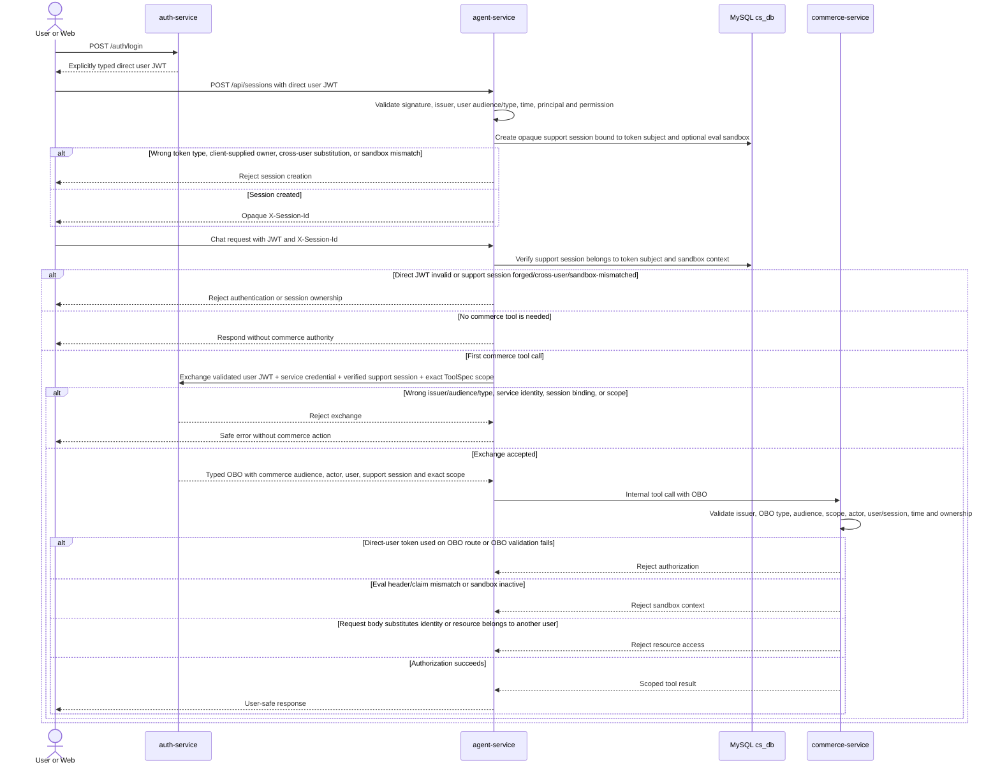

# CityBuddy capability contracts

This document records CityBuddy's durable technical contracts: ownership, truth hierarchy,
identity and security boundaries, transaction and replay invariants, public and internal
interfaces, and the retained designs that are deliberately outside the current implementation.

Unless a section is explicitly marked **Retained design**, it describes a boundary enforced by
the current code. Exact fields, dependency versions, schemas, grants, and runtime topology remain
executable truth in migrations, OpenAPI documents, source configuration, and contract tests.
Historical development slices and route decisions are archived under [docs/archive/](archive/README.md);
they explain provenance but do not define current behavior or process. Verified engineering
pitfalls are collected in [docs/LESSONS.md](LESSONS.md).

## Merchant analysis and approved price changes

The merchant API is enabled with `citybuddy.merchant.enabled=true`, alongside catalog and OBO
identity. ShopMate owns its operator-bound sessions. Auth accepts the `merchant-agent` service
identity only with a direct user holding `merchant:session:create`, issuing one exact read,
prepare, draft-read or cancel scope. Commerce endpoints require that actor and a matching
`X-Merchant-Session-Id`; the customer-support actor cannot access them. Auth does not query an
agent's session database.

`POST /internal/merchant/price-drafts` snapshots the authoritative product price and version for
one to three products. Its operator/session/idempotency key names an immutable intent. It does
not change product prices. Only a direct user with `merchant:price:apply` can approve the draft
through `POST /api/merchant/price-drafts/{draftId}/apply`, and the user must own that draft. An OBO
token or an approval statement in chat cannot substitute for this direct request.

Apply locks the draft and then all products in sorted ID order. The transaction uses READ
COMMITTED and checks activity association after taking product locks, without acquiring an
oppositely ordered activity lock. Products associated with any seckill activity are ineligible.
All versions and conditions are checked before writes; only price and publication version change.
The same transaction advances catalog generation, writes each `PRODUCT_PUBLICATION_CHANGED`
event, and persists the APPLIED receipt. A business conflict records REJECTED without product
writes. Cancellation records CANCELLED. Repeated approval returns the stored terminal result.
Database or unexpected failures roll back the complete transaction rather than becoming a
successful business rejection.

The three `merchant_*` reporting views expose catalog context and historical paid
order facts, with no user identities. Reporting connections use UTC and a bounded query timeout.
Analysis users have SELECT only on the views. Paid amount is gross before refunds, grouped by
currency and payment-success time in a half-open interval; current catalog prices never rewrite
historical sales. The deterministic fixture generator is `scripts/seed_merchant_fixture.py`.

Outbox completion is event-type specific: product and FAQ events have configured publishers.
Order and refund outbox records are retained transaction facts, not a promise that a worker
publishes every PENDING row. Backlog measurements must select the relevant delivery mechanism.

## 1. System context and current capabilities

CityBuddy combines local-commerce transactions with a text-only AI customer-support path. Its
defining boundary is not the number of services; it is that identity, transactional side effects,
retrieval evidence, and evaluation-only access remain independently enforceable.

| Component | Runtime boundary | Current responsibility |
|---|---|---|
| `auth-service` | Java 21 / Spring Boot 3.5 | Login, RS256 user tokens, service-authenticated token exchange, OBO tokens, JWKS publication and key rotation, and evaluation-only test identities. |
| `commerce-service` | Java 21 / Spring Boot 3.5 | Products, inventory, orders, seckill admission and ordering, mock payment, refund, CRM and FAQ truth, internal tool APIs, PendingAction and ActionReceipt truth, and evaluation-only state APIs. |
| `agent-service` | Python 3.11 / FastAPI / Pydantic | Customer-support APIs, bounded same-session context, one ReAct agent, deterministic control signals, model policy, tool mediation, PendingAction reference and decision handling, retrieval, bounded public projection, authoritative support evidence, confirmation of a prepared action, and projection of the receipt returned by commerce. |
| `knowledge-indexer` | Python 3.11 | Production RocketMQ FAQ synchronization, FAQ/product snapshot rebuilds, source-version ordering, tombstones, validation, and versioned Elasticsearch alias changes. |
| `web` | React / TypeScript / Vite | The current demonstration surface for login, products, seckill reservation status, support chat, and the full PendingAction lifecycle including confirmation and the receipt identifier returned by the server. |
| `litellm-proxy` boundary | OpenAI-compatible HTTP | Provider key isolation, rate limiting, same-tier provider failover, one bounded network retry, and usage/cost records when a proxy is deployed. It never makes business-tier routing decisions. Tests and the local demonstration use a deterministic compatible fake rather than a real provider. |

The retained MemoryPacker, support-ticket/handoff, and failure-candidate export designs are
separated under [Retained vNext designs and current non-goals](#contract-mainline-non-goals). A
listed retained responsibility is an ownership decision, not an implementation or deployment
claim. [README.md](../README.md) states the verified runnable scope.

### 1.1 Executable contract and version truth

- Exact dependency versions, image digests, generated schemas, lockfiles, and executable tool
  configuration are runtime version truth. Markdown records compatibility boundaries and choices;
  it is not a parallel lockfile.
- Database migrations, OpenAPI documents, ToolSpec definitions, source-owned inventories, and
  contract tests are executable truth for field names and payload details. This document fixes
  cross-component invariants without duplicating every DDL column or DTO field.
- Public model configuration uses role aliases only. Concrete provider model identifiers belong in
  runtime configuration and, where needed, recorded run metadata.

## 2. Shared platform and trust foundations

The anchor above is retained for historical links. These are durable boundaries, not a release
freeze: changes follow the current working agreement in [AGENTS.md](../AGENTS.md).

### 2.1 Service and language boundaries

- `auth-service` owns token issuance, token exchange, service authentication at the exchange
  endpoint, JWKS, signing-key lifecycle, and evaluation-only test-token issuance. No other service
  owns a token-signing key.
- `commerce-service` owns transactional business state and every business-side authorization
  decision, including audience, scope, sandbox, and resource ownership.
- `agent-service` owns support orchestration and support evidence. It can request a delegated token
  but cannot issue identity, choose arbitrary scopes, or substitute a user identifier from a
  request body.
- `knowledge-indexer` is an asynchronous projection worker and snapshot consumer. It does not
  become a source of product or FAQ truth.
- `web` is a client, not an authority for confirmation, identity, price, stock, action status, or
  sandbox state.
- An OpenAI-compatible model proxy is provider infrastructure, not a business router. Business-tier
  selection stays in `agent-service`.
- Java owns authentication and commerce transactions. Python owns the agent path and indexing
  worker. Cross-language synchronous calls use internal HTTP/REST JSON; RocketMQ is used only for
  asynchronous messaging.

### 2.2 Storage topology and truth hierarchy

- MySQL 8 is one physical instance with two logical databases: `commerce_db` and `cs_db`.
  Cross-database joins are forbidden; data crosses service boundaries through APIs or events.
- Runtime identities are distinct: `auth_app` accesses only auth-owned principals, credential
  verifiers, service identities, signing-key metadata, and evaluation test-principal records;
  `commerce_app` accesses only commerce-owned transaction and business tables; `agent_app`
  accesses only agent-owned tables in `cs_db`.
- A bootstrap/admin identity exists only to create databases, accounts, and grants. When MySQL
  requires the grantor to hold delegated privileges with `GRANT OPTION`, those privileges live in
  a dedicated non-default grant role. `activate_all_roles_on_login` remains `OFF`. A one-shot grant
  job verifies a new session has `CURRENT_ROLE()=NONE`, activates the role only for the repository's
  fixed version-controlled allowlist of exact `GRANT`/`REVOKE` statements, and returns the session
  to `NONE`. The role and bootstrap credentials are absent from migration and runtime
  configuration. The job accepts no caller-supplied SQL and executes no business-data DML.
  Separate migration identities execute only their owning migration streams. Runtime identities
  do not execute DDL, have no global/admin grants, and never use bootstrap/admin credentials.
- Auth-owned persistence remains an auth-owned table family in `commerce_db`; this does not give
  `commerce_app` access to credential or private identity metadata and does not add a third
  database.
- `commerce_db` is current truth for products, orders, inventory, seckill allocation,
  reservations, payments, refunds, CRM, published FAQ state, PendingAction, ActionReceipt,
  sandbox registration, and transaction Outbox records. It is also the retained owner for a future
  authoritative support-ticket capability.
- `cs_db` is current truth for support sessions, event/evidence records, retrieval evidence,
  feedback, PendingAction references, and receipt projections. It is the retained owner for future
  summaries, handoff projections, and failure candidates. A projection never overrides commerce
  action or ticket truth.
- Commerce Redis is a separate Redis 7 instance using `noeviction` and AOF. Support Redis is a
  separate Redis 7 instance using TTL-oriented data and LFU eviction.
- MySQL remains truth for current transactions, inventory, quotas, action state, and idempotency;
  `commerce_db` is the retained truth owner for a future ticket capability. Redis is only admission
  control, a projection, a lock, or a cache. A Redis success alone never proves an order, refund,
  payment, or confirmed action.
- Elasticsearch is a derived public-knowledge index and never contains private orders, refunds,
  personal coupons, or other user-private transactional data.

### 2.3 Runtime access boundaries

| Identity/component | May write | May read | Forbidden direct access |
|---|---|---|---|
| Bootstrap/admin identity | Database creation, account creation, and grants only; an explicit one-shot grant job may temporarily activate its dedicated non-default grant role solely for the repository's fixed version-controlled allowlist of exact `GRANT`/`REVOKE` statements | Server metadata required for bootstrap and grant verification | Application runtime use, ordinary migrations, a default-active grant role, caller-supplied SQL, ad hoc privilege mutation, or business-data `SELECT`/`INSERT`/`UPDATE`/`DELETE` even while the grant role is active |
| Auth migration identity | Auth-owned migration stream in `commerce_db` | Auth migration history and auth-owned schema metadata | Commerce business tables, `cs_db`, application runtime |
| Commerce migration identity | Commerce-owned migration stream in `commerce_db` | Commerce migration history and commerce-owned schema metadata | Auth credential/private metadata, `cs_db`, application runtime |
| Agent migration identity | Agent-owned migration stream in `cs_db` | Agent migration history and agent-owned schema metadata | `commerce_db`, application runtime |
| `auth_app` / `auth-service` | Auth-owned principal, credential-verifier, service-identity, signing-key metadata, and eval test-principal records | The same auth-owned family | Commerce business table families, `cs_db`, Elasticsearch; DDL/global/admin grants |
| `commerce_app` / `commerce-service` | Commerce-owned business tables, transaction Outbox, sandbox registry, Commerce Redis, and any future authoritative ticket tables | Commerce-owned business tables; JWKS over HTTP | Auth credential/service-identity/private metadata, `cs_db`, Support Redis, direct model providers; DDL/global/admin grants |
| `agent_app` / `agent-service` | Agent-owned `cs_db` tables and Support Redis | Agent-owned `cs_db`; Elasticsearch; commerce data only through scoped tool APIs; JWKS over HTTP; model proxy | All `commerce_db` tables, signing keys, direct provider credentials; DDL/global/admin grants |
| `knowledge-indexer` | Versioned Elasticsearch indexes; allowed FAQ-version cache entries in Support Redis | Knowledge events and published source snapshots | Runtime writes to `commerce_db` or `cs_db`; private order/refund data |
| `web` | No authoritative data store | Public/user-scoped HTTP APIs | Databases, Redis, Elasticsearch, RocketMQ, signing material |
| Model proxy | Provider-routing, usage, and cost records configured for the proxy | Runtime alias mapping and provider credentials | Business databases, ToolSpec policy, user/resource authorization decisions |

### 2.4 Conflict-resolution order

When two stores disagree, resolve the conflict in this order:

1. `commerce_db` for transaction, inventory, quota, resource ownership, PendingAction,
   ActionReceipt, sandbox, payment, and refund truth;
2. `cs_db` for support evidence observed and persisted by `agent-service`;
3. Elasticsearch for a versioned public-knowledge projection;
4. Redis for admission state, projections, locks, or caches;
5. optional observability data as a non-authoritative mirror.

### 2.5 Fail-closed security rules

- Authentication failure is never converted into an anonymous business request.
- Missing audience, scope, actor, owner, session, or required sandbox context rejects; it does not
  fall back to a broader query.
- Production identity and protected tool boundaries reject `X-Eval-Sandbox-Id`; production does
  not load `/api/eval/*` or evidence routes. Public health endpoints do not authenticate that header.
- Evaluation requests require both management authentication and sandbox-bound user identity for
  black-box chat. The management credential is not a substitute for a user JWT.
- SQL repositories, batch updates, deletes, and asynchronous consumers that participate in
  evaluation are covered by tests proving sandbox filtering. An absent sandbox context in an
  evaluation path fails before SQL mutation.
- Tool inputs and outputs follow their explicit allowlists and bounded-view policies. A reversible
  personal-data masking layer is not implemented; callers must not assume that arbitrary text is
  anonymized before a model request.
- Tool results are stored server-side in full only where evidence policy allows. The model receives
  a bounded view, and SSE receives a smaller allowlisted view.
- Secrets are injected at runtime, excluded from logs, absent from committed examples, and scanned
  before merge.

## 3. Capability contract index

The historical anchors above now land on this capability-first index. Each implemented capability
co-locates its persistent invariants, synchronous interfaces, asynchronous boundaries, and any
sequence that materially explains the contract. Full request and response fields remain in the
[agent](../agent-service/openapi.json),
[auth](../auth-service/src/main/resources/openapi.json), and
[commerce](../commerce-service/src/main/resources/openapi.json) OpenAPI documents and the
[ToolSpec definitions](../agent-service/src/citybuddy_agent/agent_control.py).

| Capability | Persistent truth and invariants | Interfaces and sequences | State |
|---|---|---|---|
| Identity and delegation | Principals, service identities, signing-key metadata, support-session binding | Login, JWKS, exchange, evaluation test identity, JIT OBO sequence | Implemented |
| Catalog and standard ordering | CRM, products, stock, standard orders, Outbox | Product reads and idempotent order creation | Implemented |
| Seckill and inventory convergence | Activity allocation, reservations, uniqueness, inventory ledger | Reservation APIs, transaction and delay messages, RocketMQ sequence | Implemented |
| Payment, refund, and sensitive action | Payment attempts/callbacks, refunds, PendingAction, ActionReceipt | Payment, refund, prepare/confirm, receipt projection, confirmation sequence | Implemented |
| Support agent and evidence | Conversations, ordered evidence, feedback, receipt projection | Chat, SSE, feedback, scoped commerce tool | Implemented |
| Knowledge and retrieval | FAQ/product source versions, retrieval evidence, index aliases, FAQ cache | Snapshot, FAQ events, application-side RRF | Implemented |
| Evaluation-only access | Test principals, sandbox lifecycle, scoped audit/evidence | Reset, completion, liveness, state, audit, version, evidence | Implemented only in the evaluation profile |
| Memory, handoff, and candidate export | Summary watermark, authoritative ticket, projections, reviewed candidate | Proposed async and cross-system contracts | Retained design |

## 4. Identity, support sessions, and delegated authorization

Token classes are distinguished explicitly by a token-purpose/type claim or an equivalent
independent authentication chain. Absence of an actor claim is never treated as a permissive
direct-user downgrade.

### 4.1 Direct user JWT

1. A user logs in through `auth-service` and receives an RS256-signed direct user JWT.
2. User-facing routes in `agent-service` and `commerce-service` validate signature, fixed issuer,
   configured user-facing audience, expiry, not-before, accepted clock skew, user principal,
   route-required role or user permission, and resource ownership.
3. An unknown `kid` triggers one JWKS refresh and one validation retry; continued failure rejects.
4. A direct user JWT does not require `act.azp`, an OBO scope, or a support-session identifier.
   Production direct-user tokens do not carry an evaluation sandbox claim.

### 4.2 Agent OBO

5. Conversation and public FAQ paths do not acquire commerce authority. Before an internal
   commerce tool invocation, `agent-service` requests a short-lived OBO just in time.
6. `POST /api/sessions` is the only support-session bootstrap. It requires a direct user JWT;
   `agent-service` generates an opaque session id and binds it to the validated token subject. In
   evaluation it also binds the sandbox context. The client cannot choose the owner. Wrong token
   type, cross-user substitution, or sandbox mismatch rejects. `X-Session-Id` identifies this
   support session, not a login-token session, and every use is rechecked against the validated user
   and sandbox context in `cs_db`.
7. For that tool invocation, `agent-service` submits the validated user JWT, its independently
   authenticated service credential, the verified support-session binding, and the exact
   server-side ToolSpec scope to token exchange. `auth-service` trusts the authenticated service's
   session-binding assertion and writes that support session into the OBO. Service authentication
   reads current state, scope, and the exact persisted verifier on every exchange. New machine
   credentials are `cbsvc_v1_` tokens containing 256 CSPRNG bits and store a versioned, client-bound
   SHA-256 digest; `scripts/service_credential.py` is the provisioning primitive. The digest is safe
   only for those generated high-entropy tokens, not for human-chosen passwords. Legacy service
   BCrypt rows remain accepted and execute BCrypt on every request; no successful verifier is
   cached. Deploying a new binary does not rewrite those rows: obtaining the digest-path behavior
   requires an explicit `generate` then client-bound `hash` credential rotation. Human login always
   executes BCrypt directly. New application-generated BCrypt hashes use configured strength 12;
   verification honors the cost encoded in each persisted hash.
8. The OBO contains at least an explicit OBO purpose/type, `sub`, `user_id`, support `session`,
   `aud=commerce-service`, exact `scope`, `act.azp=agent-service`, `jti`, `exp`, and applicable
   not-before/issued-at metadata. Scope is fixed by ToolSpec; neither model nor request payload can
   widen it. `jti` is required but is not consumed: the OBO is a bearer token, not a server-enforced
   single-use capability, and remains subject to every validation above until expiry.
9. `commerce-service` accepts internal tool identity only from the validated OBO. It validates
   signature, fixed issuer, OBO purpose/type, audience, exact required scope, actor, user subject,
   support session, expiry/not-before/skew, and resource ownership. It never trusts identity fields
   in the request body.
10. Evaluation test JWTs and derived OBO tokens carry the same sandbox claim. Internal tool
    requests also require sandbox header/claim equality and an ACTIVE sandbox. Production tokens
    carry no sandbox claim, and production rejects the evaluation header.
11. Signing private keys stay in `auth-service` secret material. Public keys overlap for at least
    the maximum token lifetime plus accepted clock skew during rotation.

### 4.3 Persistent identity invariants

| Entity | Owner/store | Unique invariant | Lifecycle or boundary | Executable source |
|---|---|---|---|---|
| User principals, login credentials, service identities, signing-key metadata | `auth-service`; auth-owned family in `commerce_db`; runtime identity `auth_app` | Stable user subject and unique login identifier; unique service client identity; unique `kid` per active public-key set | Principal `ACTIVE/DISABLED`; service credential independently revocable; signing keys overlap during rotation; private keys are never returned | Auth migrations and OpenAPI |
| Support session identity and ownership | `agent-service`; `cs_db`; runtime identity `agent_app` | Server-generated opaque session id bound to immutable user subject and, in evaluation, sandbox context | Direct-user-authenticated creation; client cannot choose owner; cross-user, wrong-token-type, and sandbox mismatch reject | Agent migrations and OpenAPI |
| Evaluation test-principal provisioning record | `auth-service`; auth-owned family in `commerce_db`; runtime identity `auth_app` | Unique opaque test-user handle bound to sandbox and case correlation; idempotent provisioning and revoke keys | TTL-bound provisioned/revoked lifecycle; duplicate reset returns the same valid binding or deterministic conflict; token issuance validates this record only and never reads commerce tables | Auth evaluation migration and OpenAPI |

### 4.4 Identity interfaces

| Caller → owner | Method and path | Authentication | Required boundary | Success semantics | Rejection semantics |
|---|---|---|---|---|---|
| `web` → `auth-service` | `POST /auth/login` | User credential exchange | No bearer token; request fields defined by OpenAPI | Returns an explicitly typed direct-user JWT with fixed issuer, configured user-facing audience, principal, time bounds, and route-relevant authority | Invalid/disabled principal rejects without credential disclosure |
| `agent-service` or `commerce-service` → `auth-service` | `GET /auth/jwks` | Public-key distribution endpoint | Stable `kid`; cache validators allowed | Returns current and overlapping public keys only | Unavailable/malformed key set causes fail-closed validation after one bounded refresh |
| `web` or authorized evaluator → `agent-service` | `POST /api/sessions` | Direct user JWT | Fixed issuer, user audience, explicit direct-user type, user principal/permission; evaluation also supplies matching sandbox context | Generates an opaque support-session id server-side and binds it to token subject and, when applicable, sandbox | Client-supplied owner, wrong token type, cross-user substitution, invalid audience/issuer, sandbox mismatch, or production eval header rejects |
| `agent-service` → `auth-service` | `POST /auth/token/exchange` | Independent `agent-service` credential plus validated direct-user JWT | Verified subject and support-session binding; exact ToolSpec scope | Returns a short typed OBO with `aud=commerce-service`, exact scope, actor, user, support session, time bounds, and unchanged eval sandbox claim when applicable | Wrong issuer/audience/type, invalid service credential, forged session binding, disallowed scope, or claim-mode mismatch rejects |
| `commerce-service` → `auth-service` | `POST /internal/eval/test-principals/provision` | Dedicated commerce service authentication; evaluation profile only | Sandbox id, case correlation, TTL, minimum test-subject attributes, idempotency key | Creates or returns the same TTL-bound provisioning record and opaque handle; returns no credential | Invalid service identity, conflicting duplicate, invalid TTL/subject, dead/revoked correlation, or production profile rejects |
| `commerce-service` → `auth-service` | `POST /internal/eval/test-principals/{handle}/revoke` | Dedicated commerce service authentication; evaluation profile only | Opaque handle, required sandbox/case correlation, idempotency key | Idempotently revokes or confirms invalidation of the auth-owned provisioning record | Other service identity, mismatched handle/correlation, invalid credential, or production profile rejects |
| Authorized evaluator → `auth-service` | `POST /auth/eval/test-token` | Independent evaluation API credential; evaluation profile only | `X-Eval-Sandbox-Id` and opaque test-user handle matching an unexpired provisioning record | Returns an explicitly typed test direct-user JWT carrying the bound sandbox claim | Arbitrary sandbox id, wrong handle, expired/revoked record, mismatch, invalid credential, or production profile rejects |

### 4.5 Direct user JWT to support-session validation to JIT OBO

```mermaid
sequenceDiagram
    actor U as User or Web
    participant A as auth-service
    participant G as agent-service
    participant S as MySQL cs_db
    participant C as commerce-service

    U->>A: POST /auth/login
    A-->>U: Explicitly typed direct user JWT
    U->>G: POST /api/sessions with direct user JWT
    G->>G: Validate signature, issuer, user audience/type, time, principal and permission
    G->>S: Create opaque support session bound to token subject and optional eval sandbox
    alt Wrong token type, client-supplied owner, cross-user substitution, or sandbox mismatch
        G-->>U: Reject session creation
    else Session created
        G-->>U: Opaque X-Session-Id
    end
    U->>G: Chat request with JWT and X-Session-Id
    G->>S: Verify support session belongs to token subject and sandbox context

    alt Direct JWT invalid or support session forged/cross-user/sandbox-mismatched
        G-->>U: Reject authentication or session ownership
    else No commerce tool is needed
        G-->>U: Respond without commerce authority
    else First commerce tool call
        G->>A: Exchange validated user JWT + service credential + verified support session + exact ToolSpec scope
        alt Wrong issuer/audience/type, service identity, session binding, or scope
            A-->>G: Reject exchange
            G-->>U: Safe error without commerce action
        else Exchange accepted
            A-->>G: Typed OBO with commerce audience, actor, user, support session and exact scope
            G->>C: Internal tool call with OBO
            C->>C: Validate issuer, OBO type, audience, scope, actor, user/session, time and ownership
            alt Direct-user token used on OBO route or OBO validation fails
                C-->>G: Reject authorization
            else Eval header/claim mismatch or sandbox inactive
                C-->>G: Reject sandbox context
            else Request body substitutes identity or resource belongs to another user
                C-->>G: Reject resource access
            else Authorization succeeds
                C-->>G: Scoped tool result
                G-->>U: User-safe response
            end
        end
    end
```

## 5. Catalog and standard ordering

### 5.1 Persistent invariants

| Entity | Owner/store | Unique invariant | Transaction boundary | Executable source |
|---|---|---|---|---|
| User profile/CRM | `commerce-service`; `commerce_db`; runtime identity `commerce_app` | One profile per immutable user subject | Commerce rules write; `agent-service` reads only through a scoped commerce tool | Commerce catalog migration |
| Product and published product content | `commerce-service`; `commerce_db` | Stable product identifier; publication/version increases monotonically | Product update and its Outbox event commit together; price and stock remain live commerce fields | Commerce catalog migration and OpenAPI |
| Standard order and stock item | `commerce-service`; `commerce_db` | Stable order id; request idempotency key unique in user/action scope | Conditional stock decrement or optimistic version check and order creation form one MySQL business transaction; finite retry only | Commerce ordering migration and OpenAPI |
| Transaction Outbox | `commerce-service`; `commerce_db` | Unique event id and aggregate version/idempotency key | Business mutation and Outbox insert commit together; publisher progress never changes the business result | Commerce migrations and workers |

### 5.2 Interfaces

| Caller → owner | Method and path | Authentication | Required boundary | Success semantics | Rejection semantics |
|---|---|---|---|---|---|
| `web` → `commerce-service` | `GET /api/products`, `GET /api/products/{productId}` | Direct-user JWT | Authenticated routes validate fixed issuer/user audience/direct type, permission, and no body identity | Returns published product data with live commerce fields | Wrong issuer/audience/type, forbidden profile/resource, or missing product rejects |
| `web` → `commerce-service` | `POST /api/orders` | Direct-user JWT | Direct-user identity, permission, ownership, `Idempotency-Key` | Atomically creates or returns the same standard order after a valid MySQL stock update | Wrong identity mode, cross-user resource, insufficient stock, conflicting idempotency, illegal quantity, or stale version rejects |

### 5.3 Product publication events

Product publication and its Outbox row commit together. The current `product-publication` normal
message is consumed by `commerce-service` to invalidate/rebuild its product cache projection;
duplicates and late delivery cannot reverse a newer MySQL publication version. Product documents
for the public-knowledge index are obtained through the authoritative snapshot/rebuild interface,
not by treating the product cache-invalidation consumer as a knowledge-indexer feed.

## 6. Seckill, inventory, and asynchronous convergence

### 6.1 Messaging and consistency responsibilities

- RocketMQ 5 runs with Broker and Proxy available to the 5.x clients. The Proxy endpoint remains
  explicit.
- Live seckill admission has one path: Redis Lua `preAdmit`, transaction half message, MySQL
  admitted reservation, then broker commit. Deterministic rejections write a Redis intent
  anchor plus reservation/decision projections, with an absolute 15-minute replay window that
  replay does not refresh; they do not
  access business MySQL or RocketMQ. Admitted user markers live until the activity ends, not
  merely until the request replay window expires.
- Lua admission records a pending handoff before returning. A bounded worker retries those
  handoffs through the same half-message/MySQL path; MySQL rollback leaves the handoff available
  for recovery. The existing activity rebuild lease blocks projection rebuild or cancellation
  while a handoff is pending, so republishing quota cannot erase an admission not yet in MySQL.
  Old MySQL-`PENDING` preparation and deadline APIs remain for legacy persistence fixtures, but
  neither the HTTP runtime nor the worker calls them.
- The transaction checker reads only the durable MySQL reservation and returns `UNKNOWN` when
  it is missing, historically `PENDING`, or temporarily unreadable. Duplicate delivery is settled
  by the existing MySQL order and ledger invariants, not by an observed callback count. This
  path assumes a fresh fixture rather than online migration from old pending rows; it reuses the
  existing rebuild lease without a new persistent write fence; Redis restart/data loss requires
  operators to stop admission and rebuild from authoritative rows before reopening traffic.
- Downstream order creation is idempotent. Database unique constraints, an inventory-ledger
  movement keyed by the business event, and conditional transitions handle repeated delivery; a
  duplicate returns or projects the existing result. Lua admission reserves per-activity quota,
  while locked MySQL rows are final for stock shared by overlapping activities and the
  activity-user uniqueness key. A positive stock shortfall or an order held by another reservation
  on that key records terminal `UNFULFILLED` with the original `ADMITTED` decision, projection
  version 3, no durable order, and no activity-quota refund; retries replay that result.
- Transaction and timeout consumers leave failed messages unacknowledged, process the remaining
  received messages, then rethrow the first failure with later failures suppressed. The Broker
  owns delivery retries and dead-letter policy. Timeout dispatch scans both `PENDING` and `FAILED`
  unpaid orders in bounded batches, prioritizing the lowest failed-send count. A failed activation
  batch exits the startup cutoff so newer orders remain eligible; a send failure is recoverable
  until a durable Broker message identity is recorded.
- The inventory ledger covers seckill order creation and replay idempotency, atomic unpaid
  cancellation with inventory/activity-quota restoration, payment movements, refund movements,
  and full reconciliation.
- Delay messages trigger unpaid-order cancellation and, in the retained handoff design, ticket SLA
  checks. Delivery is a trigger, not authority: consumers re-read MySQL state and use conditional
  status/version updates.
- A consumer may produce a terminal business disposition only from a positively established
  business conclusion. Integrity failure, dependency unavailability, timeout, malformed or
  contradictory owner-local state, and any result whose truth cannot be determined are not
  business conflicts, denials, absence, or successful terminal outcomes; they remain retryable or
  explicitly unavailable and must preserve the opportunity to reconstruct from authoritative
  truth. Broad exception or result mappings must not fold those fault classes into ACK, reject,
  drop, not-found, or another terminal decision. Each stateful consumer must preserve this
  classification across its persisted state classes and mutation phases, including the indeterminate
  window after an authoritative mutation but before owner-local projection finalization.
- MySQL-derived product, FAQ, order, refund, and retained ticket events use an Outbox row
  written in the same local transaction as the business change. A retained authoritative ticket
  capability would produce its own state, SLA event, and Outbox in `commerce-service`; the agent
  would only request handoff and store a projection.
- Transaction messages, delay messages, domain events, and FAQ knowledge-sync events are distinct
  responsibilities. Request threads do not dual-write MySQL, Redis caches, and Elasticsearch as
  independent truths.

### 6.2 Persistent invariants

| Entity | Owner/store | Unique invariant | State or transaction boundary | Executable source |
|---|---|---|---|---|
| `seckill_activity` | `commerce-service`; `commerce_db` | Stable activity id; allocation cannot exceed inventory assigned to it | Quota allocation is a MySQL transaction; Redis receives only admission projection | Seckill activity migration |
| Reservation | `commerce-service`; Redis admission/replay state, admitted business truth in `commerce_db` | Unique `reservation_id`; Redis never creates an order | Live rejection remains Redis-only for 15 minutes; an admitted Redis handoff polls as `PENDING` until handoff completion; MySQL admission inserts `ADMITTED`; order consumption records `ORDERED` or admission-consuming `UNFULFILLED`, unpaid timeout may record `CANCELLED`; historical MySQL `PENDING/REJECTED` rows remain readable | Admission store, reservation service, and transaction-order migrations |
| One-user-one-order | `commerce-service`; `commerce_db` plus Lua marker | Database uniqueness on `(activity_id, user_subject)` and `reservation_id` | Lua blocks repeat users until activity end; database uniqueness is final and repeated messages resolve to existing result | Transaction-order migration and consumer |
| `inventory_ledger` | `commerce-service`; `commerce_db` | Unique business event/idempotency key per movement | Order creation, cancellation/restoration, payment, and refund movements reconcile against authoritative order/payment state | Commerce transaction migrations |

### 6.3 Interfaces

| Caller → owner | Method and path | Authentication | Required boundary | Success semantics | Rejection semantics |
|---|---|---|---|---|---|
| `web` → `commerce-service` | `POST /api/seckill/activities/{activityId}/reservations` | Production direct-user JWT | Direct-user claims, ownership, idempotency; evaluation tokens/headers are not accepted | Starts transaction-message admission and returns reservation status, never a false completed-order claim | Identity/type/audience failure, evaluation context, no quota, duplicate user, inactive activity, or bounded indeterminate result rejects or returns explicit status |
| `web` → `commerce-service` | `GET /api/reservations/{reservationId}` | Production direct-user JWT | Direct-user claims and ownership; evaluation tokens/headers are not accepted | Returns Redis-only `PENDING` handoff or `REJECTED` within its replay window, otherwise owned MySQL status (`ADMITTED`, `ORDERED`, `UNFULFILLED`, `CANCELLED`, or historical `PENDING/REJECTED`) without inventing an order | Cross-user access, evaluation context, or unknown/expired Redis-only reservation rejects |

### 6.4 Asynchronous contracts

| Channel | Producer → consumer | Message type | Stable payload/invariant | Failure and replay rule | State |
|---|---|---|---|---|---|
| Seckill order transaction | Commerce producer → commerce order consumer | Transaction | Reservation/activity/user ids, event id, version; current production payload carries no sandbox and consumer rejects the reserved sandbox property | Half message is sent after Lua admission and commits only after MySQL `ADMITTED`; pending handoff retains recovery work; checker reads MySQL, and uniqueness plus ledger movements make replay harmless | Implemented |
| Order/payment timeout | `commerce-service` → commerce timeout consumer | Delay | Order id, expected state/version, due time, event id; current production payload carries no sandbox and consumer rejects the reserved sandbox property | Re-read MySQL on every delivery; conditional cancellation and ledger restoration are idempotent; paid/final orders are not cancelled. Broker group policy owns retry/DLQ. EARLY changes invisibility without ACK. ACK or change-invisibility exceptions leave Broker state unconfirmed; malformed, business and control failures leave their message unacknowledged while later received messages continue. The first failure is rethrown after the batch. Any redelivery re-reads MySQL | Implemented |
| Commerce domain events | Commerce Outbox publisher → authorized consumers | Normal | Event id, aggregate/version, occurred time; current payloads carry no sandbox and production consumers reject the reserved sandbox property | Mutation and Outbox commit together; consumers are idempotent; late events cannot reverse newer state | Implemented; current product event consumer is commerce cache invalidation |

### 6.5 RocketMQ transaction message, Lua admission, and idempotent order creation

```mermaid
sequenceDiagram
    actor U as User or Web
    participant C as commerce-service producer
    participant M as RocketMQ Broker and Proxy
    participant R as Commerce Redis
    participant W as commerce-service consumer
    participant D as MySQL commerce_db

    U->>C: Request seckill reservation
    C->>R: Run Lua quota, one-user, and reservation admission

    alt Lua rejects and writes intent anchor plus reservation/decision projections
        R-->>C: Rejected
        Note over C,D: No business MySQL or RocketMQ request
        C-->>U: Rejected reservation status
    else Lua admits and writes a pending handoff with reserved quota
        R-->>C: Admitted handoff with reservation id
        C->>M: Send transaction half message
        M-->>C: Half message accepted
        C->>D: Insert ADMITTED reservation in MySQL transaction
        alt MySQL transaction rolls back or is unavailable
            D-->>C: No committed admission
            Note over C,R: Keep pending handoff for bounded worker recovery
        else MySQL admission commits
            D-->>C: Durable ADMITTED reservation
            C->>M: Commit half message
            opt Broker commit acknowledged
                C->>R: Complete handoff without shortening user-marker lifetime
            end
        Note over M,W: Only a committed half message can be delivered
        M-->>W: Deliver committed transaction message
        W->>D: Conditional order insert and reservation transition
        alt Locked stock is short or another reservation owns the activity-user order
            D-->>W: Reservation UNFULFILLED at projection version 3; no order
            W-->>M: Acknowledge terminal disposition
        else Unique activity-user or reservation key already exists
            D-->>W: Existing order/result
            W-->>M: Acknowledge duplicate safely
        else Insert and transition succeed
            D-->>W: New durable order
            W-->>M: Acknowledge consumption
        else Database failure
            D-->>W: Failure
            Note over W,M: No acknowledgement, bounded retry or dead-letter policy applies
        end
        C-->>U: Reservation id, client polls durable status
        end
    else Lua result cannot be determined
        R-->>C: Indeterminate
        Note over C,D: No new half message or MySQL admission
        C-->>U: Indeterminate reservation status
    end

    opt Pending handoff remains after send, MySQL, or commit uncertainty
        C->>R: Bounded worker reads due handoffs
        Note over C,D: Retry the same half-message/MySQL path with reservation idempotency
    end

    opt Second-phase acknowledgement is missing or result is UNKNOWN
        M->>C: Transaction checkback
        C->>D: Read durable reservation only
        alt MySQL state consumed admission
            C-->>M: COMMIT
        else Historical MySQL state is REJECTED
            C-->>M: ROLLBACK
        else MySQL state missing, PENDING, or temporarily unreadable
            C-->>M: UNKNOWN
            Note over M,C: UNKNOWN is intermediate only. Broker timeout, check interval, and maximum check count define the terminal boundary.
        end
    end
```

## 7. Payment, refund, and sensitive-action truth

### 7.1 Persistent invariants

| Entity | Owner/store | Unique invariant | State or transaction boundary | Executable source |
|---|---|---|---|---|
| Mock payment | `commerce-service`; `commerce_db` | Unique payment-attempt and callback idempotency keys per order | `UNPAID → PAID`; duplicate callbacks return existing state; illegal transitions reject; committed replay reconciles complete durable closure within caller authorization visibility | Payment migration, OpenAPI, and integration tests |
| Refund | `commerce-service`; `commerce_db` | Unique refund id and request idempotency key; the sum reserved by requested, processing, and succeeded refunds cannot exceed the authoritative paid amount | Requested/processing/succeeded/failed states are guarded by order/payment state; capacity uses a locking current read after the payment-attempt aggregate-root lock; refund, ledger, and Outbox share required transaction boundaries | Refund migration, OpenAPI, and integration tests |
| PendingAction | `commerce-service`; `commerce_db` | Unique `pending_action_id`; one server-derived idempotency key per turn/tool/argument hash | Prepared with argument hash, resource version, owner, expiry, and unconsumed state; confirmation validates, consumes once, executes, and persists receipt in one commerce transaction | Action migration and OpenAPI |
| ActionReceipt | `commerce-service`; `commerce_db` | Unique receipt id and action idempotency key | Persisted with successful action and immutable; repeated key returns existing receipt | Action migration and OpenAPI |

### 7.2 Interfaces

| Caller → owner | Method and path | Authentication | Required boundary | Success semantics | Rejection semantics |
|---|---|---|---|---|---|
| `web` → `commerce-service` | `POST /api/orders/{orderId}/mock-payment` | Direct-user JWT | Direct-user identity, ownership, `Idempotency-Key` | Starts eligible mock payment or replays complete committed truth after canonical owner visibility is established | Wrong identity mode, paid/cancelled/ineligible order, cross-user access, concealed ownership, idempotency conflict, or damaged visible durable truth rejects |
| Mock payment component → `commerce-service` | `POST /internal/mock-payments/callback` | Separate internal callback credential/signature | Callback idempotency, payment/order correlation, exact sandbox binding when applicable | Applies one legal transition; duplicate returns fully reconciled existing result | Invalid credential, unknown correlation, sandbox mismatch/inactivity, illegal transition, or damaged durable closure rejects and audits |
| `web` → `commerce-service` | `POST /api/orders/{orderId}/refunds` | Direct-user JWT | Direct-user identity, ownership, canonical refund intent, `Idempotency-Key` | Creates one eligible refund and Outbox event atomically, or replays the same committed owner/order/key/intent result | Malformed amount, wrong identity/evaluation mode, missing/non-owned order, lifecycle or durable-integrity conflict, indeterminate committed observation, or unavailable persistence rejects with its typed status |
| `agent-service` → `commerce-service` | `POST /internal/tools/actions/prepare` | Agent OBO only | Exact sensitive scope, actor, owner/session, idempotency, trace/turn correlation, sandbox equality and liveness | Creates or returns PendingAction bound to owner, session, argument hash, target version, and expiry | Token mode, actor, scope, session, ownership, stale resource, conflict, or sandbox failure rejects |
| `agent-service` → `commerce-service` | `POST /internal/tools/actions/{pendingActionId}/confirm` | Agent OBO only | Same owner/session/scope, exact sandbox equality, confirmation idempotency | One transaction validates, consumes, executes, and persists ActionReceipt | Expired/consumed action, mismatch, ownership, illegal transition, or sandbox failure rolls back |

### 7.3 PendingAction, confirmation, receipt, and evidence boundary

- ToolSpec defines each tool's schema, risk tier, fixed scope, timeout, idempotency behavior, and
  model-visible output. The model cannot expand scope or bypass confirmation.
- Read and ordinary write tools are checked at `commerce-service`. Sensitive actions first create a
  PendingAction in `commerce_db`; `agent-service` stores only the validated reference and presents
  a text confirmation request.
- Confirmation is not a front-end security primitive. In one commerce transaction, the service
  validates argument hash, resource version, expiry, ownership, unconsumed state, and current refund
  capacity after locking the payment aggregate root; consumes the PendingAction once; executes the
  business mutation; and persists an ActionReceipt.
- Before the irreversible commerce call, the agent atomically claims its local reference from
  `PENDING` to `CONFIRMING` in a separate committed transaction. A transport failure after the
  commerce commit therefore leaves a claim that can safely re-enter commerce and replay the
  receipt; it never leaves a local durable statement that the action was declined or never
  attempted.
- A strict Commerce `409` Action error in category `CONFLICT` or
  `INCONSISTENT_DURABLE_STATE` resolves that claim, its `ACTION_REJECTED` evidence, and the
  confirming turn's `action_rejected` outcome atomically. It records that Commerce rejected the
  request and returned no receipt; it does not infer whether an inconsistent pre-existing durable
  state includes a business effect. Malformed errors, other 4xx statuses, rate limits, server
  failures, transport failures, and invalid success responses leave the reference `CONFIRMING` so
  a later exact confirmation can recover.
- A successful Commerce ActionReceipt remains immutable action truth. The agent projects it into
  `cs_db.action_receipt_projection` in the same transaction that resolves the reference to
  `CONFIRMED` and commits the turn as `action_completed`; none of those three may exist without the
  others. Commerce is idempotent per PendingAction, so confirmation retried after a lost response
  replays the committed receipt rather than refunding twice.
- JSON `reply` and public SSE `token` prose are the same bounded, non-authoritative explanation of
  one durable turn. They are structurally validated on first response and replay, but are not a
  semantic truth classifier and may contradict business state. A client renders successful action
  only when `action_completed` is paired with the stored receipt projection. On SSE the receipt
  leads the stream, has exact status `REQUESTED`, and terminal `done` carries `action_completed`;
  neither may appear without the other. The web surface keeps this distinction visible.
- The server derives write idempotency from `turn_id`, tool identity, and argument hash. A repeated
  key returns the existing action result or receipt.
- Internal events may include text, tool, retrieval, guard, error, PendingAction
  preparation/confirmation/decline/expiry, and completion evidence. Public `action_receipt` is
  emitted from stored projection only, with the identifier and `REQUESTED` request-recording
  status durably recorded.

### 7.4 PendingAction, atomic confirmation, ActionReceipt, and retry sequence

The whole sequence is implemented. Commerce owns prepare/confirm/ActionReceipt; the agent claims
the reference before the commerce call, then projects the receipt and commits the
`action_completed` turn in the transaction that resolves the reference.

```mermaid
sequenceDiagram
    actor U as User
    participant G as agent-service
    participant C as commerce-service
    participant D as MySQL commerce_db
    participant E as MySQL cs_db

    U->>G: Request a sensitive action
    G->>C: Prepare action with OBO and server idempotency key
    C->>D: Create PendingAction bound to owner, args hash, version, and expiry
    D-->>C: PendingAction persisted
    C-->>G: pending_action_id and confirmation summary
    G-->>U: Ask for text confirmation

    alt User declines or never confirms
        Note over G,C: No business mutation is executed
    else User sends confirmation text
        U->>G: Confirm
        G->>E: Claim reference, PENDING to CONFIRMING, in its own transaction
        G->>C: Confirm pending_action_id with OBO
        C->>D: Begin one business transaction
        D->>D: Validate owner, scope, args hash, resource version, expiry, and unconsumed state
        D->>D: Lock payment root; current-read refund capacity
        alt Validation fails or business transition is illegal
            D-->>C: Roll back
            C-->>G: Structured rejection, no receipt
            alt Strict Commerce 409 CONFLICT or INCONSISTENT_DURABLE_STATE
                G->>E: Resolve claim and turn atomically as REJECTED/action_rejected
                G-->>U: Fixed rejection, no receipt
            else Ambiguous, invalid, or transient response
                Note over G,E: Keep CONFIRMING for a later exact confirmation
                G-->>U: Fixed typed failure
            end
        else Validation succeeds
            D->>D: Consume PendingAction once
            D->>D: Execute mutation and persist ActionReceipt
            D-->>C: Commit action and receipt together
            C-->>G: Authoritative ActionReceipt
            G->>E: Persist receipt projection and turn evidence
            G-->>U: SSE action_receipt, then explanation
            opt Repeat same request after commit point
                G->>E: Read stored turn and receipt projection
                Note over G,C: No model call and no second commerce execution
                G-->>U: Stored turn, or same receipt then explanation on SSE
            end
        end
    end
```

## 8. Support agent and durable evidence

### 8.1 Agent-control boundaries

- Production support uses one ReAct agent. There is no multi-agent or decomposer mainline.
- `RuleRouter` emits only deterministic signals for refund context and an exact chitchat greeting.
  Refund context is coarse capability relevance, not a claim that the user wants an action and not
  an authorization decision; policy, status, and negated refund messages intentionally remain in
  that context. Message length, high-risk duplication, and a wording whitelist for public FAQs are
  not treated as intent signals.
- `ModelRouter` converts those signals into a server-owned plan. Refund context exposes all current
  tools; exact chitchat exposes none and caps the configured attempt limit at three; every other
  input exposes read tools. The read default keeps public retrieval available when wording or
  published knowledge changes. The current deployment has one `standard` tier, so no signal
  invents an unconfigured tier or provider route.
- Tool visibility reduces what the model can request; it does not replace argument validation,
  delegated scope, ownership checks, confirmation, or any other `ToolAdapter` boundary. A known
  tool outside the selected profile is denied before identity or commerce I/O.
- The model proxy may retry or fail over only inside the tier selected by the server-owned plan.
- One shared `attempt_budget` spans model, model-proxy, HTTP, and tool attempts. Circuit breakers are
  provider-scoped, do not open before a minimum request count, and use bounded half-open probes.
  Provider fallback stays within the tier selected by `ModelRouter`.
- `ToolAdapter` returns structured `deny_with_feedback` results. The single agent, constrained by
  ToolSpec and deterministic signals, handles missing slots, RAG/tool choice, clarification, and
  refusal. CityBuddy does not train or introduce a separate intent classifier.
- Current-turn task state is server owned. PendingAction state, exact confirmation/decline parsing,
  identity, authorization, arguments, tool results, retrieval decisions and receipts are never
  reconstructed from conversation prose. A live PendingAction continues through the fixed server
  path without a model call.
- Short-term context contains only completed user/assistant pairs from the same conversation,
  support session, subject and evaluation sandbox. At reservation, the store reads at most 17
  earlier rows by descending turn sequence, retains at most the newest 16, and excludes
  `PROCESSING`, `FAILED`, current and cross-session turns. Overlapping different-key requests are
  not causally ordered: each sees only earlier turns already completed at its own reservation.
- The history lane has a 6,144 estimated-token budget. `utf8-bytes-v1` counts one estimated token
  per UTF-8 byte plus four framing units per role message as a deterministic conservative capacity
  estimate, not provider usage. This is an injection limit for stored history, not a claim about
  the provider's complete context window; system text, tool schemas, the current input and in-turn
  tool messages remain outside this lane. Up to 50% utilization is `low`; above 50% through 80% is
  `guarded`; above 80% is `high` and evicts the oldest whole pairs toward a 70% target. If the newest
  pair alone exceeds that target, it remains eligible only when it fits the 6,144 hard limit; a
  pair over that limit is omitted whole. The policy never splits a pair, skips a newer pair to
  retain an older one, summarizes text, or grows without a hard turn and token bound.
- History is inserted as ordinary `user` and `assistant` roles between the one system message and
  the current user message. Prior user text and prior assistant replies are both untrusted context,
  not business truth, authorization or confirmation. Historical tool calls, tool data, retrieval
  payloads, PendingAction data and receipts are not replayed into the prompt.
- The window is recomputed, not a second model-authored memory store. A wrong assistant reply or
  malicious user turn cannot mutate domain truth and is bounded out by the suffix policy; creating
  a new support session immediately supplies an empty context window. Append-only support evidence
  is not rewritten as a rollback, and authoritative business repair remains with the owning service.
- Only the most recent included pair may extend the coarse refund-context routing signal into the
  current turn; an exact current greeting still selects the no-tools profile. This preserves a
  direct task follow-up without making any older mention a sticky tool profile. The signal affects
  relevance and cost only: every tool request still crosses the same schema, scope, owner, session,
  confirmation and commerce checks.
- Current model input remains separated into `SYSTEM`, `TOOLS`, `CURRENT USER`, `UNTRUSTED SESSION
  CONTEXT`, `UNTRUSTED RETRIEVED`, and `UNTRUSTED TOOL DATA`; citations may point only to allowlisted
  evidence sources.
- Every modeled turn records one content-free `CONTEXT_WINDOW` event with the policy and estimator
  versions, budget, pressure, candidate/included/omitted counts, older-history flag and included
  turn ids. The evaluation projection validates that selected ids are completed, earlier, ordered
  turns under the same conversation/session/owner before exposing this metadata; it never exposes
  the conversation text or prompt.
- `cs_db` plus the evaluation-only evidence API is the authoritative support-evidence channel.
  Langfuse may be enabled only as an optional observability profile with no-op fallback; it may
  mirror traces but never becomes an assertion source or prompt authority. Prompt definitions stay
  versioned with code.
- CI and tests never receive a real model-provider key. Model calls must be replaceable by
  deterministic fakes or mocks.

### 8.2 Persistent evidence invariants

| Entity | Owner/store | Unique invariant | Lifecycle or boundary | Executable source |
|---|---|---|---|---|
| Support conversation, event, and evidence lifecycle | `agent-service`; `cs_db`; runtime identity `agent_app` | Ordered records scoped to server-created support session and owner | Conversation lifecycle and append-only evidence bind to established session; no cross-user reuse | Agent conversation migrations and tests |
| Agent event and evidence records | `agent-service`; `cs_db` | Unique `(trace_id, sequence)` or equivalent ordered event key | Append-only evidence for accepted internal events; public SSE is filtered projection | Agent evidence migration and SSE tests |
| ActionReceipt projection | `agent-service`; `cs_db` | Unique receipt, PendingAction, turn, and refund bindings | Insert-only projection may be committed only with `CONFIRMED` reference and `action_completed` turn; it never overrides commerce receipt truth | Agent receipt-projection migration and conversation store |
| Retrieval evidence | `agent-service`; `cs_db` | Trace/turn association plus index version and source references | Stores evidence actually used by turn; never re-queries Elasticsearch to rewrite history | Agent retrieval migration and evidence tests |
| Feedback | `agent-service`; `cs_db` | Unique feedback associated with trace/session/user or sandbox | Append-only signal; authorization and ownership checked at write | Agent feedback migration and OpenAPI |

### 8.3 Support interfaces

| Caller → owner | Method and path | Authentication | Required boundary | Success semantics | Rejection semantics |
|---|---|---|---|---|---|
| `web` or evaluator → `agent-service` | `POST /api/chat` | Direct-user JWT | Fixed issuer/user audience/type, permission, owned `X-Session-Id`, `Idempotency-Key`; evaluation also supplies matching sandbox header | Returns one bounded explanation; exact confirmation returns either `action_completed` with its stored `receiptId` projection or `action_rejected` without a receipt for the two strict Commerce `409` categories | Wrong identity/session/sandbox, idempotency conflict, policy block, or exhausted attempts rejects with typed status |
| `web` or evaluator → `agent-service` | `POST /api/chat/stream` | Direct-user JWT | Same identity, session, idempotency, and sandbox rules as `/api/chat` | Emits only `token`, `done`, `error`, and `action_receipt`; `retrieval_denied` is a normal `done`; receipt is `REQUESTED`, leads, and appears only with `action_completed`, while `action_rejected` has no receipt frame | Same failures; no raw tool/retrieval output or synthetic receipt |
| `web` → `agent-service` | `POST /api/feedback` | Direct-user JWT | User principal, owned support session, `Idempotency-Key`, trace owned by persisted support evidence | Persists authorized append-only feedback in `cs_db` | Wrong identity, unknown trace, forged/cross-user session, ownership failure, or idempotency conflict rejects |
| Authorized evaluator → `agent-service` | `GET /api/eval/evidence/{traceId}` | Independent evaluation API credential; evaluation profile only | Sandbox and trace must be associated | Returns authoritative allowed support evidence from `cs_db` | Production not found; cross-sandbox/unknown trace/invalid credential rejects |
| `agent-service` → `commerce-service` | `POST /internal/tools/catalog.product.get` | Agent OBO only | Exact catalog-read scope; `act.azp=agent-service`; user subject; verified support session; time bounds; ownership; eval equality/liveness when applicable | Returns ToolSpec-bounded published product view and evidence metadata | Direct-user token, wrong issuer/audience/type/scope/actor, forged session, body identity substitution, cross-user resource, sandbox mismatch/inactivity, malformed input, or unavailable truth rejects |

`knowledge.search` is a process-local ToolSpec mediated by `agent-service`; it has no commerce HTTP
route. Sensitive action HTTP routes are listed in the preceding capability.

## 9. Knowledge, indexing, and retrieval

### 9.1 Retrieval boundaries

- RAG is invoked through the `knowledge.search` tool; it is not unconditionally prepended to every
  turn.
- Retrieval keeps original query and optional rewrite as separate recall inputs. Both may
  contribute BM25 and dense-vector candidates.
- Default fusion is deterministic application-side reciprocal rank fusion, followed by a reranker
  role alias and a sufficiency gate whose score threshold and top-result margin are calibrated on
  a development set. Insufficient evidence produces structured denial or clarification rather
  than an unsupported answer.
- Knowledge is stored in `knowledge_docs_vN` and read through a stable alias. FAQ and product chunks
  share the logical index and are separated by `doc_type` and metadata.
- FAQ is one question-and-answer document per published item. Product documents use
  structure-aware chunks with bounded length and modest overlap; each chunk is one Elasticsearch
  document.
- Every indexed record carries source identity, source version, document type, publication state,
  and deletion/tombstone information. Older out-of-order events cannot overwrite newer source
  version.
- Rebuilds create a new physical version, load and validate it, run required retrieval checks,
  atomically switch the alias, and retain the old version for controlled rollback until cleanup is
  authorized.
- Real-time price, stock, and availability come from commerce tools. Elasticsearch is never live
  transaction truth.

### 9.2 Persistent knowledge invariants

| Entity | Owner/store | Unique invariant | Lifecycle or boundary | Executable source |
|---|---|---|---|---|
| FAQ source and publication version | `commerce-service`; `commerce_db` | Stable FAQ id and monotonically increasing published version | Draft/publish transition and Outbox commit together; only published versions may be indexed or cached as authoritative answers | FAQ migration and publication service |
| `knowledge_docs_vN` and read alias | `knowledge-indexer`; Elasticsearch | One document/chunk identity per source version; alias points to one approved physical version | Source-version compare, idempotent upsert, tombstone delete, validate new version, atomic alias switch, caught-up rollback, authorized cleanup | Indexer projection and rebuild code |
| FAQ authoritative cache entries | `agent-service` and `knowledge-indexer`; Support Redis | Query hash maps to `{faq_id, version}`; answer key is `{faq_id, version}` | Only a high-confidence single match passing guards populates first level; published version changes naturally invalidate old answer keys | FAQ cache projection and retrieval code |

### 9.3 Snapshot interface and asynchronous FAQ synchronization

| Caller/channel | Interface | Authentication or message type | Stable boundary | Failure and replay rule | State |
|---|---|---|---|---|---|
| `knowledge-indexer` → `commerce-service` | `GET /internal/knowledge/snapshot` | Dedicated knowledge-snapshot credential | One complete committed owner snapshot of published FAQ and product public knowledge | Invalid credential rejects; inconsistent owner snapshot is conflict; unavailable persistence is unavailable, never a partial successful snapshot | Implemented |
| FAQ publication Outbox → `knowledge-indexer` | RocketMQ `knowledge-sync` tag | Normal message | FAQ source id, version, publication/tombstone state, public content/reference; reserved sandbox property is rejected | Older versions discarded; duplicates safe; unavailable/indeterminate projection retries; tombstones and rebuild evidence retained | Implemented |

Product publication messages use the commerce cache-invalidation path described in the catalog
capability. Product knowledge is captured by the authenticated snapshot/rebuild path. This keeps
incremental FAQ consumption distinct from complete FAQ/product rebuilds.

## 10. Evaluation-only capability

- Evaluation routes are loaded only by the evaluation profile. Production returns not found for
  `/api/eval/*`, rejects `X-Eval-Sandbox-Id`, and cannot issue evaluation test tokens.
- The evaluator first calls `commerce-service POST /api/eval/reset`. Commerce creates a one-time
  sandbox and business fixtures, then calls an internal service-authenticated auth provisioning
  endpoint with sandbox id, case correlation, TTL, and minimum test-principal attributes.
- `auth-service` persists its own TTL-bound provisioning record and returns an opaque test-user
  handle. It never reads commerce sandbox registry. Reset returns only the sandbox/test-user handle
  needed by evaluator and never credentials.
- The evaluator calls `POST /auth/eval/test-token` with independent evaluation API credential,
  sandbox header, and opaque handle. Auth validates only its provisioning record and issues a test
  JWT with sandbox claim. Derived OBO tokens preserve the same claim.
- Runtime sandbox liveness remains a commerce decision. Reset/provision failure must not leave a
  usable ACTIVE sandbox: reset fails before activation or commerce explicitly compensates to DEAD
  and calls the eval-only auth revocation endpoint.
- Provisioning and revocation are service-authenticated, idempotent by sandbox/case correlation or
  handle, TTL-bound, and have explicit duplicate/reset-retry semantics. A handle cannot mint a token
  for another sandbox or after expiry/revocation. Auth never reads commerce sandbox registry.
- Normal completion calls commerce completion, which idempotently transitions `ACTIVE → DEAD` and
  revokes or invalidates the test-principal handle. TTL/janitor is backstop for abandoned cases,
  not normal completion. Compensation performs the same fail-closed invalidation.
- Each sandbox id is one-time, has `PROVISIONING/ACTIVE/DEAD` plus TTL, and is never reused. Any
  evaluation-reachable asynchronous consumer checks liveness before effects; inactive work is
  dropped or archived.
- Business tables participating in evaluation carry explicit sandbox context. Repository/SQL
  enforcement fails closed when required context is absent.
- The evaluation profile stubs irreversible external effects such as SMS. Mock payment remains
  sandbox-bound business flow with idempotent callbacks; it is not replaced by an untracked
  shortcut.
- `commerce-service` owns reset, state, audit, version, sandbox truth, and test-identity provisioning
  orchestration. `agent-service` owns evaluation-only support evidence backed by `cs_db`.
  ServiceEval implementation remains outside this repository.

### 10.1 Persistent sandbox invariant

| Entity | Owner/store | Unique invariant | Lifecycle or boundary | Executable source |
|---|---|---|---|---|
| Sandbox registry | `commerce-service`; `commerce_db` | One-time unique sandbox id, never reused | `PROVISIONING → ACTIVE → DEAD` or equivalent fail-closed transition; completion is idempotent, failure compensates to DEAD, TTL/janitor cleans abandoned cases, and any evaluation-reachable async consumer checks liveness | Commerce evaluation migrations, OpenAPI, and async-entry inventory |

### 10.2 Evaluation interfaces

| Caller → owner | Method and path | Authentication | Required boundary | Success semantics | Rejection semantics |
|---|---|---|---|---|---|
| Authorized evaluator → `commerce-service` | `POST /api/eval/reset` | Independent evaluation API credential; evaluation profile only | New sandbox id, case correlation, fixture specification, reset idempotency | Creates fixtures, provisions auth principal, activates only after closure, returns sandbox plus opaque handle without credentials | Reused/conflicting id, invalid fixture/credential, provisioning or compensation failure leaves no usable ACTIVE sandbox |
| Authorized evaluator → `commerce-service` | `POST /api/eval/sandboxes/{sandboxId}/complete` | Independent evaluation API credential; evaluation profile only | Sandbox id, case correlation/idempotency, caller authorization | Idempotently transitions `ACTIVE → DEAD`, revokes/invalidates handle, establishes terminal liveness truth | Unknown/cross-sandbox id, invalid credential, conflicting correlation, unsafe revocation failure, or production profile rejects |
| Evaluation user path → `commerce-service` | `POST /internal/eval/sandboxes/{sandboxId}/liveness` | Sandbox-bound direct-user JWT; evaluation profile only | Token, `X-Eval-Sandbox-Id`, path id, and ACTIVE commerce truth must agree | Returns 204 only when all four agree | Identity, sandbox, or liveness mismatch rejects |
| Authorized evaluator → `commerce-service` | `GET /api/eval/state` | Independent evaluation API credential; evaluation profile only | Sandbox context | Returns sandbox-scoped business snapshot after complete committed-payment reconciliation | Missing/mismatched/unscoped access or damaged committed truth rejects |
| Authorized evaluator → `commerce-service` | `GET /api/eval/audit/{sessionId}` | Independent evaluation API credential; evaluation profile only | Sandbox and session association | Returns sandbox-scoped audit/receipt references after committed-payment reconciliation | Cross-sandbox/session, invalid credential, or damaged committed truth rejects |
| Authorized evaluator → `commerce-service` | `GET /api/eval/version` | Independent evaluation API credential; evaluation profile only | Evaluation credential | Returns build/schema/capability identifiers | Invalid credential or production profile rejects |

### 10.3 Asynchronous liveness introduction rule

`commerce-service/src/main/resources/async-entry-inventory.json` is the executable baseline and
policy. It records zero current evaluation-reachable asynchronous paths, while
`futureEvaluationReachablePathRequirements` carries the introduction-point guard and evidence
obligations. A change that makes an existing row evaluation-reachable, or adds a new
evaluation-reachable producer/consumer, must implement the sandbox liveness guard in that same
capability change. Acceptance evidence must use the real producer and Broker to cover active
delivery, redelivery, completion racing an in-flight handler, consumer restart, liveness
outage/indeterminate handling, and idempotent owner-local drop/archive convergence without late
business mutation. Mock, direct repository/coordinator invocation, database fixture insertion, or
hand-built sandbox messages cannot establish reachability or satisfy that obligation.

## 11. Retained vNext designs and current non-goals

Everything in this section is **Retained design**, not current runtime behavior.

### 11.1 Memory and summary design

The implemented recent-turn window in section 8.1 is session-scoped short-term context, not this
retained summary or cross-session memory design. Starting a new support session reads none of the
old session's turns. The prompt/read cap also does not claim to delete append-only support evidence;
durable retention and erasure require a separate policy across turns, retrieval evidence, feedback,
PendingAction references and receipts.

`MemoryPacker` may combine a commerce-owned read-only CRM view, recent turns, and a summary
protected by monotonic `summary_until_turn`. The cold summary belongs in `cs_db`, with a hot copy in
Support Redis. One current watermark exists per session; an older asynchronous summary cannot
overwrite a newer watermark, and the cold summary remains recoverable from MySQL. Summary work
would carry owner/session, exact source-turn prefix commitment, target watermark, policy version,
and sandbox where applicable. Monotonic CAS applies; inactive sandbox work drops/archives
idempotently, while unavailable or indeterminate liveness remains retryable.

Any future cross-session memory is limited to explicit, stable, low-risk preferences such as
language or response style. A model inference cannot write it. A chat request would first create a
bounded proposal showing the exact value, scope and expiry, and the user would explicitly confirm
before activation; a direct settings edit can itself be the confirmation. Order ownership, order
ids, amounts, payment/refund state, identity, authorization, confirmation and instructions to
change agent rules are never eligible memory.

Each eligible slot requires an owner-bound source turn, policy version, expiry and monotonically
versioned active pointer. Update and delete use an expected version; a conflict returns the current
value for an explicit user choice rather than last-write-wins. Delete or expiry writes a tombstone
and immediately excludes the value from prompts, while any privacy erasure policy separately
defines what minimal audit metadata may remain. Conflict precedence is authoritative live domain
truth, then the current user's explicit input, then the latest confirmed memory. Evaluation memory
would also be sandbox-bound and could not survive into another sandbox. These are entry conditions
for a future feature, not behavior supplied by the current runtime.

### 11.2 Human handoff design

Handoff is a bounded ticket flow rather than a full agent workstation. `commerce-service` owns the
authoritative ticket, SLA, and Outbox; `agent-service` requests handoff and stores only a projection.
The ticket has unique id and idempotent request key, with one applicable open ticket per configured
session/action boundary. Its state is
`REQUESTED → QUEUED → ASSIGNED → ACCEPTED → CLOSED / EXPIRED`. `HUMAN_PENDING` is an agent session
mode, not ticket state; that mode plus an open authoritative ticket blocks sensitive writes.

The proposed `POST /internal/handoffs` requires exact OBO handoff scope, user subject, support
session, idempotency, and evidence correlation. Commerce would create or replay the authoritative
ticket; wrong token mode/scope/session/owner, duplicate conflict, or invalid transition rejects.
Ticket mutation and Outbox commit together. SLA delay consumers re-read ticket truth, and
duplicates or late delivery cannot regress state.

### 11.3 Failure-candidate export design

Failure candidates belong to `agent-service` in `cs_db`, uniquely keyed by candidate and source
trace with idempotent export status. Raw support evidence stays in CityBuddy. Only a reviewed,
masked, synthetic bundle may cross to an authenticated ServiceEval import contract; missing review
or masking, raw production evidence, invalid authentication, replay conflict, or attempted direct
`cs_db` access rejects. Candidate events would carry trace/session/event id, minimized PII, and
sandbox where applicable; duplicates are idempotent and inactive sandbox work drops/archives.

### 11.4 Retained persistent invariants

| Entity | Owner/store | Unique invariant | Lifecycle or boundary | State |
|---|---|---|---|---|
| Authoritative support ticket/handoff | `commerce-service`; `commerce_db` | Unique ticket id and idempotent handoff request key; one applicable open ticket per configured session/action boundary | `REQUESTED → QUEUED → ASSIGNED → ACCEPTED → CLOSED / EXPIRED`; mutation, state change, SLA delay event, and Outbox are commerce transactions; `HUMAN_PENDING` is agent session mode, not ticket state | Retained design |
| Handoff projection | `agent-service`; `cs_db`; runtime identity `agent_app` | Projection keyed to authoritative commerce ticket id and support session | Agent requests handoff, enters/leaves `HUMAN_PENDING`, stores controlled evidence projection, and never becomes ticket truth | Retained design |
| Support summary | `agent-service`; `cs_db`, hot copy in Support Redis | One current summary watermark per session; monotonically increasing `summary_until_turn` | Older asynchronous summary cannot overwrite newer watermark; cold summary is recoverable from MySQL | Retained design |
| Failure candidate | `agent-service`; `cs_db` | Unique candidate id and source trace; export status idempotent | Raw evidence stays in CityBuddy; only reviewed, masked, synthetic bundle may cross evaluation boundary | Retained design |

### 11.5 Retained interfaces

| Caller → owner | Method and path | Authentication | Required boundary | Success semantics | Rejection semantics |
|---|---|---|---|---|---|
| `agent-service` → `commerce-service` | `POST /internal/handoffs` | Agent OBO only | Exact handoff scope, user subject, support session, idempotency, evidence correlation | Creates or returns authoritative ticket; agent stores projection and enters `HUMAN_PENDING` as applicable | Wrong token mode/scope/session/owner, duplicate conflict, or invalid transition rejects |
| `agent-service` export process → ServiceEval authenticated import | Endpoint defined by receiving system | Dedicated cross-system authentication; no direct database access | Reviewed export authorization, masked/synthetic payload, stable candidate id/version, audit correlation | Transfers only controlled reviewed/masked/synthetic bundle; raw `cs_db` evidence remains in CityBuddy | Missing review/masking, raw production evidence, invalid authentication, replay conflict, or attempted direct `cs_db` access rejects |

### 11.6 Retained asynchronous contracts

| Channel | Producer → consumer | Message type | Stable payload/invariant | Failure and replay rule | State |
|---|---|---|---|---|---|
| Support summary generation | `agent-service` bounded async publisher → summary worker | Normal | Owner/session, exact source-turn prefix commitment, target watermark, policy version, sandbox where applicable | Monotonic CAS projection; inactive sandbox work drops/archives idempotently; unavailable or indeterminate liveness retries | Retained design |
| Support failure-candidate events | `agent-service` bounded async publisher → authorized support-side consumers | Normal | Trace/session/event id, minimized PII, sandbox where applicable | Idempotent candidate work; inactive sandbox work drops/archives | Retained design |
| Ticket/handoff and SLA events | Commerce transaction/Outbox → authorized consumers | Normal or Delay | Authoritative ticket id/state/version, support-session correlation, event id, due time, sandbox | Ticket mutation and Outbox commit together; SLA re-reads ticket; duplicates and late delivery cannot regress state; agent is not authoritative producer | Retained design |

### 11.7 Explicit current non-goals

The current implementation does not include MemoryPacker summaries/watermarks, cross-session
memory or its proposal/confirmation/update/delete/expiry lifecycle, the associated
PII/prompt lane, handoff tickets, failure-candidate export, multimodal input, image/audio/video
storage, a full shopping site or cart, a multi-page commerce product, a full human-agent
workstation, multi-agent orchestration, a decomposer model, long-term vector memory, a second
vector database, a service gateway or registry, Kubernetes, production return of evaluation
evidence, automatic code changes by an evaluator, or a recovery scanner that can repeat committed
actions.

## 12. Compatibility decisions and resolved dependency drills

These compatibility decisions constrain the implemented capabilities. Exact selected patches are
in build files, image references, and lockfiles.

| Item | Current conclusion | Status | Adopted boundary | Official or first-party sources |
|---|---|---:|---|---|
| Java 21 with Spring Boot 3.5 and Spring Security/Nimbus | Spring Boot supports Java 21; resource-server JWT uses Nimbus processing and supports JWKS, issuer/audience validation, and custom validators | Implemented | Java 21 and Spring Boot `3.5.x`; exact patches through Maven; manage Spring Security and Nimbus through Boot's dependency graph unless a documented security fix requires explicit override | [Spring Boot system requirements](https://docs.spring.io/spring-boot/3.5/system-requirements.html); [Spring Security JWT resource server](https://docs.spring.io/spring-security/reference/servlet/oauth2/resource-server/jwt.html) |
| MyBatis-Plus on Java transaction service | Boot 3 starter is supported and warns against adding raw MyBatis starter alongside it | Implemented | Use only `mybatis-plus-spring-boot3-starter`; exact patch in Maven | [MyBatis-Plus installation](https://baomidou.com/en/getting-started/install/) |
| Java multi-module build | Maven reactor aggregates/orders modules; Maven Wrapper pins entry point | Implemented | One root reactor for auth, commerce, and RocketMQ probe; no Gradle | [Maven reactor](https://maven.apache.org/guides/mini/guide-multiple-modules.html); [Maven Wrapper](https://maven.apache.org/tools/wrapper/) |
|  RocketMQ 5 runtime and Java client | Broker plus Proxy, 5.x clients, transaction and delay message mechanisms are implemented and integration-tested | Implemented | Proxy endpoint explicit; message types explicit; consumer idempotency remains application obligation | [RocketMQ quick start](https://rocketmq.apache.org/docs/quickStart/01quickstart/); [transaction messages](https://rocketmq.apache.org/docs/featureBehavior/04transactionmessage/); [delay messages](https://rocketmq.apache.org/docs/featureBehavior/02delaymessage/); [official clients](https://github.com/apache/rocketmq-clients) |
| RocketMQ transaction failure behavior | Project-specific Lua rejection, duplicate delivery, checkback, bounded `UNKNOWN`, and terminal evidence were drilled against selected runtime | Resolved | Checker reads the durable MySQL reservation only; configured transaction bounds define terminal window | [RocketMQ transaction lifecycle](https://rocketmq.apache.org/docs/featureBehavior/04transactionmessage/) |
| Python RocketMQ consumption | Selected simple-consumer/manual-ack path proves consumption, retry/redelivery, long processing, source-version ordering, tombstones, and rebuild handoff | Resolved | Keep indexer behind messaging adapter and preserve explicit ACK/retry classification | [client matrix](https://github.com/apache/rocketmq-clients); [Python examples](https://github.com/apache/rocketmq-clients/tree/master/python/example); [client issue #1198](https://github.com/apache/rocketmq-clients/issues/1198) |
|  MySQL 8 and Redis 7 dual-instance semantics | InnoDB transaction truth plus separate Redis durability/eviction policies are implemented | Implemented | One MySQL instance with two databases; Commerce Redis `noeviction` + AOF; Support Redis TTL + LFU; Redis never business truth | [InnoDB transaction model](https://dev.mysql.com/doc/refman/8.0/en/innodb-transaction-model.html); [Redis eviction](https://redis.io/docs/latest/develop/reference/eviction/); [Redis persistence](https://redis.io/docs/latest/operate/oss_and_stack/management/persistence/) |
| MySQL delegated grants through non-default role | Grantor requires delegated privilege with `GRANT OPTION`; roles require explicit activation | Implemented | Dedicated non-default role, `activate_all_roles_on_login=OFF`, fixed one-shot grant job, explicit clear to `NONE` | [MySQL `GRANT`](https://dev.mysql.com/doc/refman/8.4/en/grant.html); [roles](https://dev.mysql.com/doc/refman/8.4/en/roles.html); [`SET ROLE`](https://dev.mysql.com/doc/refman/8.4/en/set-role.html); [role activation variable](https://dev.mysql.com/doc/refman/8.4/en/server-system-variables.html#sysvar_activate_all_roles_on_login) |
|  Elasticsearch 8 dense vectors, kNN, aliases | Selected Elasticsearch patch implements dense vectors, BM25/kNN retrieval, and atomic alias actions | Implemented | Build and validate `knowledge_docs_vN`, then atomic stable-alias switch; exclude private data | [dense vector](https://www.elastic.co/guide/en/elasticsearch/reference/8.19/dense-vector.html); [kNN](https://www.elastic.co/guide/en/elasticsearch/reference/8.19/knn-search.html); [aliases](https://www.elastic.co/guide/en/elasticsearch/reference/8.19/aliases.html) |
| Reciprocal rank fusion | Server-side availability is not an undeclared deployment assumption | Implemented | Application merges separate BM25 and kNN lists deterministically; server-side RRF requires future distribution verification | [Elasticsearch RRF](https://www.elastic.co/guide/en/elasticsearch/reference/8.19/rrf.html) |
|  IK analyzer compatibility | Elasticsearch and IK are pinned to matching patch; image installation and analyzer smoke tests pass | Resolved | Do not silently omit IK or change analyzer behavior; version changes must verify matching artifact/build | [IK analyzer repository](https://github.com/infinilabs/analysis-ik) |
| Python 3.11, FastAPI, Pydantic, `pyproject.toml` | Pydantic v2 path and uv workspace are implemented | Implemented | Python 3.11, per-package metadata, committed shared `uv.lock`, exact locked patches | [FastAPI migration](https://fastapi.tiangolo.com/how-to/migrate-from-pydantic-v1-to-pydantic-v2/); [Pydantic](https://pydantic.dev/docs/validation/latest/get-started/install/); [uv layout](https://docs.astral.sh/uv/concepts/projects/layout/); [uv workspaces](https://docs.astral.sh/uv/concepts/workspaces/) |
| Model-proxy compatibility and retry boundary | OpenAI-compatible calls, same-tier fallback, and bounded retry are enforced by application policy and deterministic tests | Implemented boundary | `ModelRouter` keeps the configured `standard` tier and selects signal-driven tool visibility and attempt limit; proxy gets at most one transient/network retry and same-tier fallback; shared attempt budget forbids stacked unbounded retry | [LiteLLM Proxy](https://docs.litellm.ai/docs/simple_proxy); [fallback and retry](https://docs.litellm.ai/docs/proxy/reliability) |
|  Compose readiness and migration jobs | Health-gated dependencies and one-shot migration/grant jobs are implemented | Implemented | Stateful dependencies have meaningful health checks; migrations are explicit one-shot jobs, never API startup side effects | [Compose startup order](https://docs.docker.com/compose/how-tos/startup-order/); [Compose run](https://docs.docker.com/reference/cli/docker/compose/run/) |
| Initialization checks and build tools | Maintained language tools and secret scanning back every invoked check | Implemented | Maven/Spotless/Checkstyle/JUnit; Ruff/mypy/pytest/uv; npm/Prettier/ESLint/TypeScript/Vitest/Vite; Gitleaks; CI targets invoke only checks backed by real files and tests | [Spotless](https://github.com/diffplug/spotless/tree/main/plugin-maven); [Checkstyle](https://maven.apache.org/plugins/maven-checkstyle-plugin/); [Maven compiler](https://maven.apache.org/plugins/maven-compiler-plugin/); [Surefire](https://maven.apache.org/surefire/maven-surefire-plugin/); [Ruff](https://docs.astral.sh/ruff/); [mypy](https://mypy.readthedocs.io/en/stable/); [pytest](https://docs.pytest.org/en/stable/); [ESLint](https://eslint.org/docs/latest/use/getting-started); [Prettier](https://prettier.io/docs/); [TypeScript](https://www.typescriptlang.org/docs/handbook/compiler-options.html); [Vitest](https://vitest.dev/guide/); [npm ci](https://docs.npmjs.com/cli/v11/commands/npm-ci/); [Gitleaks](https://github.com/gitleaks/gitleaks) |

All three formerly open dependency drills are resolved. Future dependency upgrades must re-run the
relevant real integration evidence rather than relying on this prose.

### 12.1 Resolved drills and preserved exit criteria

| Drill | State | Proven boundary | Failure consequence for a future change |
|---|---:|---|---|
| Python RocketMQ consumer viability | Resolved | Against pinned Broker/Proxy/client: connection, subscription/filtering, consumption, explicit acknowledgement, retry/redelivery, long processing/invisible duration, source-version out-of-order rejection, tombstones, rebuild and alias switch; reruns record client mode, exceptions, timing, and duplicate behavior | Block the indexer messaging change. No language/protocol fallback is pre-approved; changing the service/language boundary requires explicit contract and evidence updates. |
|  Elasticsearch/IK version pair | Resolved | Matching pinned artifact installs reproducibly and passes startup/analyzer tests with provenance in executable configuration | Block the version change. Do not silently omit IK or change analysis behavior. |
| RocketMQ transaction failure drill | Resolved | Lua rejection rolls back without delivery; duplicate delivery creates one durable order; missing second-phase result checkbacks from the durable MySQL reservation; `UNKNOWN` is bounded; marker/reservation TTL covers the Lua/deadline-recovery window | Block changes to transaction-message behavior until equivalent real evidence passes. Moving away from this mainline requires explicit invariant, migration, and test updates. |

### 12.2 Risk register

| Risk | Guardrail |
|---|---|
| Dependency/version drift | Exact patches and image digests live in build files/lockfiles. Markdown keeps compatibility boundary only; upgrades require real build and contract tests. |
| Retry amplification across agent, proxy, HTTP, and MQ | One bounded attempt budget is propagated. `ModelRouter` owns the server plan and caps exact chitchat at three attempts; model proxy gets at most one transient/network retry and same-tier fallback. Commerce side-effect retries return existing results. Confirmation re-enters commerce only from claimed reference and replays receipt; repeated request idempotency replays stored turn without commerce. |
| Redis or Elasticsearch treated as business truth | Contract tests and reconciliation compare with MySQL. User-visible order/action success requires durable MySQL state or ActionReceipt. |
| Cross-database or cross-service leakage | Separate bootstrap/migration/runtime identities, exact grants, no cross-database joins, API-only boundaries, token-derived ownership, and private data excluded from RAG. |
| Evaluation sandbox leakage, orphaned test identity, or late asynchronous effects | Commerce-orchestrated auth provision/revoke, opaque TTL handles, fail-closed activation/compensation, normal completion, janitor backstop, header/claim equality, ACTIVE/DEAD registry, scoped SQL, introduction-point liveness checks, and sandbox-bound callbacks. |
| Model text contradicts action state | Commerce ActionReceipt is authoritative. JSON reply and SSE token text are explicitly non-authoritative explanations, and clients render successful action only from `action_completed` paired with the projected receipt. |
| Committed receipt read as settled money | Receipt proves refund request is durably recorded and commerce-owned. Mock provider does not advance it: result remains `REQUESTED` and refunded amount remains zero. Client copy states request, not settlement. |
| Private/provider credentials in repository or CI | Runtime secret injection, safe examples, redaction tests, Gitleaks, deterministic model fakes, and no real provider key in CI. |
| Evidence or observability divergence | `commerce_db` and `cs_db` remain authoritative for their domains. Optional tracing is mirror only and may degrade to no-op. |

### 12.3 Changing these contracts

The current branch, validation, evidence, and review rules are in [AGENTS.md](../AGENTS.md). A
contract change updates the affected executable schema, migration, inventory, or test in the same
pull request and records the real validation performed. The archived slice levels, route statuses,
and recovery process are historical context only and must not be reintroduced as the governing
ruleset.
