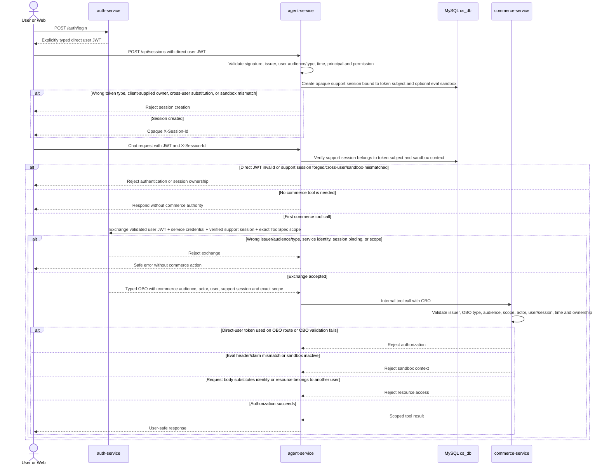
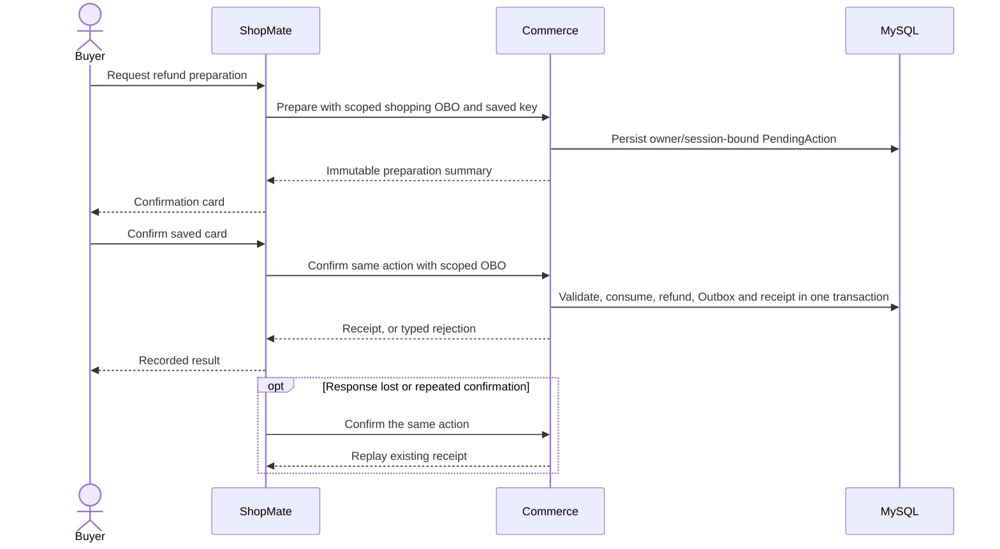

# CityBuddy capability contracts

This document records CityBuddy's durable technical contracts: ownership, truth hierarchy,
identity and security boundaries, transaction and replay invariants, public and internal
interfaces, and the retained designs that are deliberately outside the current implementation.

Unless a section is explicitly marked **Retained design**, it describes a boundary enforced by
the current code. Exact fields, dependency versions, schemas, grants, and runtime topology remain
executable truth in migrations, OpenAPI documents, source configuration, and contract tests.
Historical development slices and route decisions are archived under [docs/archive/](archive/README.md);
they explain provenance but do not define current behavior or process. Verified engineering
pitfalls are collected in [docs/LESSONS.md](LESSONS.md).

## Retail catalog reads

The retail catalog adds display metadata and SKU families without changing the existing
eight-field `Product` or order request. A plain product or variant points to one authoritative
`product` row. A family has its own catalog ID and no transaction row, so it cannot be ordered.
Fixture importers use disjoint family/SKU IDs and lower-case, knowledge-compatible SKU IDs.

`retail_product_family` stores the family title, description, ordered option dimensions and
content version. `retail_product_metadata` links each actual SKU to its family, records its
option values and display order, and holds an independent content version. Only the stored SKU
rows exist; option value domains do not imply a Cartesian product. Leaf content overrides family
content; attributes and specs merge by key. Metadata permits brand, category, image URL, long
description, rating/review count, labels, attributes, specs and review highlights. It cannot store
price, currency, stock, sale eligibility or publication version. Those fields always come from
`product`, including after ordinary ordering and merchant repricing. Buyer reads do not mutate
these extension tables; approved merchant listing changes update their display content and
versions inside the same transaction as the affected SKU publication events.

All three retail read routes require a direct user token with `catalog:read`; production routes
reject evaluation context. Published legacy products without extension metadata remain plain
products with empty content and `metadataVersion=0`. Paused or empty-stock SKUs remain visible
with `inStock=false`; unpublished SKUs are absent.

| Route | Result |
| --- | --- |
| `GET /api/retail/products?limit=20&offset=0` | A bounded page of plain/family summaries |
| `POST /api/retail/products/search` | Filtered summaries; variants stay under their family |
| `GET /api/retail/products/{id}` | Plain/variant detail or a family with its actual published variants |

Search accepts `query`, `category`, integer `minPriceMinor`/`maxPriceMinor`, `minRating`,
`currency`, an `attributes` string map, `sort`, `limit` and `offset`. Sort values are `relevance`,
`price_asc`, `price_desc` and `rating`; the limit is 1–50, default 20, and offset is 0–10000,
default 0. GET accepts only one value each for `limit` and `offset`. Root selection uses stable
sort/display-order/ID ordering and applies LIMIT/OFFSET before hydrating complete families;
individual variants never consume page positions. A short or empty page ends enumeration.
Each page selects and hydrates in one repeatable-read transaction. Separate requests may
observe intervening changes and do not promise a shared catalog snapshot. Price filters and price
sorting require currency. Explicit attributes and price constraints must match the same actual
SKU. An absent specification combination returns no match; the server never relaxes requested
filters. Category and rating use the displayed listing's content; a variant's rating override
does not raise its family's displayed rating. Search can also match published but unavailable
SKUs, so a matching family is not a promise that the requested option is purchasable. Its
detail supplies each actual option's availability; the transaction rechecks the selected SKU.
Input is at most 8 KiB, rejects unknown/duplicate fields and coerced integer values,
and is bound as SQL parameters. This path uses MySQL keyword/filter reads, not the support
knowledge index or a vector search.

Buyer family price is the lowest price among in-stock eligible SKUs, or the lowest published
SKU price if all are unavailable. `inStock` requires publication, availability and positive
stock. Family stock is the sum of published SKU stock; its publication version is null and it
has its own metadata version. Mixed-currency family data is invalid. Merchant operations must
use individual SKU truth or their separately defined aggregate, not the buyer's minimum
in-stock price as a price-change input. Summaries omit full variants and long detail fields.

The existing publication transaction and product Outbox remain responsible for SKU publication.
Importing a published SKU must include its publication event; display metadata does not create a
second cache or an Elasticsearch indexing pipeline.

## Merchant analysis and approved price changes

The merchant API is enabled with `citybuddy.merchant.enabled=true`, alongside catalog and OBO
identity. ShopMate owns its operator-bound sessions. Auth accepts the `merchant-agent` service
identity only with a direct user holding `merchant:session:create`, issuing one exact read,
prepare, draft-read or cancel scope. Commerce endpoints require that actor and a matching
`X-Merchant-Session-Id`; the customer-support actor cannot access them. Auth does not query an
agent's session database.

`POST /internal/merchant/price-drafts` snapshots the authoritative product price and version for
one to 25 products. Its operator/session/idempotency key names an immutable intent. It does
not change product prices. Only a direct user with `merchant:price:apply` can approve the draft
through `POST /api/merchant/price-drafts/{draftId}/apply`, and the user must own that draft. An OBO
token or an approval statement in chat cannot substitute for this direct request.

Apply locks the draft and then all products in sorted ID order. The transaction uses READ
COMMITTED and checks activity association after taking product locks, without acquiring an
oppositely ordered activity lock. Products associated with any seckill activity are ineligible.
All versions and conditions are checked before writes; only price and publication version change.
The same transaction advances catalog generation, writes each `PRODUCT_PUBLICATION_CHANGED`
event, and persists the APPLIED receipt. A business conflict records REJECTED without product
writes. Cancellation records CANCELLED. Repeated approval returns the stored terminal result.
Database or unexpected failures roll back the complete transaction rather than becoming a
successful business rejection.

### Approved retail operations

The same owned draft ledger also stores `PRICE_UPDATE`, `LISTING_UPDATE` and
`INVENTORY_ACTION`. The existing price-draft endpoints remain compatible: a price proposal has
one identity, state and receipt whichever supported API reads or approves it. Generic change
endpoints do not create a second approval ledger.

| Route | Authority and result |
| --- | --- |
| `POST /internal/merchant/changes` | `merchant:change:prepare`, exact `Idempotency-Key`, `{kind,payload}`; returns a proposal with before/after items, without applying it |
| `GET /internal/merchant/changes?state=PREPARED&limit=20&offset=0` | `merchant:change:read`; only the signed operator and session, ordered by creation time descending then ID |
| `GET /internal/merchant/changes/{changeId}` | `merchant:change:read`; unknown or unowned changes return 404 |
| `POST /internal/merchant/changes/{changeId}/cancel` | `merchant:change:cancel`; empty body, resolves or replays the stored terminal |
| `POST /api/merchant/changes/{changeId}/apply` | Direct user with `merchant:change:apply`, original operator ownership, empty body; APPLIED returns 200, a stored non-APPLIED terminal returns 409 |

Internal routes fix `act.azp=merchant-agent` and require the matching
`X-Merchant-Session-Id`. Auth issues only the three exact change scopes after both deployment
and service grants and the direct user's `merchant:session:create` permission pass. Neither
`merchant:change:apply` nor the original `merchant:price:apply` can be delegated through OBO.
Evaluation context is rejected. All change responses use `Cache-Control: no-store`.
Requests are limited to 64 KiB, reject duplicate JSON and unknown top-level fields, and cannot
take owner or replacement approval data from a model. List queries allow one value per parameter,
limit 1–100 and offset 0–10000; state is one of PREPARED/APPLIED/CANCELLED/REJECTED or omitted.

PRICE_UPDATE contains currency and 1–25 actual SKU price items. LISTING_UPDATE contains
`listingId` and 1–25 string fields: shared title/short description/long description/category,
supported supplemental attributes, or existing descriptive attributes. Shared content must be
edited on a family rather than one variant. Protected transaction, variant identity, cost,
compliance and content-quality bookkeeping fields are not editable through this payload.
INVENTORY_ACTION accepts `restock` for a leaf SKU with an increment of 1–500, or `pause`/`activate`
for a leaf or its actual family members. Expanded operations touch at most 25 actual SKUs and
25 stock/availability changes, and cannot target the same SKU field twice. Pause/activate only
accept PUBLISHED SKUs; their approval items show the actual `available` boolean, so activating
a zero-stock SKU does not imply it has stock. Content maintenance and restocking may touch a
draft without publishing it. Missing variant combinations are never invented. Products referenced
by a seckill activity remain ineligible.

Preparation snapshots the affected SKU publication versions, family membership/content versions
and applicable display/operations metadata versions. Apply locks the draft and its actual
products in stable order, rechecks the stored snapshot and validates all changes before writing.
Stock increments use the locked current quantity; availability changes do not overwrite stock.
Listing metadata, current SKU fields, publication versions, catalog generation, product Outbox
and the stored terminal commit together. A business version or eligibility conflict persists
REJECTED without partial writes. Repeated apply/cancel returns the same persisted terminal.

The `merchant_*` reporting views expose catalog context, historical paid order facts and
explicit operating observations, with no user identities. Reporting connections use UTC and a bounded query timeout.
Analysis users have SELECT only on the views. Paid amount is gross before refunds, grouped by
currency and payment-success time in a half-open interval; current catalog prices never rewrite
historical sales. The deterministic fixture generator is `scripts/seed_merchant_fixture.py`.

### Complete merchant catalog and marketing facts

`GET /internal/merchant/listings`, `/listings/{id}`, `/inventory-alerts`,
`/campaigns[/{id}]` and `/promotions[/{id}]` require the fixed merchant actor and exact
`merchant:read` scope, matching merchant session and no evaluation context. Responses are
uncached. Lists use limit 1–50 and offset 0–10000; catalog and alert pages return nextOffset.
Marketing lists end with a short page. Query parameters occur once, and unknown parameters fail.

Merchant catalog pagination groups actual family members before paging and includes draft,
unpublished, paused and out-of-stock products. Family price is the minimum of all actual leaf
prices, stock is their sum, and the family is not an orderable SKU. Individual leaves preserve
publication state and selected variant dimensions. Private cost, quality, missing fields and
observation metadata come from retail_product_operations; absence stays unknown. There is no
inferred cost floor, physical return rate or last-price-change timestamp. Price sorting requires
a currency. Inventory alerts use current stock and the preceding 30 complete Asia/Shanghai days
of authoritative paid orders; a future asOf is rejected. Low stock is stock <= known threshold, and the demo slow-mover
rule is stock > threshold with at most five sold units. Cover is unknown when no units sold.
Refund percentages count distinct paid-cohort orders with effective refund requests, not returns.

PROMOTION and CAMPAIGN use the same owned change ledger, precise prepare/read/cancel scopes and
direct-operator apply endpoint. Their typed payloads cannot accept caller-supplied before values,
versions, results or observations. Money in proposals, differences and receipts is integer minor
units; dates are normalized to UTC. Date-only input uses Shanghai: a starts date begins that day,
and an ends date includes that day; explicit offset timestamps use their exact half-open window.

A promotion expands one to twenty-five actual unique SKUs, freezes current prices/versions and
rounds a positive discount of at most 50% to the nearest minor unit, half up. All targets must be
eligible ordinary published available products, and family membership is rechecked at approval.
Before the start, approval returns promotion_not_started and retains PREPARED; a first approval
after the end resolves REJECTED. Inside the window, all official product prices, catalog
versions/generation, product Outbox, promotion/target records and the approval receipt commit
atomically. A stale target rejects the whole batch; repeat approval replays the terminal.
The current product price is the only checkout authority. Old quotes are stale, and historical
order/payment/refund amounts keep their original order price. Ending the operating window does
not restore an old price: the approval interaction must explain that restoration needs another
confirmed change. No automatic start/end pricing job is scheduled. Promotion reads include actual
current price/currency/version and mark a differing price or currency, rather than presenting historical target prices
as current payable amounts.

Campaign approval really creates or updates a local marketing plan: name, objective, audience,
copy, bounded budget (at most 1,000,000 minor units) and optional dates. New plans use CNY, start
in draft state and have no attributed spend/revenue. Updating a plan uses its saved version and
does not change observed results. It does not send ads, deliver email or spend money. Existing
campaign observations retain their explicit window/source/version; missing revenue is not zero.
ROAS requires positive spend and known attributed revenue from the same observed window.

The narrow merchant_listing_facts, merchant_store_traffic_daily and merchant_campaign_facts
views add current classification/operating facts, whole-store visits and campaign observations.
Paid sales still come from merchant_paid_orders at historical order prices. Store traffic dates
are Shanghai calendar days; missing dates are unknown, not zero. Traffic and conversion have no
invented SKU/category/currency attribution. Whole-store conversion divides successful single-SKU
orders by visits over the same complete window, not unique shoppers or checkout groups. Analysis
accounts receive SELECT on views only; commerce cannot overwrite observed visits or campaign
attribution. The existing UTC merchant_daily_sales view retains its historical semantics.

Outbox completion is event-type specific: product and FAQ events have configured publishers.
Order and refund outbox records are retained transaction facts, not a promise that a worker
publishes every PENDING row. Backlog measurements must select the relevant delivery mechanism.

## 1. System context and current capabilities

CityBuddy supplies the transaction and identity backend for ShopMate retail Agents. Its
defining boundary is not the number of services; it is that identity, transactional side effects,
retrieval evidence, and evaluation-only access remain independently enforceable.

| Component | Runtime boundary | Current responsibility |
|---|---|---|
| `auth-service` | Java 21 / Spring Boot 3.5 | Login, RS256 user tokens, service-authenticated token exchange, OBO tokens, JWKS publication and key rotation, and evaluation-only test identities. |
| `commerce-service` | Java 21 / Spring Boot 3.5 | Products, inventory, orders, seckill admission and ordering, mock payment, refund, CRM and FAQ truth, internal tool APIs, PendingAction and ActionReceipt truth, and evaluation-only state APIs. |
| `agent-service` | Python 3.11 / FastAPI / Pydantic | Retained support-session identity, historical feedback and evaluation evidence API, historical conversation/receipt readers. No model loop, chat or SSE endpoint. |
| `knowledge-indexer` | Python 3.11 | Production RocketMQ FAQ synchronization, FAQ/product snapshot rebuilds, source-version ordering, tombstones, validation, and versioned Elasticsearch alias changes. |
| `web` | React / TypeScript / Vite | Login, product reads, dedicated seckill engineering forms and the ShopMate buyer link. The default retail deployment does not enable seckill. |
| ShopMate (separate repository) | Python / FastAPI and React | One buyer and merchant retail runtime, analysis delegation, user-confirmed execution and role/owner-isolated session state. Its repository defines actual model/proxy/tool capabilities. |

The retained MemoryPacker, support-ticket/handoff, and failure-candidate export designs are
separated under [Retained vNext designs and current non-goals](#contract-mainline-non-goals). A
listed retained responsibility is an ownership decision, not an implementation or deployment
claim. [README.md](../README.md) states the verified runnable scope.

### 1.1 Executable contract and version truth

- Exact dependency versions, image digests, generated schemas, lockfiles, and executable tool
  configuration are runtime version truth. Markdown records compatibility boundaries and choices;
  it is not a parallel lockfile.
- Database migrations, OpenAPI documents, ToolSpec definitions, source-owned inventories, and
  contract tests are executable truth for field names and payload details. This document fixes
  cross-component invariants without duplicating every DDL column or DTO field.
- Public model configuration uses role aliases only. Concrete provider model identifiers belong in
  runtime configuration and, where needed, recorded run metadata.

## 2. Shared platform and trust foundations

The anchor above is retained for historical links. These are durable boundaries, not a release
freeze: changes follow the current working agreement in [AGENTS.md](../AGENTS.md).

### 2.1 Service and language boundaries

- `auth-service` owns token issuance, token exchange, service authentication at the exchange
  endpoint, JWKS, signing-key lifecycle, and evaluation-only test-token issuance. No other service
  owns a token-signing key.
- `commerce-service` owns transactional business state and every business-side authorization
  decision, including audience, scope, sandbox, and resource ownership.
- `agent-service` retains support identity and historical evidence. Its identity client can request a delegated token
  but cannot issue identity, choose arbitrary scopes, or substitute a user identifier from a
  request body.
- `knowledge-indexer` is an asynchronous projection worker and snapshot consumer. It does not
  become a source of product or FAQ truth.
- `web` is a client, not an authority for confirmation, identity, price, stock, action status, or
  sandbox state.
- ShopMate owns current model orchestration. A model proxy never owns business authorization.
- Java owns authentication and commerce transactions. Python owns the agent path and indexing
  worker. Cross-language synchronous calls use internal HTTP/REST JSON; RocketMQ is used only for
  asynchronous messaging.

### 2.2 Storage topology and truth hierarchy

- MySQL 8 is one physical instance with two logical databases: `commerce_db` and `cs_db`.
  Cross-database joins are forbidden; data crosses service boundaries through APIs or events.
- Runtime identities are distinct: `auth_app` accesses only auth-owned principals, credential
  verifiers, service identities, signing-key metadata, and evaluation test-principal records;
  `commerce_app` accesses only commerce-owned transaction and business tables; `agent_app`
  accesses only agent-owned tables in `cs_db`.
- A bootstrap/admin identity exists only to create databases, accounts, and grants. When MySQL
  requires the grantor to hold delegated privileges with `GRANT OPTION`, those privileges live in
  a dedicated non-default grant role. `activate_all_roles_on_login` remains `OFF`. A one-shot grant
  job verifies a new session has `CURRENT_ROLE()=NONE`, activates the role only for the repository's
  fixed version-controlled allowlist of exact `GRANT`/`REVOKE` statements, and returns the session
  to `NONE`. The role and bootstrap credentials are absent from migration and runtime
  configuration. The job accepts no caller-supplied SQL and executes no business-data DML.
  Separate migration identities execute only their owning migration streams. Runtime identities
  do not execute DDL, have no global/admin grants, and never use bootstrap/admin credentials.
- Auth-owned persistence remains an auth-owned table family in `commerce_db`; this does not give
  `commerce_app` access to credential or private identity metadata and does not add a third
  database.
- `commerce_db` is current truth for products, orders, inventory, seckill allocation,
  reservations, payments, refunds, CRM, published FAQ state, PendingAction, ActionReceipt,
  sandbox registration, and transaction Outbox records. It is also the retained owner for a future
  authoritative support-ticket capability.
- `cs_db` is current truth for support sessions, event/evidence records, retrieval evidence,
  feedback, PendingAction references, and receipt projections. It is the retained owner for future
  summaries, handoff projections, and failure candidates. A projection never overrides commerce
  action or ticket truth.
- Commerce Redis is a separate Redis 7 instance using `noeviction` and AOF. Support Redis is a
  separate Redis 7 instance using TTL-oriented data and LFU eviction.
- MySQL remains truth for current transactions, inventory, quotas, action state, and idempotency;
  `commerce_db` is the retained truth owner for a future ticket capability. Redis is only admission
  control, a projection, a lock, or a cache. A Redis success alone never proves an order, refund,
  payment, or confirmed action.
- Elasticsearch is a derived public-knowledge index and never contains private orders, refunds,
  personal coupons, or other user-private transactional data.

### 2.3 Runtime access boundaries

| Identity/component | May write | May read | Forbidden direct access |
|---|---|---|---|
| Bootstrap/admin identity | Database creation, account creation, and grants only; an explicit one-shot grant job may temporarily activate its dedicated non-default grant role solely for the repository's fixed version-controlled allowlist of exact `GRANT`/`REVOKE` statements | Server metadata required for bootstrap and grant verification | Application runtime use, ordinary migrations, a default-active grant role, caller-supplied SQL, ad hoc privilege mutation, or business-data `SELECT`/`INSERT`/`UPDATE`/`DELETE` even while the grant role is active |
| Auth migration identity | Auth-owned migration stream in `commerce_db` | Auth migration history and auth-owned schema metadata | Commerce business tables, `cs_db`, application runtime |
| Commerce migration identity | Commerce-owned migration stream in `commerce_db` | Commerce migration history and commerce-owned schema metadata | Auth credential/private metadata, `cs_db`, application runtime |
| Agent migration identity | Agent-owned migration stream in `cs_db` | Agent migration history and agent-owned schema metadata | `commerce_db`, application runtime |
| `auth_app` / `auth-service` | Auth-owned principal, credential-verifier, service-identity, signing-key metadata, and eval test-principal records | The same auth-owned family | Commerce business table families, `cs_db`, Elasticsearch; DDL/global/admin grants |
| `commerce_app` / `commerce-service` | Commerce-owned business tables, transaction Outbox, sandbox registry, Commerce Redis, and any future authoritative ticket tables | Commerce-owned business tables; JWKS over HTTP | Auth credential/service-identity/private metadata, `cs_db`, Support Redis, direct model providers; DDL/global/admin grants |
| `agent_app` / `agent-service` | Agent-owned `cs_db` tables | Agent-owned `cs_db`; JWKS and sandbox liveness over HTTP | All `commerce_db` tables, signing keys, direct provider credentials; DDL/global/admin grants |
| `knowledge-indexer` | Versioned Elasticsearch indexes; allowed FAQ-version cache entries in Support Redis | Knowledge events and published source snapshots | Runtime writes to `commerce_db` or `cs_db`; private order/refund data |
| `web` | No authoritative data store | Public/user-scoped HTTP APIs | Databases, Redis, Elasticsearch, RocketMQ, signing material |
| Model proxy | Provider-routing, usage, and cost records configured for the proxy | Runtime alias mapping and provider credentials | Business databases, ToolSpec policy, user/resource authorization decisions |

### 2.4 Conflict-resolution order

When two stores disagree, resolve the conflict in this order:

1. `commerce_db` for transaction, inventory, quota, resource ownership, PendingAction,
   ActionReceipt, sandbox, payment, and refund truth;
2. `cs_db` for support evidence observed and persisted by `agent-service`;
3. Elasticsearch for a versioned public-knowledge projection;
4. Redis for admission state, projections, locks, or caches;
5. optional observability data as a non-authoritative mirror.

### 2.5 Fail-closed security rules

- Authentication failure is never converted into an anonymous business request.
- Missing audience, scope, actor, owner, session, or required sandbox context rejects; it does not
  fall back to a broader query.
- Production identity and protected tool boundaries reject `X-Eval-Sandbox-Id`; production does
  not load `/api/eval/*` or evidence routes. Public health endpoints do not authenticate that header.
- Evaluation requests require both management authentication and sandbox-bound user identity for
  black-box chat. The management credential is not a substitute for a user JWT.
- SQL repositories, batch updates, deletes, and asynchronous consumers that participate in
  evaluation are covered by tests proving sandbox filtering. An absent sandbox context in an
  evaluation path fails before SQL mutation.
- Tool inputs and outputs follow their explicit allowlists and bounded-view policies. A reversible
  personal-data masking layer is not implemented; callers must not assume that arbitrary text is
  anonymized before a model request.
- Tool results are stored server-side in full only where evidence policy allows. The model receives
  a bounded view, and SSE receives a smaller allowlisted view.
- Secrets are injected at runtime, excluded from logs, absent from committed examples, and scanned
  before merge.

## 3. Capability contract index

The historical anchors above now land on this capability-first index. Each implemented capability
co-locates its persistent invariants, synchronous interfaces, asynchronous boundaries, and any
sequence that materially explains the contract. Full request and response fields remain in the
[agent](../agent-service/openapi.json),
[auth](../auth-service/src/main/resources/openapi.json), and
[commerce](../commerce-service/src/main/resources/openapi.json) OpenAPI documents. Current Agent tool
definitions live in the separate ShopMate repository.

| Capability | Persistent truth and invariants | Interfaces and sequences | State |
|---|---|---|---|
| Identity and delegation | Principals, service identities, signing-key metadata, support-session binding | Login, JWKS, exchange, evaluation test identity, JIT OBO sequence | Implemented |
| Catalog and standard ordering | CRM, products, stock, standard orders, Outbox | Product reads and idempotent order creation | Implemented |
| Seckill and inventory convergence | Activity allocation, reservations, uniqueness, inventory ledger | Reservation APIs, transaction and delay messages, RocketMQ sequence | Implemented |
| Payment, refund, and sensitive action | Payment attempts/callbacks, refunds, PendingAction, ActionReceipt | Payment, refund, prepare/confirm, receipt projection, confirmation sequence | Implemented |
| Historical support evidence | Conversations, ordered evidence, feedback, receipt projection | Session creation, feedback and evaluation-only evidence reads; no chat/SSE execution | Retained implementation |
| Knowledge and retrieval | FAQ/product source versions, retrieval evidence, index aliases, FAQ cache | Snapshot, FAQ events, application-side RRF | Implemented |
| Evaluation-only access | Test principals, sandbox lifecycle, scoped audit/evidence | Reset, completion, liveness, state, audit, version, evidence | Implemented only in the evaluation profile |
| Memory, handoff, and candidate export | Summary watermark, authoritative ticket, projections, reviewed candidate | Proposed async and cross-system contracts | Retained design |

## 4. Identity, support sessions, and delegated authorization

The legacy `agent-service` actor and support-session contracts remain for historical identity and
evidence consumers. ShopMate uses `shopping-agent` and `merchant-agent` with their exact retail
scopes; it does not create a legacy support session or run the old support model loop.

Token classes are distinguished explicitly by a token-purpose/type claim or an equivalent
independent authentication chain. Absence of an actor claim is never treated as a permissive
direct-user downgrade.

### 4.1 Direct user JWT

1. A user logs in through `auth-service` and receives an RS256-signed direct user JWT.
2. User-facing routes in `agent-service` and `commerce-service` validate signature, fixed issuer,
   configured user-facing audience, expiry, not-before, accepted clock skew, user principal,
   route-required role or user permission, and resource ownership.
3. An unknown `kid` triggers one JWKS refresh and one validation retry; continued failure rejects.
4. A direct user JWT does not require `act.azp`, an OBO scope, or a support-session identifier.
   Production direct-user tokens do not carry an evaluation sandbox claim.

### 4.2 Agent OBO

5. Conversation and public FAQ paths do not acquire commerce authority. Before an internal
   commerce tool invocation, `agent-service` requests a short-lived OBO just in time.
6. `POST /api/sessions` is the only support-session bootstrap. It requires a direct user JWT;
   `agent-service` generates an opaque session id and binds it to the validated token subject. In
   evaluation it also binds the sandbox context. The client cannot choose the owner. Wrong token
   type, cross-user substitution, or sandbox mismatch rejects. `X-Session-Id` identifies this
   support session, not a login-token session, and every use is rechecked against the validated user
   and sandbox context in `cs_db`.
7. For that tool invocation, `agent-service` submits the validated user JWT, its independently
   authenticated service credential, the verified support-session binding, and the exact
   server-side ToolSpec scope to token exchange. `auth-service` trusts the authenticated service's
   session-binding assertion and writes that support session into the OBO. Service authentication
   reads current state, scope, and the exact persisted verifier on every exchange. New machine
   credentials are `cbsvc_v1_` tokens containing 256 CSPRNG bits and store a versioned, client-bound
   SHA-256 digest; `scripts/service_credential.py` is the provisioning primitive. The digest is safe
   only for those generated high-entropy tokens, not for human-chosen passwords. Legacy service
   BCrypt rows remain accepted and execute BCrypt on every request; no successful verifier is
   cached. Deploying a new binary does not rewrite those rows: obtaining the digest-path behavior
   requires an explicit `generate` then client-bound `hash` credential rotation. Human login always
   executes BCrypt directly. New application-generated BCrypt hashes use configured strength 12;
   verification honors the cost encoded in each persisted hash.
8. The OBO contains at least an explicit OBO purpose/type, `sub`, `user_id`, support `session`,
   `aud=commerce-service`, exact `scope`, `act.azp=agent-service`, `jti`, `exp`, and applicable
   not-before/issued-at metadata. Scope is fixed by ToolSpec; neither model nor request payload can
   widen it. `jti` is required but is not consumed: the OBO is a bearer token, not a server-enforced
   single-use capability, and remains subject to every validation above until expiry.
9. `commerce-service` accepts internal tool identity only from the validated OBO. It validates
   signature, fixed issuer, OBO purpose/type, audience, exact required scope, actor, user subject,
   support session, expiry/not-before/skew, and resource ownership. It never trusts identity fields
   in the request body.
10. Evaluation test JWTs and derived OBO tokens carry the same sandbox claim. Internal tool
    requests also require sandbox header/claim equality and an ACTIVE sandbox. Production tokens
    carry no sandbox claim, and production rejects the evaluation header.
11. Signing private keys stay in `auth-service` secret material. Public keys overlap for at least
    the maximum token lifetime plus accepted clock skew during rotation.

### 4.3 Persistent identity invariants

| Entity | Owner/store | Unique invariant | Lifecycle or boundary | Executable source |
|---|---|---|---|---|
| User principals, login credentials, service identities, signing-key metadata | `auth-service`; auth-owned family in `commerce_db`; runtime identity `auth_app` | Stable user subject and unique login identifier; unique service client identity; unique `kid` per active public-key set | Principal `ACTIVE/DISABLED`; service credential independently revocable; signing keys overlap during rotation; private keys are never returned | Auth migrations and OpenAPI |
| Support session identity and ownership | `agent-service`; `cs_db`; runtime identity `agent_app` | Server-generated opaque session id bound to immutable user subject and, in evaluation, sandbox context | Direct-user-authenticated creation; client cannot choose owner; cross-user, wrong-token-type, and sandbox mismatch reject | Agent migrations and OpenAPI |
| Evaluation test-principal provisioning record | `auth-service`; auth-owned family in `commerce_db`; runtime identity `auth_app` | Unique opaque test-user handle bound to sandbox and case correlation; idempotent provisioning and revoke keys | TTL-bound provisioned/revoked lifecycle; duplicate reset returns the same valid binding or deterministic conflict; token issuance validates this record only and never reads commerce tables | Auth evaluation migration and OpenAPI |

### 4.4 Identity interfaces

| Caller → owner | Method and path | Authentication | Required boundary | Success semantics | Rejection semantics |
|---|---|---|---|---|---|
| `web` → `auth-service` | `POST /auth/login` | User credential exchange | No bearer token; request fields defined by OpenAPI | Returns an explicitly typed direct-user JWT with fixed issuer, configured user-facing audience, principal, time bounds, and route-relevant authority | Invalid/disabled principal rejects without credential disclosure |
| `agent-service` or `commerce-service` → `auth-service` | `GET /auth/jwks` | Public-key distribution endpoint | Stable `kid`; cache validators allowed | Returns current and overlapping public keys only | Unavailable/malformed key set causes fail-closed validation after one bounded refresh |
| `web` or authorized evaluator → `agent-service` | `POST /api/sessions` | Direct user JWT | Fixed issuer, user audience, explicit direct-user type, user principal/permission; evaluation also supplies matching sandbox context | Generates an opaque support-session id server-side and binds it to token subject and, when applicable, sandbox | Client-supplied owner, wrong token type, cross-user substitution, invalid audience/issuer, sandbox mismatch, or production eval header rejects |
| `agent-service` → `auth-service` | `POST /auth/token/exchange` | Independent `agent-service` credential plus validated direct-user JWT | Verified subject and support-session binding; exact ToolSpec scope | Returns a short typed OBO with `aud=commerce-service`, exact scope, actor, user, support session, time bounds, and unchanged eval sandbox claim when applicable | Wrong issuer/audience/type, invalid service credential, forged session binding, disallowed scope, or claim-mode mismatch rejects |
| `commerce-service` → `auth-service` | `POST /internal/eval/test-principals/provision` | Dedicated commerce service authentication; evaluation profile only | Sandbox id, case correlation, TTL, minimum test-subject attributes, idempotency key | Creates or returns the same TTL-bound provisioning record and opaque handle; returns no credential | Invalid service identity, conflicting duplicate, invalid TTL/subject, dead/revoked correlation, or production profile rejects |
| `commerce-service` → `auth-service` | `POST /internal/eval/test-principals/{handle}/revoke` | Dedicated commerce service authentication; evaluation profile only | Opaque handle, required sandbox/case correlation, idempotency key | Idempotently revokes or confirms invalidation of the auth-owned provisioning record | Other service identity, mismatched handle/correlation, invalid credential, or production profile rejects |
| Authorized evaluator → `auth-service` | `POST /auth/eval/test-token` | Independent evaluation API credential; evaluation profile only | `X-Eval-Sandbox-Id` and opaque test-user handle matching an unexpired provisioning record | Returns an explicitly typed test direct-user JWT carrying the bound sandbox claim | Arbitrary sandbox id, wrong handle, expired/revoked record, mismatch, invalid credential, or production profile rejects |

### 4.5 Direct user JWT to support-session validation to JIT OBO

**Historical support chain.** This sequence describes the retired support chat entry point;
the current ShopMate buyer flow uses the retained authorization and action contracts.

```mermaid
sequenceDiagram
    actor U as User or Web
    participant A as auth-service
    participant G as agent-service
    participant S as MySQL cs_db
    participant C as commerce-service

    U->>A: POST /auth/login
    A-->>U: Explicitly typed direct user JWT
    U->>G: POST /api/sessions with direct user JWT
    G->>G: Validate signature, issuer, user audience/type, time, principal and permission
    G->>S: Create opaque support session bound to token subject and optional eval sandbox
    alt Wrong token type, client-supplied owner, cross-user substitution, or sandbox mismatch
        G-->>U: Reject session creation
    else Session created
        G-->>U: Opaque X-Session-Id
    end
    U->>G: Chat request with JWT and X-Session-Id
    G->>S: Verify support session belongs to token subject and sandbox context

    alt Direct JWT invalid or support session forged/cross-user/sandbox-mismatched
        G-->>U: Reject authentication or session ownership
    else No commerce tool is needed
        G-->>U: Respond without commerce authority
    else First commerce tool call
        G->>A: Exchange validated user JWT + service credential + verified support session + exact ToolSpec scope
        alt Wrong issuer/audience/type, service identity, session binding, or scope
            A-->>G: Reject exchange
            G-->>U: Safe error without commerce action
        else Exchange accepted
            A-->>G: Typed OBO with commerce audience, actor, user, support session and exact scope
            G->>C: Internal tool call with OBO
            C->>C: Validate issuer, OBO type, audience, scope, actor, user/session, time and ownership
            alt Direct-user token used on OBO route or OBO validation fails
                C-->>G: Reject authorization
            else Eval header/claim mismatch or sandbox inactive
                C-->>G: Reject sandbox context
            else Request body substitutes identity or resource belongs to another user
                C-->>G: Reject resource access
            else Authorization succeeds
                C-->>G: Scoped tool result
                G-->>U: User-safe response
            end
        end
    end
```

## 5. Catalog and standard ordering

### 5.1 Persistent invariants

| Entity | Owner/store | Unique invariant | Transaction boundary | Executable source |
|---|---|---|---|---|
| User profile/CRM | `commerce-service`; `commerce_db`; runtime identity `commerce_app` | One profile per immutable user subject | Commerce rules write; `agent-service` reads only through a scoped commerce tool | Commerce catalog migration |
| Product and published product content | `commerce-service`; `commerce_db` | Stable product identifier; publication/version increases monotonically | Product update and its Outbox event commit together; price and stock remain live commerce fields | Commerce catalog migration and OpenAPI |
| Standard order and stock item | `commerce-service`; `commerce_db` | Stable order id; request idempotency key unique in user/action scope | Conditional stock decrement or optimistic version check and order creation form one MySQL business transaction; finite retry only | Commerce ordering migration and OpenAPI |
| Transaction Outbox | `commerce-service`; `commerce_db` | Unique event id and aggregate version/idempotency key | Business mutation and Outbox insert commit together; publisher progress never changes the business result | Commerce migrations and workers |

### 5.2 Interfaces

| Caller → owner | Method and path | Authentication | Required boundary | Success semantics | Rejection semantics |
|---|---|---|---|---|---|
| `web` → `commerce-service` | `GET /api/products`, `GET /api/products/{productId}` | Direct-user JWT | Authenticated routes validate fixed issuer/user audience/direct type, permission, and no body identity | Returns published product data with live commerce fields | Wrong issuer/audience/type, forbidden profile/resource, or missing product rejects |
| `web` → `commerce-service` | `POST /api/orders` | Direct-user JWT | Direct-user identity, permission, ownership, `Idempotency-Key` | Atomically creates or returns the same standard order after a valid MySQL stock update | Wrong identity mode, cross-user resource, insufficient stock, conflicting idempotency, illegal quantity, or stale version rejects |

### 5.3 Product publication events

Product publication and its Outbox row commit together. The current `product-publication` normal
message is consumed by `commerce-service` to invalidate/rebuild its product cache projection;
duplicates and late delivery cannot reverse a newer MySQL publication version. Product documents
for the public-knowledge index are obtained through the authoritative snapshot/rebuild interface,
not by treating the product cache-invalidation consumer as a knowledge-indexer feed.

## 6. Seckill, inventory, and asynchronous convergence

### 6.1 Messaging and consistency responsibilities

- RocketMQ 5 runs with Broker and Proxy available to the 5.x clients. The Proxy endpoint remains
  explicit.
- Live seckill admission has one path: Redis Lua `preAdmit`, transaction half message, MySQL
  admitted reservation, then broker commit. Deterministic rejections write a Redis intent
  anchor plus reservation/decision projections, with an absolute 15-minute replay window that
  replay does not refresh; they do not
  access business MySQL or RocketMQ. Admitted user markers live until the activity ends, not
  merely until the request replay window expires.
- Lua admission records a pending handoff before returning. A bounded worker retries those
  handoffs through the same half-message/MySQL path; MySQL rollback leaves the handoff available
  for recovery. The existing activity rebuild lease blocks projection rebuild or cancellation
  while a handoff is pending, so republishing quota cannot erase an admission not yet in MySQL.
  Old MySQL-`PENDING` preparation and deadline APIs remain for legacy persistence fixtures, but
  neither the HTTP runtime nor the worker calls them.
- The transaction checker reads only the durable MySQL reservation and returns `UNKNOWN` when
  it is missing, historically `PENDING`, or temporarily unreadable. Duplicate delivery is settled
  by the existing MySQL order and ledger invariants, not by an observed callback count. This
  path assumes a fresh fixture rather than online migration from old pending rows; it reuses the
  existing rebuild lease without a new persistent write fence; Redis restart/data loss requires
  operators to stop admission and rebuild from authoritative rows before reopening traffic.
- Downstream order creation is idempotent. Database unique constraints, an inventory-ledger
  movement keyed by the business event, and conditional transitions handle repeated delivery; a
  duplicate returns or projects the existing result. Lua admission reserves per-activity quota,
  while locked MySQL rows are final for stock shared by overlapping activities and the
  activity-user uniqueness key. A positive stock shortfall or an order held by another reservation
  on that key records terminal `UNFULFILLED` with the original `ADMITTED` decision, projection
  version 3, no durable order, and no activity-quota refund; retries replay that result.
- Transaction and timeout consumers leave failed messages unacknowledged, process the remaining
  received messages, then rethrow the first failure with later failures suppressed. The Broker
  owns delivery retries and dead-letter policy. Timeout dispatch scans both `PENDING` and `FAILED`
  unpaid orders in bounded batches, prioritizing the lowest failed-send count. A failed activation
  batch exits the startup cutoff so newer orders remain eligible; a send failure is recoverable
  until a durable Broker message identity is recorded.
- The inventory ledger covers seckill order creation and replay idempotency, atomic unpaid
  cancellation with inventory/activity-quota restoration, payment movements, refund movements,
  and full reconciliation.
- Delay messages trigger unpaid-order cancellation and, in the retained handoff design, ticket SLA
  checks. Delivery is a trigger, not authority: consumers re-read MySQL state and use conditional
  status/version updates.
- A consumer may produce a terminal business disposition only from a positively established
  business conclusion. Integrity failure, dependency unavailability, timeout, malformed or
  contradictory owner-local state, and any result whose truth cannot be determined are not
  business conflicts, denials, absence, or successful terminal outcomes; they remain retryable or
  explicitly unavailable and must preserve the opportunity to reconstruct from authoritative
  truth. Broad exception or result mappings must not fold those fault classes into ACK, reject,
  drop, not-found, or another terminal decision. Each stateful consumer must preserve this
  classification across its persisted state classes and mutation phases, including the indeterminate
  window after an authoritative mutation but before owner-local projection finalization.
- MySQL-derived product, FAQ, order, refund, and retained ticket events use an Outbox row
  written in the same local transaction as the business change. A retained authoritative ticket
  capability would produce its own state, SLA event, and Outbox in `commerce-service`; the agent
  would only request handoff and store a projection.
- Transaction messages, delay messages, domain events, and FAQ knowledge-sync events are distinct
  responsibilities. Request threads do not dual-write MySQL, Redis caches, and Elasticsearch as
  independent truths.

### 6.2 Persistent invariants

| Entity | Owner/store | Unique invariant | State or transaction boundary | Executable source |
|---|---|---|---|---|
| `seckill_activity` | `commerce-service`; `commerce_db` | Stable activity id; allocation cannot exceed inventory assigned to it | Quota allocation is a MySQL transaction; Redis receives only admission projection | Seckill activity migration |
| Reservation | `commerce-service`; Redis admission/replay state, admitted business truth in `commerce_db` | Unique `reservation_id`; Redis never creates an order | Live rejection remains Redis-only for 15 minutes; an admitted Redis handoff polls as `PENDING` until handoff completion; MySQL admission inserts `ADMITTED`; order consumption records `ORDERED` or admission-consuming `UNFULFILLED`, unpaid timeout may record `CANCELLED`; historical MySQL `PENDING/REJECTED` rows remain readable | Admission store, reservation service, and transaction-order migrations |
| One-user-one-order | `commerce-service`; `commerce_db` plus Lua marker | Database uniqueness on `(activity_id, user_subject)` and `reservation_id` | Lua blocks repeat users until activity end; database uniqueness is final and repeated messages resolve to existing result | Transaction-order migration and consumer |
| `inventory_ledger` | `commerce-service`; `commerce_db` | Unique business event/idempotency key per movement | Order creation, cancellation/restoration, payment, and refund movements reconcile against authoritative order/payment state | Commerce transaction migrations |

### 6.3 Interfaces

| Caller → owner | Method and path | Authentication | Required boundary | Success semantics | Rejection semantics |
|---|---|---|---|---|---|
| `web` → `commerce-service` | `POST /api/seckill/activities/{activityId}/reservations` | Production direct-user JWT | Direct-user claims, ownership, idempotency; evaluation tokens/headers are not accepted | Starts transaction-message admission and returns reservation status, never a false completed-order claim | Identity/type/audience failure, evaluation context, no quota, duplicate user, inactive activity, or bounded indeterminate result rejects or returns explicit status |
| `web` → `commerce-service` | `GET /api/reservations/{reservationId}` | Production direct-user JWT | Direct-user claims and ownership; evaluation tokens/headers are not accepted | Returns Redis-only `PENDING` handoff or `REJECTED` within its replay window, otherwise owned MySQL status (`ADMITTED`, `ORDERED`, `UNFULFILLED`, `CANCELLED`, or historical `PENDING/REJECTED`) without inventing an order | Cross-user access, evaluation context, or unknown/expired Redis-only reservation rejects |

### 6.4 Asynchronous contracts

| Channel | Producer → consumer | Message type | Stable payload/invariant | Failure and replay rule | State |
|---|---|---|---|---|---|
| Seckill order transaction | Commerce producer → commerce order consumer | Transaction | Reservation/activity/user ids, event id, version; current production payload carries no sandbox and consumer rejects the reserved sandbox property | Half message is sent after Lua admission and commits only after MySQL `ADMITTED`; pending handoff retains recovery work; checker reads MySQL, and uniqueness plus ledger movements make replay harmless | Implemented |
| Order/payment timeout | `commerce-service` → commerce timeout consumer | Delay | Order id, expected state/version, due time, event id; current production payload carries no sandbox and consumer rejects the reserved sandbox property | Re-read MySQL on every delivery; conditional cancellation and ledger restoration are idempotent; paid/final orders are not cancelled. Broker group policy owns retry/DLQ. EARLY changes invisibility without ACK. ACK or change-invisibility exceptions leave Broker state unconfirmed; malformed, business and control failures leave their message unacknowledged while later received messages continue. The first failure is rethrown after the batch. Any redelivery re-reads MySQL | Implemented |
| Commerce domain events | Commerce Outbox publisher → authorized consumers | Normal | Event id, aggregate/version, occurred time; current payloads carry no sandbox and production consumers reject the reserved sandbox property | Mutation and Outbox commit together; consumers are idempotent; late events cannot reverse newer state | Implemented; current product event consumer is commerce cache invalidation |

### 6.5 RocketMQ transaction message, Lua admission, and idempotent order creation

```mermaid
sequenceDiagram
    actor U as User or Web
    participant C as commerce-service producer
    participant M as RocketMQ Broker and Proxy
    participant R as Commerce Redis
    participant W as commerce-service consumer
    participant D as MySQL commerce_db

    U->>C: Request seckill reservation
    C->>R: Run Lua quota, one-user, and reservation admission

    alt Lua rejects and writes intent anchor plus reservation/decision projections
        R-->>C: Rejected
        Note over C,D: No business MySQL or RocketMQ request
        C-->>U: Rejected reservation status
    else Lua admits and writes a pending handoff with reserved quota
        R-->>C: Admitted handoff with reservation id
        C->>M: Send transaction half message
        M-->>C: Half message accepted
        C->>D: Insert ADMITTED reservation in MySQL transaction
        alt MySQL transaction rolls back or is unavailable
            D-->>C: No committed admission
            Note over C,R: Keep pending handoff for bounded worker recovery
        else MySQL admission commits
            D-->>C: Durable ADMITTED reservation
            C->>M: Commit half message
            opt Broker commit acknowledged
                C->>R: Complete handoff without shortening user-marker lifetime
            end
        C-->>U: ADMITTED reservation id; client polls durable status
        Note over C,W: HTTP response does not await consumption; consumer scheduling is independent and completion may race the response
        Note over M,W: Only a committed half message can be delivered
        M-->>W: Deliver committed transaction message
        W->>D: Conditional order insert and reservation transition
        alt Locked stock is short or another reservation owns the activity-user order
            D-->>W: Reservation UNFULFILLED at projection version 3; no order
            W-->>M: Acknowledge terminal disposition
        else Unique activity-user or reservation key already exists
            D-->>W: Existing order/result
            W-->>M: Acknowledge duplicate safely
        else Insert and transition succeed
            D-->>W: New durable order
            W-->>M: Acknowledge consumption
        else Database failure
            D-->>W: Failure
            Note over W,M: No acknowledgement, bounded retry or dead-letter policy applies
        end
        end
    else Lua result cannot be determined
        R-->>C: Indeterminate
        Note over C,D: No new half message or MySQL admission
        C-->>U: Indeterminate reservation status
    end

    opt Pending handoff remains after send, MySQL, or commit uncertainty
        C->>R: Bounded worker reads due handoffs
        Note over C,D: Retry the same half-message/MySQL path with reservation idempotency
    end

    opt Second-phase acknowledgement is missing or result is UNKNOWN
        M->>C: Transaction checkback
        C->>D: Read durable reservation only
        alt MySQL state consumed admission
            C-->>M: COMMIT
        else Historical MySQL state is REJECTED
            C-->>M: ROLLBACK
        else MySQL state missing, PENDING, or temporarily unreadable
            C-->>M: UNKNOWN
            Note over M,C: UNKNOWN is intermediate only. Broker timeout, check interval, and maximum check count define the terminal boundary.
        end
    end
```

## 7. Payment, refund, and sensitive-action truth

### 7.1 Persistent invariants

| Entity | Owner/store | Unique invariant | State or transaction boundary | Executable source |
|---|---|---|---|---|
| Mock payment | `commerce-service`; `commerce_db` | Unique payment-attempt and callback idempotency keys per order | `UNPAID → PAID`; duplicate callbacks return existing state; illegal transitions reject; committed replay reconciles complete durable closure within caller authorization visibility | Payment migration, OpenAPI, and integration tests |
| Refund | `commerce-service`; `commerce_db` | Unique refund id and request idempotency key; the sum reserved by requested, processing, and succeeded refunds cannot exceed the authoritative paid amount | Requested/processing/succeeded/failed states are guarded by order/payment state; capacity uses a locking current read after the payment-attempt aggregate-root lock; refund, ledger, and Outbox share required transaction boundaries | Refund migration, OpenAPI, and integration tests |
| PendingAction | `commerce-service`; `commerce_db` | Unique `pending_action_id`; one server-derived idempotency key per turn/tool/argument hash | Prepared with argument hash, resource version, owner, expiry, and unconsumed state; confirmation validates, consumes once, executes, and persists receipt in one commerce transaction | Action migration and OpenAPI |
| ActionReceipt | `commerce-service`; `commerce_db` | Unique receipt id and action idempotency key | Persisted with successful action and immutable; repeated key returns existing receipt | Action migration and OpenAPI |

### 7.2 Interfaces

| Caller → owner | Method and path | Authentication | Required boundary | Success semantics | Rejection semantics |
|---|---|---|---|---|---|
| `web` → `commerce-service` | `POST /api/orders/{orderId}/mock-payment` | Direct-user JWT | Direct-user identity, ownership, `Idempotency-Key` | Starts eligible mock payment or replays complete committed truth after canonical owner visibility is established | Wrong identity mode, paid/cancelled/ineligible order, cross-user access, concealed ownership, idempotency conflict, or damaged visible durable truth rejects |
| Mock payment component → `commerce-service` | `POST /internal/mock-payments/callback` | Separate internal callback credential/signature | Callback idempotency, payment/order correlation, exact sandbox binding when applicable | Applies one legal transition; duplicate returns fully reconciled existing result | Invalid credential, unknown correlation, sandbox mismatch/inactivity, illegal transition, or damaged durable closure rejects and audits |
| `web` → `commerce-service` | `POST /api/orders/{orderId}/refunds` | Direct-user JWT | Direct-user identity, ownership, canonical refund intent, `Idempotency-Key` | Creates one eligible refund and Outbox event atomically, or replays the same committed owner/order/key/intent result | Malformed amount, wrong identity/evaluation mode, missing/non-owned order, lifecycle or durable-integrity conflict, indeterminate committed observation, or unavailable persistence rejects with its typed status |
| `agent-service` → `commerce-service` | `POST /internal/tools/actions/prepare` | Agent OBO only | Exact sensitive scope, actor, owner/session, idempotency, trace/turn correlation, sandbox equality and liveness | Creates or returns PendingAction bound to owner, session, argument hash, target version, and expiry | Token mode, actor, scope, session, ownership, stale resource, conflict, or sandbox failure rejects |
| `agent-service` → `commerce-service` | `POST /internal/tools/actions/{pendingActionId}/confirm` | Agent OBO only | Same owner/session/scope, exact sandbox equality, confirmation idempotency | One transaction validates, consumes, executes, and persists ActionReceipt | Expired/consumed action, mismatch, ownership, illegal transition, or sandbox failure rolls back |

### 7.3 PendingAction, confirmation and receipt boundary

- Commerce validates tool input, exact delegated scope, session and ownership. The model cannot
  expand scope or execute a refund by returning prose.
- ShopMate's buyer tool prepares a PendingAction with saved arguments and a stable request key.
  The resulting card references that saved command under the authenticated buyer/session.
- The buyer's explicit confirmation calls Java with the saved action id and correlation, after
  checking the card belongs to that buyer/session. Model tools do not expose confirmation.
- One Java transaction locks the payment aggregate root, checks current refund capacity, owner,
  argument hash, version, expiry and unconsumed state, then consumes the PendingAction and commits
  the refund request, Outbox and immutable ActionReceipt together.
- A repeated confirmation asks Java to replay the same receipt. ShopMate stores a projection only
  after a valid response; a lost response does not declare success or create a new action.
  `REQUESTED` means request recording, not settlement of funds.

### 7.4 Buyer confirmation sequence

```mermaid
sequenceDiagram
    actor U as Buyer
    participant S as ShopMate
    participant C as Commerce
    participant D as MySQL
    U->>S: Request refund preparation
    S->>C: Prepare with scoped shopping OBO and saved key
    C->>D: Persist owner/session-bound PendingAction
    C-->>S: Immutable preparation summary
    S-->>U: Confirmation card
    U->>S: Confirm saved card
    S->>C: Confirm same action with scoped OBO
    C->>D: Validate, consume, refund, Outbox and receipt in one transaction
    C-->>S: Receipt, or typed rejection
    S-->>U: Recorded result
    opt Response lost or repeated confirmation
        S->>C: Confirm the same action
        C-->>S: Replay existing receipt
    end
```

The former support caller's text-confirmation grammar, `CONFIRMING` claim and `cs_db` projection
sequence are [historical contracts](https://github.com/ChanTso/citybuddy/blob/2eb42634f082c0ddf93639f902db38009381d337/docs/CONTRACTS.md#73-pendingaction-confirmation-receipt-and-evidence-boundary).
Their storage invariants remain tested with declared historical fixtures; this is not the current
ShopMate confirmation protocol and no old PendingAction is automatically confirmed or migrated.

## 8. Retained support identity and durable evidence

### 8.1 Runtime boundary

`agent-service` no longer constructs a model, tool router, reranker or SSE projector. It retains
JWT validation, support-session creation, historical feedback, sandbox liveness and evaluation-only
evidence reads. `history_types.py` defines the immutable stored DTOs and bounds needed by the
conversation/evidence readers; these are not a second Agent runtime.

The old RuleRouter/ModelRouter, prompt packing and public chat behavior are recorded only at the
[pre-cutover source revision](https://github.com/ChanTso/citybuddy/blob/2eb42634f082c0ddf93639f902db38009381d337/docs/CONTRACTS.md#81-agent-control-boundaries). Reproduce historical measurements
from each result's recorded full SHA. Current-main integration tests exercise real identity,
MySQL, Elasticsearch and Redis boundaries directly. Historical evidence fixture events and
fixed reranker scores are explicitly test data, never real-model task outcomes.

The current buyer and merchant model lifecycle, context, memory, budget, search, code execution,
streaming and cache protocols belong to ShopMate. They do not read old `cs_db` conversations into
new sessions or treat old receipt projections as new actions.

### 8.2 Persistent evidence invariants

| Entity | Owner/store | Unique invariant | Lifecycle or boundary | Executable source |
|---|---|---|---|---|
| Support conversation, event, and evidence lifecycle | `agent-service`; `cs_db`; runtime identity `agent_app` | Ordered records scoped to server-created support session and owner | Conversation lifecycle and append-only evidence bind to established session; no cross-user reuse | Agent conversation migrations and tests |
| Agent event and evidence records | `agent-service`; `cs_db` | Unique `(trace_id, sequence)` or equivalent ordered event key | Append-only historical evidence with validated reader projection | Agent evidence migration and history/evaluation tests |
| ActionReceipt projection | `agent-service`; `cs_db` | Unique receipt, PendingAction, turn, and refund bindings | Insert-only projection may be committed only with `CONFIRMED` reference and `action_completed` turn; it never overrides commerce receipt truth | Agent receipt-projection migration and conversation store |
| Retrieval evidence | `agent-service`; `cs_db` | Trace/turn association plus index version and source references | Stores evidence actually used by turn; never re-queries Elasticsearch to rewrite history | Agent retrieval migration and evidence tests |
| Feedback | `agent-service`; `cs_db` | Unique feedback associated with trace/session/user or sandbox | Append-only signal; authorization and ownership checked at write | Agent feedback migration and OpenAPI |

### 8.3 Retained support interfaces

| Caller → owner | Method and path | Authentication and boundary | Result |
|---|---|---|---|
| Historical support client → `agent-service` | `POST /api/sessions` | Direct-user JWT, `support:session:create`; evaluation also requires matching active sandbox | Server-created owner-bound support session |
| Historical support client → `agent-service` | `POST /api/feedback` | Direct-user JWT, owned support session and trace, idempotency key | Append-only feedback or typed ownership/conflict rejection |
| Authorized evaluator → `agent-service` | `GET /api/eval/evidence/{trace_id}` | Independent evaluation credential, matching sandbox/trace; evaluation profile only | Validated stored historical evidence; absent in production |

`POST /api/chat` and `POST /api/chat/stream` are removed. The scoped Java tool endpoints remain
available to their configured actors; their contracts do not imply an active CityBuddy model loop.

## 9. Knowledge, indexing, and retrieval

### 9.1 Retrieval boundaries

- The indexer, real Elasticsearch client, FAQ cache and pure retrieval decision functions remain
  independently testable retained components. Current ShopMate catalog/policy reads use Java
  retail APIs; its buyer runtime does not invoke the retired `knowledge.search` ToolAdapter.
- Retrieval keeps original query and optional rewrite as separate recall inputs. Both may
  contribute BM25 and dense-vector candidates.
- The retained Elasticsearch client fuses recall lists using deterministic reciprocal rank
  fusion. Pure decision code interprets supplied reranker scores against historical calibration;
  current `agent-service` does not call a reranker model or generate an answer. Historical score
  and evidence fixtures verify storage and readers without claiming a new model result.
- Knowledge is stored in `knowledge_docs_vN` and read through a stable alias. FAQ and product chunks
  share the logical index and are separated by `doc_type` and metadata.
- FAQ is one question-and-answer document per published item. Product documents use
  structure-aware chunks with bounded length and modest overlap; each chunk is one Elasticsearch
  document.
- Every indexed record carries source identity, source version, document type, publication state,
  and deletion/tombstone information. Older out-of-order events cannot overwrite newer source
  version.
- Rebuilds create a new physical version, load and validate it, run required retrieval checks,
  atomically switch the alias, and retain the old version for controlled rollback until cleanup is
  authorized.
- Real-time price, stock, and availability come from commerce tools. Elasticsearch is never live
  transaction truth.

### 9.2 Persistent knowledge invariants

| Entity | Owner/store | Unique invariant | Lifecycle or boundary | Executable source |
|---|---|---|---|---|
| FAQ source and publication version | `commerce-service`; `commerce_db` | Stable FAQ id and monotonically increasing published version | Draft/publish transition and Outbox commit together; only published versions may be indexed or cached as authoritative answers | FAQ migration and publication service |
| `knowledge_docs_vN` and read alias | `knowledge-indexer`; Elasticsearch | One document/chunk identity per source version; alias points to one approved physical version | Source-version compare, idempotent upsert, tombstone delete, validate new version, atomic alias switch, caught-up rollback, authorized cleanup | Indexer projection and rebuild code |
| FAQ authoritative cache entries | `agent-service` and `knowledge-indexer`; Support Redis | Query hash maps to `{faq_id, version}`; answer key is `{faq_id, version}` | Only a high-confidence single match passing guards populates first level; published version changes naturally invalidate old answer keys | FAQ cache projection and retrieval code |

### 9.3 Snapshot interface and asynchronous FAQ synchronization

| Caller/channel | Interface | Authentication or message type | Stable boundary | Failure and replay rule | State |
|---|---|---|---|---|---|
| `knowledge-indexer` → `commerce-service` | `GET /internal/knowledge/snapshot` | Dedicated knowledge-snapshot credential | One complete committed owner snapshot of published FAQ and product public knowledge | Invalid credential rejects; inconsistent owner snapshot is conflict; unavailable persistence is unavailable, never a partial successful snapshot | Implemented |
| FAQ publication Outbox → `knowledge-indexer` | RocketMQ `knowledge-sync` tag | Normal message | FAQ source id, version, publication/tombstone state, public content/reference; reserved sandbox property is rejected | Older versions discarded; duplicates safe; unavailable/indeterminate projection retries; tombstones and rebuild evidence retained | Implemented |

Product publication messages use the commerce cache-invalidation path described in the catalog
capability. Product knowledge is captured by the authenticated snapshot/rebuild path. This keeps
incremental FAQ consumption distinct from complete FAQ/product rebuilds.

## 10. Evaluation-only capability

- Evaluation routes are loaded only by the evaluation profile. Production returns not found for
  `/api/eval/*` and `/internal/eval/*`, rejects `X-Eval-Sandbox-Id`, and cannot issue evaluation test tokens.
- The evaluator first calls `commerce-service POST /api/eval/reset`. Commerce creates a one-time
  sandbox and business fixtures, then calls an internal service-authenticated auth provisioning
  endpoint with sandbox id, case correlation, TTL, and minimum test-principal attributes.
- `auth-service` persists its own TTL-bound provisioning record and returns an opaque test-user
  handle. It never reads commerce sandbox registry. Reset returns only the sandbox/test-user handle
  needed by evaluator and never credentials.
- The evaluator calls `POST /auth/eval/test-token` with independent evaluation API credential,
  sandbox header, and opaque handle. Auth validates only its provisioning record and issues a test
  JWT with sandbox claim. Derived OBO tokens preserve the same claim.
- Runtime sandbox liveness remains a commerce decision. Reset/provision failure must not leave a
  usable ACTIVE sandbox: reset fails before activation or commerce explicitly compensates to DEAD
  and calls the eval-only auth revocation endpoint.
- Provisioning and revocation are service-authenticated, idempotent by sandbox/case correlation or
  handle, TTL-bound, and have explicit duplicate/reset-retry semantics. A handle cannot mint a token
  for another sandbox or after expiry/revocation. Auth never reads commerce sandbox registry.
- Normal completion calls commerce completion, which idempotently transitions `ACTIVE → DEAD` and
  revokes or invalidates the test-principal handle. TTL/janitor is backstop for abandoned cases,
  not normal completion. Compensation performs the same fail-closed invalidation.
- Each sandbox id is one-time, has `PROVISIONING/ACTIVE/DEAD` plus TTL, and is never reused. Any
  evaluation-reachable asynchronous consumer checks liveness before effects; inactive work is
  dropped or archived.
- Business tables participating in evaluation carry explicit sandbox context. Repository/SQL
  enforcement fails closed when required context is absent.
- The evaluation profile stubs irreversible external effects such as SMS. Mock payment remains
  sandbox-bound business flow with idempotent callbacks; it is not replaced by an untracked
  shortcut.
- `commerce-service` owns reset, state, audit, version, sandbox truth, and test-identity provisioning
  orchestration. `agent-service` owns evaluation-only support evidence backed by `cs_db`.
  ServiceEval implementation remains outside this repository.

### 10.1 Persistent sandbox invariant

| Entity | Owner/store | Unique invariant | Lifecycle or boundary | Executable source |
|---|---|---|---|---|
| Sandbox registry | `commerce-service`; `commerce_db` | One-time unique sandbox id, never reused | `PROVISIONING → ACTIVE → DEAD` or equivalent fail-closed transition; completion is idempotent, failure compensates to DEAD, TTL/janitor cleans abandoned cases, and any evaluation-reachable async consumer checks liveness | Commerce evaluation migrations, OpenAPI, and async-entry inventory |

### 10.2 Evaluation interfaces

| Caller → owner | Method and path | Authentication | Required boundary | Success semantics | Rejection semantics |
|---|---|---|---|---|---|
| Authorized evaluator → `commerce-service` | `POST /api/eval/reset` | Independent evaluation API credential; evaluation profile only | New sandbox id, case correlation, fixture specification, reset idempotency | Creates fixtures, provisions auth principal, activates only after closure, returns sandbox plus opaque handle without credentials | Reused/conflicting id, invalid fixture/credential, provisioning or compensation failure leaves no usable ACTIVE sandbox |
| Authorized evaluator → `commerce-service` | `POST /api/eval/sandboxes/{sandboxId}/complete` | Independent evaluation API credential; evaluation profile only | Sandbox id, case correlation/idempotency, caller authorization | Idempotently transitions `ACTIVE → DEAD`, revokes/invalidates handle, establishes terminal liveness truth | Unknown/cross-sandbox id, invalid credential, conflicting correlation, unsafe revocation failure, or production profile rejects |
| Evaluation user path → `commerce-service` | `POST /internal/eval/sandboxes/{sandboxId}/liveness` | Sandbox-bound direct-user JWT; evaluation profile only | Token, `X-Eval-Sandbox-Id`, path id, and ACTIVE commerce truth must agree | Returns 204 only when all four agree | Identity, sandbox, or liveness mismatch rejects |
| Authorized evaluator → `commerce-service` | `GET /api/eval/state` | Independent evaluation API credential; evaluation profile only | Sandbox context | Returns sandbox-scoped business snapshot after complete committed-payment reconciliation | Missing/mismatched/unscoped access or damaged committed truth rejects |
| Authorized evaluator → `commerce-service` | `GET /api/eval/audit/{sessionId}` | Independent evaluation API credential; evaluation profile only | Sandbox and session association | Returns sandbox-scoped audit/receipt references after committed-payment reconciliation | Cross-sandbox/session, invalid credential, or damaged committed truth rejects |
| Authorized evaluator → `commerce-service` | `GET /api/eval/version` | Independent evaluation API credential; evaluation profile only | Evaluation credential | Returns build/schema/capability identifiers | Invalid credential or production profile rejects |

### 10.2.1 Evaluation shopping reads

The five GET routes below require both the `evaluation` profile and
`citybuddy.obo.enabled=true`. They use the evaluation authorizer and existing repositories;
they do not enable the production catalog, order workers or merchant configuration. Existing
production shopping reads continue to reject evaluation context. These endpoints add no cart,
profile, checkout, payment or refund mutation.

| Path | Identity and exact permission/scope | Parameters and response |
|---|---|---|
| `/internal/eval/shopping/orders` | `shopping-agent` OBO, `shopping:orders:read` | Optional `limit`, default 20, range 1–50; array of shared `ShoppingOrder` objects |
| `/internal/eval/shopping/orders/{orderId}` | `shopping-agent` OBO, `shopping:orders:read` | No query parameters; one shared `ShoppingOrder`, or empty 404 for unknown, non-owned, other-sandbox or overlength ID (maximum 128 characters) |
| `/internal/eval/shopping/preferences` | `shopping-agent` OBO, `shopping:profile:read` | No query parameters; shared `ShoppingPreferences` for the verified subject |
| `/internal/eval/shopping/cart` | `shopping-agent` OBO, `shopping:cart:read` | No query parameters; shared `ShoppingCart` for the verified subject |
| `/internal/eval/shopping/policies` | Evaluation direct-user JWT with `shopping:session:create` | Required nonblank `query`, 1–200 characters and at most eight whitespace-separated words; at most three shared `RetailPolicy` objects |

Every request requires exactly one `Authorization` and `X-Eval-Sandbox-Id`. The signed sandbox
must match the bounded header and remain ACTIVE in Commerce. The four OBO routes additionally
require exactly one valid `X-Shopping-Session-Id`, matching the token session, and the fixed
`shopping-agent` actor with the endpoint's exact scope. The policy route requires an
`eval_direct_user` token with a nonempty valid `evaluation_handle`; production direct tokens,
OBO tokens and legacy handleless evaluation tokens cannot use it. It does not require a
shopping-session header. The independent evaluator management credential is not accepted by
these read routes. Missing/repeated identity headers reject, as do unknown/repeated query
parameters. Successful reads and handled errors use `Cache-Control: no-store`.

Evaluation orders include only STANDARD orders with the exact verified owner and sandbox.
Lists sort by creation time descending then order ID descending. Payment joins and refund
aggregation retain the same owner, order kind and sandbox in one read-only repeatable-read
transaction, preserving historical SKU price/quantity and the distinction between requested,
reserved and completed refunds. Production and seckill orders are excluded; damaged payment
truth fails rather than being presented as successful. Fulfillment is null because these
fixtures do not contain fulfillment facts. Reading does not bind a fixture order to a user;
that binding remains part of the existing evaluation payment flow.

Profiles and carts have no sandbox column. Their read boundary is the exact verified evaluation
subject tied to the active sandbox, with no caller-selected owner. A missing profile returns
that subject with null display/location, `NONE` loyalty and empty preferences. A missing cart
returns version zero and no items. Neither read inserts a profile, cart root or command; an
existing cart still derives its quote from current authoritative SKU facts.

Policy search uses the last-published FAQ snapshots whose IDs begin with `retail-policy-` or
`retail-guide-`. An unpublished working draft does not replace the published answer. For each
literal keyword, a title match scores 3 and an answer match scores 1; positive scores sort
descending, then by FAQ ID, with a limit of three. These published policy facts are shared across
sandboxes; caller identity and liveness remain evaluation-only.

### 10.3 Asynchronous liveness introduction rule

`commerce-service/src/main/resources/async-entry-inventory.json` is the executable baseline and
policy. It records zero current evaluation-reachable asynchronous paths, while
`futureEvaluationReachablePathRequirements` carries the introduction-point guard and evidence
obligations. A change that makes an existing row evaluation-reachable, or adds a new
evaluation-reachable producer/consumer, must implement the sandbox liveness guard in that same
capability change. Acceptance evidence must use the real producer and Broker to cover active
delivery, redelivery, completion racing an in-flight handler, consumer restart, liveness
outage/indeterminate handling, and idempotent owner-local drop/archive convergence without late
business mutation. Mock, direct repository/coordinator invocation, database fixture insertion, or
hand-built sandbox messages cannot establish reachability or satisfy that obligation.

## 11. Historical proposals outside this repository's current runtime

The former support MemoryPacker, summary watermark, handoff ticket and failure-candidate export
proposals remain [historical retained designs](https://github.com/ChanTso/citybuddy/blob/2eb42634f082c0ddf93639f902db38009381d337/docs/CONTRACTS.md#11-retained-vnext-designs-and-current-non-goals),
not implemented CityBuddy behavior. They do not constrain ShopMate's implemented retail scope.
ShopMate owns its current role/owner-isolated long-term memory; Commerce remains authoritative for
prices, inventory, permissions, orders and approvals. No old support conversation or memory is
copied automatically into ShopMate.

CityBuddy does not add a service registry, Kubernetes, a second vector database, real payment
settlement or a scanner that repeats committed business actions as part of this entry cutover.

## 12. Compatibility decisions and resolved dependency drills

These compatibility decisions constrain the implemented capabilities. Exact selected patches are
in build files, image references, and lockfiles.

| Item | Current conclusion | Status | Adopted boundary | Official or first-party sources |
|---|---|---:|---|---|
| Java 21 with Spring Boot 3.5 and Spring Security/Nimbus | Spring Boot supports Java 21; resource-server JWT uses Nimbus processing and supports JWKS, issuer/audience validation, and custom validators | Implemented | Java 21 and Spring Boot `3.5.x`; exact patches through Maven; manage Spring Security and Nimbus through Boot's dependency graph unless a documented security fix requires explicit override | [Spring Boot system requirements](https://docs.spring.io/spring-boot/3.5/system-requirements.html); [Spring Security JWT resource server](https://docs.spring.io/spring-security/reference/servlet/oauth2/resource-server/jwt.html) |
| MyBatis-Plus on Java transaction service | Boot 3 starter is supported and warns against adding raw MyBatis starter alongside it | Implemented | Use only `mybatis-plus-spring-boot3-starter`; exact patch in Maven | [MyBatis-Plus installation](https://baomidou.com/en/getting-started/install/) |
| Java multi-module build | Maven reactor aggregates/orders modules; Maven Wrapper pins entry point | Implemented | One root reactor for auth, commerce, and RocketMQ probe; no Gradle | [Maven reactor](https://maven.apache.org/guides/mini/guide-multiple-modules.html); [Maven Wrapper](https://maven.apache.org/tools/wrapper/) |
|  RocketMQ 5 runtime and Java client | Broker plus Proxy, 5.x clients, transaction and delay message mechanisms are implemented and integration-tested | Implemented | Proxy endpoint explicit; message types explicit; consumer idempotency remains application obligation | [RocketMQ quick start](https://rocketmq.apache.org/docs/quickStart/01quickstart/); [transaction messages](https://rocketmq.apache.org/docs/featureBehavior/04transactionmessage/); [delay messages](https://rocketmq.apache.org/docs/featureBehavior/02delaymessage/); [official clients](https://github.com/apache/rocketmq-clients) |
| RocketMQ transaction failure behavior | Project-specific Lua rejection, duplicate delivery, checkback, bounded `UNKNOWN`, and terminal evidence were drilled against selected runtime | Resolved | Checker reads the durable MySQL reservation only; configured transaction bounds define terminal window | [RocketMQ transaction lifecycle](https://rocketmq.apache.org/docs/featureBehavior/04transactionmessage/) |
| Python RocketMQ consumption | Selected simple-consumer/manual-ack path proves consumption, retry/redelivery, long processing, source-version ordering, tombstones, and rebuild handoff | Resolved | Keep indexer behind messaging adapter and preserve explicit ACK/retry classification | [client matrix](https://github.com/apache/rocketmq-clients); [Python examples](https://github.com/apache/rocketmq-clients/tree/master/python/example); [client issue #1198](https://github.com/apache/rocketmq-clients/issues/1198) |
|  MySQL 8 and Redis 7 dual-instance semantics | InnoDB transaction truth plus separate Redis durability/eviction policies are implemented | Implemented | One MySQL instance with two databases; Commerce Redis `noeviction` + AOF; Support Redis TTL + LFU; Redis never business truth | [InnoDB transaction model](https://dev.mysql.com/doc/refman/8.0/en/innodb-transaction-model.html); [Redis eviction](https://redis.io/docs/latest/develop/reference/eviction/); [Redis persistence](https://redis.io/docs/latest/operate/oss_and_stack/management/persistence/) |
| MySQL delegated grants through non-default role | Grantor requires delegated privilege with `GRANT OPTION`; roles require explicit activation | Implemented | Dedicated non-default role, `activate_all_roles_on_login=OFF`, fixed one-shot grant job, explicit clear to `NONE` | [MySQL `GRANT`](https://dev.mysql.com/doc/refman/8.4/en/grant.html); [roles](https://dev.mysql.com/doc/refman/8.4/en/roles.html); [`SET ROLE`](https://dev.mysql.com/doc/refman/8.4/en/set-role.html); [role activation variable](https://dev.mysql.com/doc/refman/8.4/en/server-system-variables.html#sysvar_activate_all_roles_on_login) |
|  Elasticsearch 8 dense vectors, kNN, aliases | Selected Elasticsearch patch implements dense vectors, BM25/kNN retrieval, and atomic alias actions | Implemented | Build and validate `knowledge_docs_vN`, then atomic stable-alias switch; exclude private data | [dense vector](https://www.elastic.co/guide/en/elasticsearch/reference/8.19/dense-vector.html); [kNN](https://www.elastic.co/guide/en/elasticsearch/reference/8.19/knn-search.html); [aliases](https://www.elastic.co/guide/en/elasticsearch/reference/8.19/aliases.html) |
| Reciprocal rank fusion | Server-side availability is not an undeclared deployment assumption | Implemented | Application merges separate BM25 and kNN lists deterministically; server-side RRF requires future distribution verification | [Elasticsearch RRF](https://www.elastic.co/guide/en/elasticsearch/reference/8.19/rrf.html) |
|  IK analyzer compatibility | Elasticsearch and IK are pinned to matching patch; image installation and analyzer smoke tests pass | Resolved | Do not silently omit IK or change analyzer behavior; version changes must verify matching artifact/build | [IK analyzer repository](https://github.com/infinilabs/analysis-ik) |
| Python 3.11, FastAPI, Pydantic, `pyproject.toml` | Pydantic v2 path and uv workspace are implemented | Implemented | Python 3.11, per-package metadata, committed shared `uv.lock`, exact locked patches | [FastAPI migration](https://fastapi.tiangolo.com/how-to/migrate-from-pydantic-v1-to-pydantic-v2/); [Pydantic](https://pydantic.dev/docs/validation/latest/get-started/install/); [uv layout](https://docs.astral.sh/uv/concepts/projects/layout/); [uv workspaces](https://docs.astral.sh/uv/concepts/workspaces/) |
|  Compose readiness and migration jobs | Health-gated dependencies and one-shot migration/grant jobs are implemented | Implemented | Stateful dependencies have meaningful health checks; migrations are explicit one-shot jobs, never API startup side effects | [Compose startup order](https://docs.docker.com/compose/how-tos/startup-order/); [Compose run](https://docs.docker.com/reference/cli/docker/compose/run/) |
| Initialization checks and build tools | Maintained language tools and secret scanning back every invoked check | Implemented | Maven/Spotless/Checkstyle/JUnit; Ruff/mypy/pytest/uv; npm/Prettier/ESLint/TypeScript/Vitest/Vite; Gitleaks; CI targets invoke only checks backed by real files and tests | [Spotless](https://github.com/diffplug/spotless/tree/main/plugin-maven); [Checkstyle](https://maven.apache.org/plugins/maven-checkstyle-plugin/); [Maven compiler](https://maven.apache.org/plugins/maven-compiler-plugin/); [Surefire](https://maven.apache.org/surefire/maven-surefire-plugin/); [Ruff](https://docs.astral.sh/ruff/); [mypy](https://mypy.readthedocs.io/en/stable/); [pytest](https://docs.pytest.org/en/stable/); [ESLint](https://eslint.org/docs/latest/use/getting-started); [Prettier](https://prettier.io/docs/); [TypeScript](https://www.typescriptlang.org/docs/handbook/compiler-options.html); [Vitest](https://vitest.dev/guide/); [npm ci](https://docs.npmjs.com/cli/v11/commands/npm-ci/); [Gitleaks](https://github.com/gitleaks/gitleaks) |

All three formerly open dependency drills are resolved. Future dependency upgrades must re-run the
relevant real integration evidence rather than relying on this prose.

### 12.1 Resolved drills and preserved exit criteria

| Drill | State | Proven boundary | Failure consequence for a future change |
|---|---:|---|---|
| Python RocketMQ consumer viability | Resolved | Against pinned Broker/Proxy/client: connection, subscription/filtering, consumption, explicit acknowledgement, retry/redelivery, long processing/invisible duration, source-version out-of-order rejection, tombstones, rebuild and alias switch; reruns record client mode, exceptions, timing, and duplicate behavior | Block the indexer messaging change. No language/protocol fallback is pre-approved; changing the service/language boundary requires explicit contract and evidence updates. |
|  Elasticsearch/IK version pair | Resolved | Matching pinned artifact installs reproducibly and passes startup/analyzer tests with provenance in executable configuration | Block the version change. Do not silently omit IK or change analysis behavior. |
| RocketMQ transaction failure drill | Resolved | Lua rejection rolls back without delivery; duplicate delivery creates one durable order; missing second-phase result checkbacks from the durable MySQL reservation; `UNKNOWN` is bounded; marker/reservation TTL covers the Lua/deadline-recovery window | Block changes to transaction-message behavior until equivalent real evidence passes. Moving away from this mainline requires explicit invariant, migration, and test updates. |

### 12.2 Risk register

| Risk | Guardrail |
|---|---|
| Dependency/version drift | Exact patches and image digests live in build files/lockfiles. Markdown keeps compatibility boundary only; upgrades require real build and contract tests. |
| Retry amplification across Agent, proxy, HTTP, and MQ | ShopMate owns a bounded task budget. Commerce rechecks identity and business invariants on every call; repeated request keys and confirmations replay the same committed business result. MQ delivery and checkback use durable reservation truth. |
| Redis or Elasticsearch treated as business truth | Contract tests and reconciliation compare with MySQL. User-visible order/action success requires durable MySQL state or ActionReceipt. |
| Cross-database or cross-service leakage | Separate bootstrap/migration/runtime identities, exact grants, no cross-database joins, API-only boundaries, token-derived ownership, and private data excluded from RAG. |
| Evaluation sandbox leakage, orphaned test identity, or late asynchronous effects | Commerce-orchestrated auth provision/revoke, opaque TTL handles, fail-closed activation/compensation, normal completion, janitor backstop, header/claim equality, ACTIVE/DEAD registry, scoped SQL, introduction-point liveness checks, and sandbox-bound callbacks. |
| Model text contradicts action state | Commerce ActionReceipt is authoritative. ShopMate renders recorded execution from the validated business response; streamed explanation and a prepared card are not execution or settlement. |
| Committed receipt read as settled money | Receipt proves refund request is durably recorded and commerce-owned. Mock provider does not advance it: result remains `REQUESTED` and refunded amount remains zero. Client copy states request, not settlement. |
| Private/provider credentials in repository or CI | Runtime secret injection, safe examples, redaction tests, Gitleaks, deterministic model fakes, and no real provider key in CI. |
| Evidence or observability divergence | `commerce_db` and `cs_db` remain authoritative for their domains. Optional tracing is mirror only and may degrade to no-op. |

### 12.3 Changing these contracts

The current branch, validation, evidence, and review rules are in [AGENTS.md](../AGENTS.md). A
contract change updates the affected executable schema, migration, inventory, or test in the same
pull request and records the real validation performed. The archived slice levels, route statuses,
and recovery process are historical context only and must not be reintroduced as the governing
ruleset.
## Shopping identity and owned transactions

ShopMate owns buyer sessions and validates their authenticated owner before each token
exchange. Auth accepts the `shopping-agent` service using the existing machine credential
verifier, requires `shopping:session:create` on the direct user token, and issues only
`shopping:orders:read`, `shopping:cart:read`, `shopping:cart:write`,
`shopping:profile:read`, or `refund:create` when
both the service and deployment grant them.
The actor comes from the authenticated service, never from model arguments. Merchant and
legacy support services cannot exchange shopping scopes. This does not add a dependency on
the legacy `cs_db.support_session` table.

`GET /internal/shopping/orders` and `GET /internal/shopping/orders/{orderId}` require
`shopping-agent`, exact `shopping:orders:read`, and a matching `X-Shopping-Session-Id`.
The list defaults to 20 and accepts a limit from 1 through 50. Reads use the authenticated
subject and exclude evaluation orders. Missing and other users' orders both return 404.
Order prices, names, quantities, and currency are historical order snapshots; payment and
refund states are read from their durable records. A pending refund reserves capacity but
is not reported as refunded. These endpoints do not infer delivery status from payment.
Evaluation tokens and headers cannot use this production order-read surface.

`POST /internal/shopping/actions/prepare` and
`POST /internal/shopping/actions/{pendingActionId}/confirm` use the existing action schema,
configured action scope (`refund:create` by default), and original `ActionService`.
The routes fix the expected actor to `shopping-agent` and use `X-Shopping-Session-Id`.
The returned `supportSessionId` is the durable session binding, including for a ShopMate
session. No legacy support-session database row is needed. Prepare makes no refund;
the host obtains explicit buyer confirmation and reuses the original trace and UUID turn
when confirming. A successful confirmation records `REQUESTED`, not a finished refund.
Repeated confirmation returns the original receipt and creates no second refund or Outbox
event. Existing production ownership checks and evaluation-only ablation behavior remain
inside the same transaction service.

### Durable shopping cart and buyer-approved checkout

These seven operations are production-only. Internal routes fix the actor to
`shopping-agent`, require an exact scope and a matching, valid `X-Shopping-Session-Id`,
and reject evaluation tokens and any `X-Eval-Sandbox-Id` header. The cart belongs to the
authenticated user across buyer sessions. User identity never comes from a JSON field.
Internal controllers require both `citybuddy.orders.enabled` and `citybuddy.obo.enabled`;
direct checkout requires `citybuddy.orders.enabled`. No new feature switch is introduced.

| Operation | Authority and behavior |
| --- | --- |
| `GET /internal/shopping/cart` | `shopping:cart:read`; live SKU state, body version and `Cache-Control: no-store`; no response ETag |
| `POST /internal/shopping/cart/items` | `shopping:cart:write`; required Idempotency-Key, `{productId, quantity}`; quantity is an increment |
| `PUT /internal/shopping/cart/items/{productId}` | `shopping:cart:write`; required key, `{quantity, expectedCartVersion}`; quantity replaces the line quantity |
| `DELETE /internal/shopping/cart/items/{productId}?expectedCartVersion=...` | `shopping:cart:write`; required key and exactly one nonnegative signed-long query version |
| `GET /internal/shopping/cart/commands?key=...` | `shopping:cart:read`; exactly one key query parameter; only reads the original receipt plus the current cart; unknown and another user's keys both return 404 |
| `POST /api/shopping/checkouts` | Direct user with the configured order permission (`order:create` by default); required key and complete confirmed quote; OBO cannot approve or create the checkout |
| `GET /internal/shopping/checkouts/{checkoutId}` | `shopping:orders:read`; owned checkout receipt and authoritative child-order/payment/refund facts; unknown and other users' checkouts both return 404 |

Cart writes return 200. The first checkout commit returns 201; matching replay returns 200.
Keys are nonblank, at most 128 Java characters, and retain their exact value; encode a
key as one query-parameter value when looking up its receipt. Slash, question mark and hash
characters are valid key data, not path or fragment delimiters. A key is bound to the owner and original command.
Reusing it for another intent returns a conflict. Successful cart mutation, version advance
and command receipt share one transaction. Receipt replay does not repeat an increment;
`receipt.appliedVersion` describes that command, while `cart.version` describes the current
cart. Reading an empty cart or an unknown command does not create a cart root or apply an
unconfirmed write.

The cart body version protects cart edits; it does not version the live product prices or
stock in a read response. GET therefore does not issue an ETag or return 304 for
`If-None-Match`. DELETE uses the explicit query version, and PUT keeps its JSON version;
HTTP conditional-cache headers are not the business concurrency precondition.

Setting or removing a missing line is an acknowledged no-op; setting does not add a line.
A no-op records its receipt without advancing the cart version, which may still be zero.

Each cart holds at most 100 actual SKUs and 1–24 units per SKU. Adding or setting checks
current availability, published state, stock and currency, but does not reserve stock.
Family display IDs cannot be ordered. Cart reads retain lines whose product later became
unavailable or has a zero price; only positive-price SKUs can be checked out because the
existing mock-payment path requires a positive amount. `orderable` and `checkoutReady`
report whether a new checkout is possible. The historical single-order API is unchanged.
Names, prices, versions and stock are current product facts, with image/options/family
metadata for display. Currency/subtotal can be null for an incompatible or overflowing
cart; an empty cart has version 0 when no root exists, null currency, subtotal 0 and
`checkoutReady=false`. Live cart prices are not historical order prices.

Checkout requires `{expectedCartVersion, currency, items}` and 1–100 items, each exactly
`{productId, quantity, expectedProductVersion, expectedUnitPriceMinor}`. The server rejects
duplicate SKUs, partial carts, stale cart versions, stale prices or product versions,
unavailable products and insufficient stock. JSON scalar types are strict: numeric strings,
fractional integers, missing values, unknown fields, duplicate keys and trailing JSON are
rejected. Cart write bodies are bounded to 8 KiB; checkout bodies to 32 KiB. HTTP validates
the wire shape; the services validate monetary, quantity, identifier and version ranges.

The checkout transaction locks the user's cart, matches the complete quote, takes product
locks in product-ID order, creates ordinary unpaid child orders using the shared standard
order writer, and records their inventory/Outbox effects. The checkout receipt, child orders,
stock changes and cart clearing/version advance commit together or all roll back. Retries
with the same key return the committed checkout before checking the now-cleared cart. A
different quote on that key is a conflict. Product publication/cache fields and the original
single-order transaction entry point remain in use.

Checkout is not payment. The receipt reports `UNPAID`, `PARTIALLY_PAID` or `PAID` from child
order/payment facts; payment continues through the existing mock-payment path for each child
order. No delivery or completed refund is inferred. A timeout or retryable concurrency result
can be unconfirmed: retry the same key, never a new key. Host cancellation cannot roll back a
Java transaction that already committed. The read-only cart command receipt route allows a
future buyer host to restore such results without applying a write merely by opening a page;
an absent receipt is not proof that an in-flight request will never commit.

### Buyer preferences, published policies, and delivery estimates

`GET /internal/shopping/preferences` requires the exact `shopping:profile:read` scope,
`shopping-agent` actor and a valid matching `X-Shopping-Session-Id`. The authenticated
subject is the lookup key; `crm_profile.user_subject` uses exact, case-sensitive, no-pad
comparison. A missing profile returns that same subject with null display name/location,
`NONE` membership and an empty preference map, without creating a row. Email is not
returned. Stored preferences must be an object of at most 20 string pairs, keys 1–64
characters and values at most 500 characters; corrupt stored values fail explicitly.
`MEMBER` is a stored store entitlement, not an implemented paid subscription. The default
location is profile text, not a validated shipping address.

`GET /api/retail/policies?query=...` requires direct-user `catalog:read`. It accepts exactly
one nonblank query of at most 200 characters and eight whitespace-separated words, with no
other query fields. It returns at most three matching published FAQ records from
`retail-policy-*` / `retail-guide-*`, scoring title matches three and body matches one per
literal keyword, then ordering by score descending and FAQ ID. A new draft keeps the prior
published answer visible; an unpublished draft is excluded. FAQ fixture publication uses
`FaqPublicationService` so draft commands, publication commands and Outbox stay coherent.
The offline `FaqFixturePublisherCli` accepts 1–100 distinct `{faqId,question,answer}` entries
from standard input, bounded to 1 MiB with strict JSON fields and types. One read-committed
transaction processes IDs in sorted order. Identical published content makes no writes and
preserves any newer draft; a matching unpublished draft is published, while a different
unpublished draft rejects and rolls back the whole batch. Changed published content advances
the current draft and publication versions through the original service. Connection secrets
come only from the existing Spring datasource environment variables; errors emit categories
without JDBC messages. The [offline publication command](FAQ_FIXTURES.md) runs from the regular
Commerce JAR without starting HTTP listeners or background workers.

`POST /api/retail/fulfillment-options` also requires direct-user `catalog:read`, with the
verified subject supplying membership. Its body is exactly `{items:[{productId,quantity}]}`,
at most 100 entries and 16,384 bytes. Quantities are JSON integers from 1 through 24;
product IDs are nonblank strings of at most 64 characters. Duplicate JSON fields, trailing
JSON, unknown fields, numeric strings and fractional integers are rejected. `items:[]`
asks for general store rules with zero item subtotal. A nonempty quote reads current SKU
price, version, availability, stock, inherited category, profile and store configuration
in one read-only repeatable-read transaction. Canonical duplicate SKUs, families, unknown
or unpublished SKUs, paused/zero-price items, insufficient stock and unsupported currency
reject the entire quote with 422. No input price, client membership or partial quote is
accepted. Invalid request shape/range is 400; oversized bodies are 413; missing or invalid
stored configuration is a service error rather than zero-cost shipping.

The local retail fixture uses CNY and `Asia/Shanghai`. Its standard delivery fee is 599
minor units, free only when item subtotal is strictly above 4900; express is 999, free for
`MEMBER` only above the same threshold. Standard/express estimates use configured business
days, Monday–Friday with no holiday promise and excluding the request day. Pickup uses the
configured Shanghai demonstration store, opens/closes and preparation duration; after
closing it advances to the next opening plus preparation, returning an exact `readyAt`.
It does not invent a nearest store from profile text. A qualifying category and unit-price
threshold adds a freight option without removing standard delivery. Fees and thresholds
are configuration facts, and dates use that configuration's time zone rather than the
host computer's zone.

Every estimate has `estimateOnly=true`. Checkout and simulated payment remain goods-only:
no shipping option has been purchased, and no delivery fee is added to a payment ledger.
The host must label delivery as an estimate excluded from the current simulated payment.
Preferences, policy and delivery reads return `Cache-Control: no-store` without an ETag;
all three reject evaluation tokens and headers.

### Persisted fulfillment and merchant order issues

`GET /internal/merchant/orders?limit=6` reads the most recently created production orders
across all buyers. It requires `merchant-agent`, `merchant:read` and the matching
`X-Merchant-Session-Id`; direct user identities and evaluation context are rejected.
The sole query parameter is a single integer `limit` in 1–50. Results use
`Cache-Control: no-store` and sort by creation time descending, order ID descending,
then order kind. Both STANDARD and SECKILL orders are included regardless of payment
state. This is a bounded operational feed, independent of reporting cutoffs or payment
completion time, and does not grant analysis SQL access to the underlying order tables.

Each row is one real SKU order, including a checkout's child orders; it is not an
aggregate checkout or a reconstructed fixture order. The shared `ShoppingOrder` read
model retains historical price/quantity, nullable payment facts, separate refund states
and nullable fulfillment. It exposes no buyer subject or account. Each order table's
candidate page is bounded before joining payment and loading refund/fulfillment facts
in the same read-only repeatable-read transaction. Existing payment consistency checks
also apply to merchant reads; unsupported success is an error, not a fabricated status.

Owned `ShoppingOrder` responses, including checkout child orders, append nullable
`fulfillment`. STANDARD orders with a matching persisted fact expose method/stage,
separate promised and estimated times, actual packed/shipped/delivered times, delay reason,
`sourceKind=FIXTURE`, source reference and observed time. SECKILL and orders without a fact
return null. A fact unsupported by the underlying paid-order/payment truth fails explicitly.
The database enforces stage/time consistency; a pre-shipment delay keeps `shippedAt` null,
a delivered stage uses `deliveredAt`, and time passing does not automatically advance any
stage. No synthetic tracking URL or carrier reference is returned. New checkout orders have
no fulfillment record until an actual business fact exists.

`GET /internal/merchant/order-issues?limit=20` requires `merchant-agent`, `merchant:read` and
matching `X-Merchant-Session-Id`; limit is 1–100. It returns only unresolved production
issues ordered by opened time descending then issue ID, with `Cache-Control: no-store`.
`listingId` is derived from the associated real standard order. Delayed issues reference
the same persisted fulfillment as the buyer's order and require a delay reason. Buyer
messages are untrusted business content, never instructions authorizing writes.

A `return_spike` result counts distinct paid STANDARD orders of the same SKU with
REQUESTED/PROCESSING/SUCCEEDED refund requests created in `[windowStart,windowEnd)`;
FAILED requests, other owners' mismatched records and evaluation orders are excluded.
Two partial refunds for one order count once. The generated summary calls these refund
requests, not delivered physical returns or completed refunds. Other issue kinds have no
refund window/count. Issue and fulfillment records are seeded business facts, not an
external carrier integration; these read endpoints neither resolve an issue nor ship an
order. Model write authority, payment and refund transaction boundaries are unchanged.
